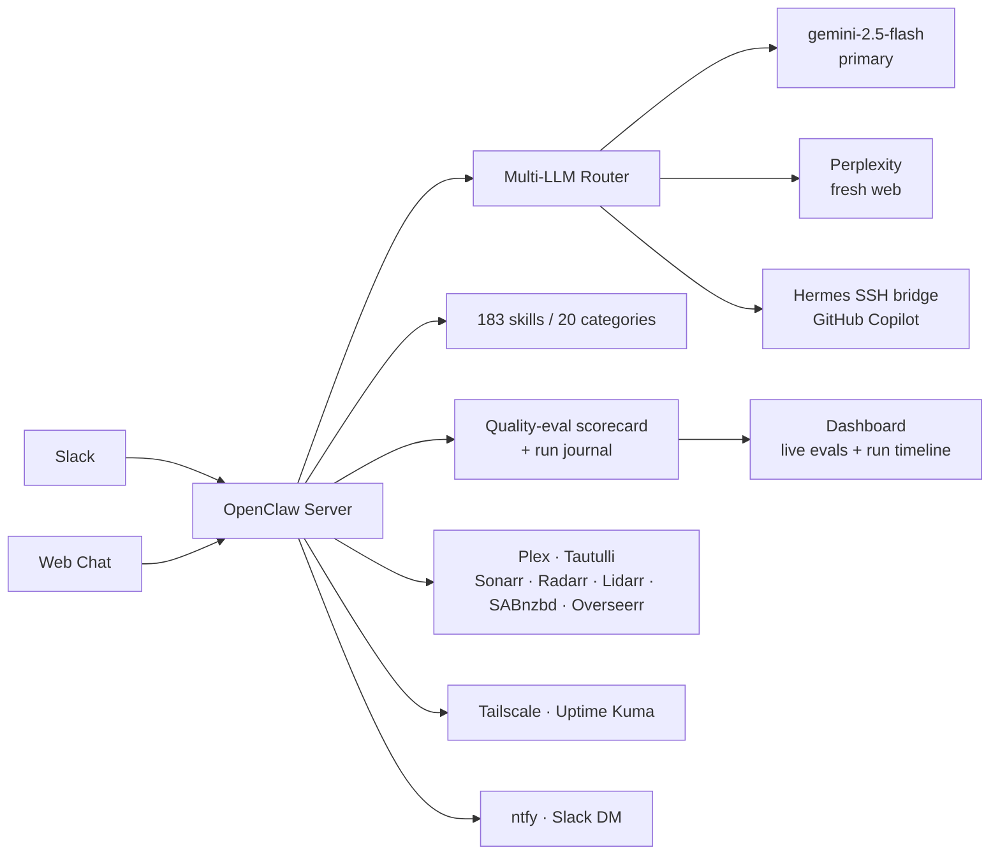

# OpenClaw 🤖

OpenClaw is a **self-hosted, multi-LLM agent platform** that runs as a Slack-first
assistant — with its own routing layer, an automated quality-eval scorecard, per-run
explainability, a 183-skill capability system, and a live observability dashboard.

It does real work every day (homelab ops, media visibility, file workflows, research),
so the agent engineering is exercised against a genuine production workload rather than a
demo. Everything runs on a **Mac Mini M4 Pro** in a Docker container.

| | |
|---|---|
| **What it is** | Multi-LLM agent platform with routing, evals, and observability |
| **Primary model** | `gemini-2.5-flash` (router also uses Perplexity and a Hermes/Copilot bridge) |
| **Capabilities** | 183 skills across 20 categories · 57 Slack slash commands |
| **Quality evals** | 4 automated correctness/safety metrics scored on live traffic |
| **Host** | Mac Mini M4 Pro, Docker |
| **Dashboard** | [openclaw.davevoyles.synology.me/dashboard](https://openclaw.davevoyles.synology.me/dashboard) — live eval scorecard + run timeline |
| **Health** | [openclaw.davevoyles.synology.me/health](https://openclaw.davevoyles.synology.me/health) |

## Why it's interesting (agent engineering)

OpenClaw is built around the parts of agent work that are hard to get right in production:

- **Multi-LLM routing** — requests are routed across models (`gemini-2.5-flash` as the
  primary, Perplexity for fresh web answers, a Hermes SSH bridge to GitHub Copilot for
  code-heavy work). Each response records which model actually served it, so routing is
  observable rather than a black box.
- **Automated quality evals on real traffic** — every `/ask` is scored against four
  correctness/safety metrics and rolled up into a live scorecard (see below). This is a
  continuous eval loop on production responses, not a one-off benchmark.
- **Per-run explainability + observability** — each run is journaled with its model,
  latency, routing notes, and a response preview, then surfaced on the dashboard's Run
  Timeline and volume chart. You can see what the agent did and how well it did it.
- **A real capability system** — 183 skills across 20 categories (automation, research,
  memory, media, ops, dev/git, analysis, and more) behind a single conversational surface.
- **Context, memory, and scheduling** — threaded sessions, follow-up anchoring to prior
  reports, a memory/knowledge layer, and a scheduler for recurring agent work.

### Quality-eval scorecard

A built-in harness scores recent responses on four dimensions that matter for a safe,
useful assistant, and publishes a pass-rate scorecard to the dashboard:

| Metric | What it checks |
|---|---|
| **Channel-leakage prevention** | The agent doesn't pull context from other channels unless the user explicitly opts in (privacy / scope safety). |
| **Follow-up anchor correctness** | Follow-up questions are anchored to the *right* prior report instead of guessing. |
| **Profile adherence** | Responses respect the user's profile — emoji level, report depth, tone, and length. |
| **Table readability / copy-safety** | Tables render in the expected copy-safe style for the surface they're sent to. |

The same telemetry powers an **offline replay harness** (`tests/evals/`) so prompts can be
re-scored deterministically in CI.

## How the agent works



1. A request arrives from Slack (primary), the web chat, or the dashboard.
2. The **router** picks a model based on the request (fresh-web → Perplexity, code → Hermes
   bridge, default → `gemini-2.5-flash`) and the relevant skills are made available.
3. The response streams back, with quality auto-repair retries if the first answer fails a
   check.
4. On completion the run is **journaled** (model, success, latency, routing notes, preview)
   and the **quality-eval scorecard** re-scores recent traffic — both visible live on the
   dashboard.

## The real-world workload

The agent earns its keep on a homelab, which is what keeps the engineering honest:

- **Ask anything** — quick answers, threaded sessions, research, and summaries.
- **Watch the media stack** — Plex now-playing, Sonarr/Radarr/Lidarr queues, SABnzbd
  downloads, and daily briefings.
- **Handle media requests** — search Overseerr and request movies or TV from Slack.
- **Network visibility** — Tailscale device status, NAS reachability, host health, and
  grouped Uptime Kuma service checks.
- **Notifications** — ntfy push alerts, Slack DMs, digests, briefings, download notices.
- **Files** — browse synced files, search recent uploads, and pull quick briefs.

## Interfaces

| Role | Interface | Access | Best for |
|---|---|---|---|
| **Primary** | Slack | DM `@OpenClaw` or use slash commands | Day-to-day chat, media checks, ops shortcuts |
| **Secondary** | Dashboard | [openclaw.davevoyles.synology.me/dashboard](https://openclaw.davevoyles.synology.me/dashboard) | Live evals, run timeline, controls, transcripts |
| **Also available** | Web Chat | [chat.davevoyles.synology.me](https://chat.davevoyles.synology.me) | Browser-based conversations |

> Slack is the primary messaging interface.

## Key Slack commands

OpenClaw registers **57 Slack slash commands**. These are the most useful day-to-day ones;
use `/help` for the full list.

### AI & Chat
- `/hermes <prompt>` — start a threaded Hermes session
- `/q <prompt>` — get a quick ephemeral answer
- `/resume [prompt]` — continue your last session
- `/sessions [n|resume n]` — list or reopen sessions
- `/research <topic>` — run the research pipeline

### Files & Knowledge
- `/files [query]` — browse synced documents
- `/filesearch <query>` — search your recent files

### Media
- `/watching` — see what Plex is playing right now
- `/media` — show active Plex streams, recent plays, and recently added titles
- `/arr` — view Sonarr/Radarr/Lidarr download queues
- `/downloads` — view active SABnzbd downloads
- `/request <title>` — request media through Overseerr
- `/upcoming` — show episodes airing soon from Sonarr

### Ops & Network
- `/status` — quick system snapshot with Uptime Kuma service summary
- `/uptime` — show all Uptime Kuma services grouped by status-page section
- `/grafana` — check Grafana health and jump to key dashboards
- `/morning` — trigger the owner morning briefing DM on demand
- `/news [topic]` — show top headlines or search a topic
- `/notify <message>` — send an ntfy push notification to your phone
- `/tailscale` — show current Tailscale device status
- `/wake mbp|mbp2` — send a Wake-on-LAN packet
- `/nas df|ls <path>|free` — browse NAS status and folders

## Install

```bash
# Install the Hermes client on your Mac
bash <(curl -fsSL https://openclaw.davevoyles.synology.me/ih)

# Configure and run OpenClaw
cp .env.example .env
# fill in your tokens, API keys, and service URLs

docker compose up -d --build
```

### Important environment groups
- **Slack & dashboard:** bot tokens, notify user, API auth
- **Hermes / host bridge:** `COPILOT_BACKEND=hermes`, bridge paths, Copilot proxy
- **Media services:** Tautulli, Sonarr, Radarr, Lidarr, SABnzbd, Overseerr
- **Notifications & monitoring:** ntfy, Slack DM, Uptime Kuma, Wake-on-LAN
- **NAS & search providers:** NAS credentials, GitHub repos, search API keys

## Operations

```bash
# Validate env docs
make validate-env

# Rebuild locally
docker compose up -d --build

# Check health
curl -s https://openclaw.davevoyles.synology.me/health | python3 -m json.tool
```

## Docs

- [docs/DEPLOYMENT.md](docs/DEPLOYMENT.md) — deployment flow
- [docs/TESTING.md](docs/TESTING.md) — test commands and conventions
- [docs/CONTRIBUTING.md](docs/CONTRIBUTING.md) — development workflow
- [CHANGELOG.md](CHANGELOG.md) — release history
