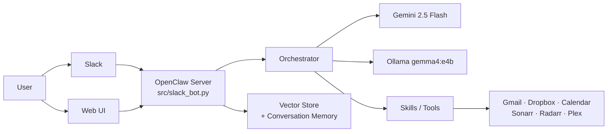

# OpenClaw 🤖

Personal AI assistant running on a home Mac Mini server. Ask it anything via Slack — it can draft emails, do research, summarize documents, search your files, and more.

Runs on a **Mac Mini M4 Pro** alongside a Synology NAS and a 20+ container Docker stack.

|                   |                                                              |
| ----------------- | ------------------------------------------------------------ |
| **Host**          | Mac Mini M4 Pro (`192.168.1.93`)                             |
| **Dashboard**     | [openclaw.davevoyles.synology.me/dashboard](https://openclaw.davevoyles.synology.me/dashboard) |
| **Web Chat**      | [chat.davevoyles.synology.me](https://chat.davevoyles.synology.me) |
| **Health**        | `https://openclaw.davevoyles.synology.me/health`             |
| **LLM**           | Gemini 2.5 Flash (primary) + Ollama `gemma4:e4b` (local)    |
| **Interfaces**    | Slack bot · Web UI · CLI                                     |

> **Note (May 2026):** Discord support was removed. Slack is now the sole chat interface. See [docs/AGENT-GUIDE.md](docs/AGENT-GUIDE.md) for architecture details.

---

## What it can do

- **Ask anything** — draft emails, proofread, explain documents, research topics
- **File search** — upload a document and ask questions about it
- **Web research** — pull summaries from the web on any topic
- **Scheduled tasks** — set recurring reminders or digests
- **System monitoring** — container health, logs, metrics
- **Integrations** — Gmail, Dropbox, Google Calendar

---

## Interfaces

| Interface | How to access | Best for |
|-----------|--------------|----------|
| **Slack** | DM `@OpenClaw` or use slash commands | Day-to-day queries, file sharing, remote Mac Mini control |
| **Web Chat** | [chat.davevoyles.synology.me](https://chat.davevoyles.synology.me) | Long conversations, rich formatting |
| **CLI** | `openclaw` (after install) | Power users, scripting |

### Key Slack commands

```
/copilot <prompt>   Run Copilot CLI on the Mac Mini in a threaded session
/host <subcommand>  Quick-action shortcuts (status, logs, restart, plex-fix, …)
/incident           Declare and track an incident
/chat <question>    Ask anything
/research <topic>   Web search + summary
/filesearch <term>  Search uploaded files
/digest             Summary of today's activity
/help               Full command list
```

---

## Architecture



---

## Deploy

```bash
# First time
cp .env.example .env   # fill in API keys
docker compose up -d --build

# Day-to-day (after code changes)
make ship-server

# Verify
curl -s https://openclaw.davevoyles.synology.me/health | python3 -m json.tool
```

### Environment variables (`.env`)

| Key | Required | Description |
|-----|----------|-------------|
| `SLACK_BOT_TOKEN` | Yes | Slack app OAuth token (`xoxb-…`) |
| `SLACK_APP_TOKEN` | Yes | Slack app-level token for Socket Mode (`xapp-…`) |
| `SLACK_SIGNING_SECRET` | Yes | Slack app signing secret |
| `OPENCLAW_HOST_BRIDGE_ALLOWED_USERS` | Yes | Comma-separated Slack user IDs allowed to run `/copilot` and `/host` |
| `GEMINI_API_KEY` | Yes | Google AI Studio |
| `GMAIL_CREDENTIALS_FILE` | No | Gmail OAuth JSON |
| `DROPBOX_APP_KEY` | No | Dropbox API app key |

See `.env.example` for the full list.

---

## Operations

```bash
# Restart
cd ~/openclaw && docker compose restart

# View logs
docker logs openclaw -f --tail 50

# Rebuild after code changes
docker compose up -d --build

# Stop
docker compose down
```

---

## Security

- Container: `read_only`, `cap_drop: ALL`, `no-new-privileges`
- Whitelisted Slack user IDs only (`OPENCLAW_HOST_BRIDGE_ALLOWED_USERS`)
- All actions logged to `data/audit/YYYY-MM-DD.jsonl`
- Resource limits: 2 GB RAM, 2 CPU cores
- Destructive commands require button-click approval
- `/estop` halts all write actions immediately

---

## Docs

| Document | Description |
|----------|-------------|
| [docs/PRODUCT-ROADMAP.md](docs/PRODUCT-ROADMAP.md) | Active roadmap and planned features |
| [docs/DEPLOYMENT.md](docs/DEPLOYMENT.md) | Detailed deployment guide |
| [docs/CONTRIBUTING.md](docs/CONTRIBUTING.md) | Development workflow |
| [docs/TESTING.md](docs/TESTING.md) | Running tests |
| [CHANGELOG.md](CHANGELOG.md) | Release history |

User-facing guides live at `/parents-guide`, `/webui-guide`, and `/onboarding` on the server.

---

## Developer Tools

| Command | Purpose |
|---------|---------|
| `make help` | Show all available make targets |
| `make smoke` | Fast smoke test gate (~18s) |
| `make lint-fix` | Auto-fix lint violations |
| `make validate-env` | Validate .env against .env.example |
| `pre-commit install` | Install git hooks (ruff, mypy, schema check) |

See [docs/API.md](docs/API.md) for HTTP endpoint reference.
See [docs/TESTING.md](docs/TESTING.md) for test suite structure.
