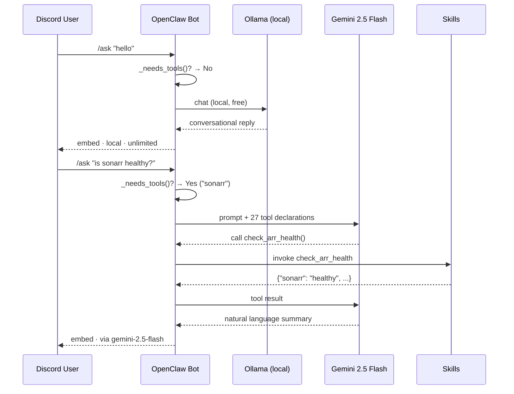
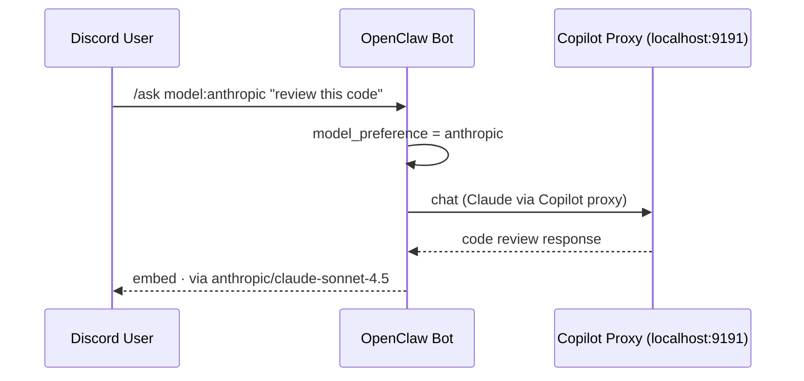
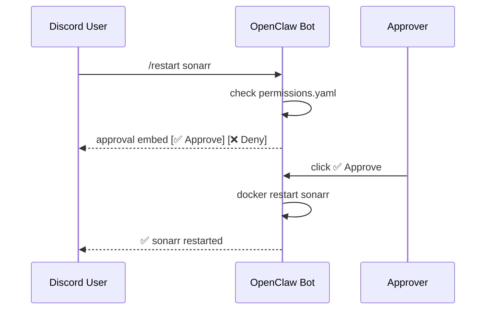

# OpenClaw 🤖

Autonomous AI agent for home automation and system management, accessible via Discord.

Runs on a **Mac Mini M4 Pro** managing a 20+ container Docker infrastructure alongside a Synology NAS.

|                  |                                                                        |
| ---------------- | ---------------------------------------------------------------------- |
| **Host**         | Mac Mini M4 Pro (192.168.1.93)                                         |
| **Tailscale IP** | `100.116.47.67` (`daves-mac-mini`)                                     |
| **Health**       | `http://192.168.1.93:8765/health`                                      |
| **Dashboard**    | `http://192.168.1.93:8765/dashboard`                                   |
| **Metrics**      | `http://192.168.1.93:8765/metrics` (Prometheus)                        |
| **External URL** | `openclaw.davevoyles.synology.me` (via Traefik)                        |
| **Remote SSH**   | `ssh davevoyles@daves-mac-mini` (Tailscale)                            |
| **Interface**    | 56 Discord slash commands                                              |
| **LLM**          | Gemini 2.5 Flash + GPT-4o + Claude Sonnet 4.5 + Gemma 3 12B local     |
| **Local LLM**    | Ollama (`gemma3:12b`) — free, with native tool calling support         |
| **Model Control** | `/ask model:auto\|local\|gemini\|openai\|anthropic` + `/model set`     |
| **Status**       | **Phase 15 — Frontier Intelligence** ✅                                |

## Features

**Phase 1 — Foundation** ✅

- Discord bot with `/ping`, `/about`, `/whoami`, `/help`
- Health check HTTP endpoint (`/health`)
- Audit logging (JSONL)
- Security-hardened Docker container

**Phase 2 — Core Skills** ✅

- `/containers` — list all running Docker containers
- `/status <service>` — detailed container status
- `/logs <service>` — tail recent container logs
- `/system` — CPU, memory, disk usage via Glances
- `/restart <service>` — restart a container (approval required)

**Phase 3 — LLM Integration** ✅

- `/ask <question>` — AI-powered natural language queries
- **Hybrid routing**: simple/conversational queries → Ollama (local, free, unlimited); tool-requiring queries → Gemini 2.5 Flash
- **User-controlled model selection**: `/ask model:local` or `/ask model:gemini` to override routing per-message; `/model set` for a sticky per-user default
- Function calling — LLM autonomously invokes skills (container status, logs, system stats)
- Conversation memory — multi-turn context per user/channel (30 min TTL)
- `/clear` — reset conversation history
- `/model show` / `/model set` — view or change your default LLM routing preference
- `/save <name>` / `/resume <name>` — persist conversations to disk; resume later
- `/threads` — list saved threads; `/forget <name>` — delete one
- Long responses auto-split across multiple embeds (no truncation)
- Rate limiting — 60 RPM / 500 RPH (Gemini only; Ollama is unlimited)

**Phase 4 — Security & Approvals** ✅

- `/restart` now requires button-click approval before executing
- Discord button UI — ✅ Approve / ❌ Deny with 5-minute timeout
- `/pending` — view pending approval requests
- `/auditlog [lines]` — view recent audit trail entries
- `/estop` — emergency stop to halt all write actions instantly
- `/estop resume` — resume normal operations after emergency stop
- Risk classification system (LOW/MEDIUM/HIGH/CRITICAL)
- Emergency stop blocks `/ask` and `/restart` when active

**Phase 5 — Advanced Skills** ✅

- `/search` — search TV shows/movies across Sonarr & Radarr
- `/queue` — view active downloads from SABnzbd + qBittorrent
- `/recent` — recently added media from Plex (via Tautulli)
- `/health` — check \*arr service + download client health
- `/ports` — verify all services are listening on expected ports
- `/report` — comprehensive system status report
- `/analyze` — AI-powered container log analysis (LLM or pattern-matching fallback)
- `/schedule` — manage recurring scheduled tasks with cron expressions, prompt jobs, and natural language creation
- `/skills` — list all available skills
- `/remember` / `/recall` — long-term QMD memory (persists to `qmd.json`)
- `/mail` — send email via AgentMail.to
- 25 Gemini function-calling tools for natural language queries
- Persistent scheduled task system with JSON storage and `croniter`-based cron scheduling

**Phase 6 — Remote Access & Monitoring** ✅

- `/network` — LAN + internet + DNS + Tailscale + OpenClaw health summary
- `/tailscale` — Tailscale VPN status and device IP
- `/speedtest` — Cloudflare download speed + DNS latency
- Prometheus metrics endpoint (`/metrics`) — `openclaw_up`, `openclaw_uptime_seconds`, `openclaw_latency_ms`, `openclaw_guilds`
- Traefik reverse proxy route: `openclaw.davevoyles.synology.me`
- Uptime Kuma monitor: polls `/health` every 60s with alerting

**Phase 7 — Local LLM & Production Hardening** ✅

- Ollama integration — `gemma3:12b` running natively on Mac Mini M4 Pro (8.1 GB, ~15–20 tok/s on M4 Neural Engine)
- Hybrid routing in `llm.py` — keyword heuristic routes simple queries to Ollama, tool-calling queries to Gemini
- Silent fallback — Ollama unavailable → seamlessly falls back to Gemini
- `LOCAL_LLM_ENABLED` toggle in `.env` — disable local LLM without a code change
- Response footer shows `via gemma3:12b` (local · unlimited) or `via gemini-2.5-flash` with rate info
- AgentMail fixed: correct `/v0/inboxes/{inbox_id}/messages/send` endpoint
- `skills/` reorganized as a Python package (`skills/__init__.py` + `skills/advanced_skills.py`)

**Phase 8 — Web, Browsing & Vision** ✅

- `/websearch` — live web search via Tavily (falls back to DuckDuckGo)
- `/browse <url>` — fetch and read a web page; optional Q&A
- `/analyze-image` — analyze an uploaded image with Gemini vision
- `/analyze-file` — analyze a document (PDF, TXT, JSON…) with Gemini
- ClawHub `free-web-search` and `openclaw-tavily-search` skill bundles installed

**Phase 9 — Mission Control (Kanban Task Board)** ✅

- `/tasks [status]` — view Kanban tasks; filter by backlog / in_progress / done
- `/ask` natural-language task management — create, move, complete, and comment on tasks
- ClawHub `mission-control` skill installed (`skills/mission-control/`)
- Tasks persisted in `data/tasks.json` (Docker volume mount)
- Dashboard published at https://davevoyles.github.io/openclaw-dashboard/ (GitHub Pages)
- 5 Gemini tool declarations for LLM-driven task management
- LLM routing keywords: _task_, _kanban_, _backlog_, _in progress_, _todo_, _ticket_
- 50+ registered skills

**Phase 10 — Persistent Agent Plans** ✅

- `/plans`, `/plan-detail`, `/resume-plan`, `/cancel-plan` — full plan lifecycle management
- Multi-step plan creation via `/ask` — the LLM calls `create_plan()` for complex tasks, tracking each step
- Plans persisted as Markdown in `data/plans/`, survive restarts; interrupted plans auto-detected on startup
- Graph-based structured memory via `ontology` ClawHub skill (entity CRUD, relations, schema validation)

**Phase 11 — Worker Agents** ✅

- `spawn_worker()` delegates focused sub-tasks to independent Gemini sessions with their own tool loops
- Autonomous parallel execution — the bot can research one topic while formatting another
- `/diff` — show uncommitted git changes; `webfetch-md` and `git-essentials` ClawHub skills for self-management

**Phase 12 — Proactive Monitoring** ✅

- RSS/Atom feed monitoring — `fetch_rss_feed`, `search_rss`, `get_rss_digest` with LLM-powered summaries
- URL change detection — `snapshot_url` + `check_url_for_changes` with SHA-256 diff-based alerting
- `/research` — autonomous multi-step research with Tavily/DuckDuckGo search and synthesis
- `/weather`, `/briefing` — on-demand weather forecasts and morning briefings

**v0.6.0 — Channel Architecture & Automation** ✅

- Per-channel prompt overrides — `#research`, `#analytics`, `#bookmarks` each get tailored bot behavior
- Obsidian vault integration — `/bookmark` and research reports saved as Markdown with YAML frontmatter
- Parallel worker sub-agents — `spawn_worker()` delegates focused subtasks to independent Gemini sessions
- 4:00 AM automated maintenance — skill updates, session cleanup, full backup to NAS (config, .env, memory, vault, audit)

**Phase 13 — Deep Memory & Semantic Search** ✅

- ChromaDB vector store — `all-MiniLM-L6-v2` embeds memories, conversations, and research locally (free, no API)
- Semantic `/recall` — merges keyword + vector search so facts are found even when phrased differently
- Contextual recall — top 3 relevant memories silently injected before every `/ask`
- SQLite persistent threads — unlimited message history, auto-titling, keyword + semantic search via `/threads-search`
- Thread continuation suggestions — bot detects when a new topic matches a past thread (≥75% similarity)
- Research memory — all `/research` reports indexed; follow-up research builds on prior findings
- Source library — all browsed URLs cataloged with excerpts; searchable via `/sources`
- New commands: `/memory-stats`, `/threads-search`, `/research-search`, `/sources`

**Phase 14 — Genesis-Inspired Intelligence** ✅

- Correction learning — when user says "no, that's wrong", bot extracts a rule and never repeats the mistake
- Memory decay & reinforcement — frequently-accessed memories rank higher; unused ones fade after 30 days
- Weekly memory consolidation — session summaries distilled into weekly digest memories
- User profile — structured preferences, interests, tools, and working style learned from conversations
- Session handover — proactive persistence of decisions, pending items, and next steps when sessions expire
- Knowledge router — `/remember` auto-classifies: preferences → profile, rules → rules engine, facts → QMD
- New commands: `/rules`, `/profile`, `/profile-edit`, `/memory-refresh`

**Phase 15 — Frontier Intelligence** ✅

_Closes the feature gap between OpenClaw and frontier LLMs (GPT-4, Claude, Gemini Pro)._

- **Auto-RAG** — automatically recalls relevant memories, user profile, and learned rules before every LLM call (no more "I forgot")
- **Code Interpreter** — LLM can autonomously write and execute Python code in a sandboxed Docker container for calculations, data analysis, and text processing
- **Vision + Tools** — image analysis can now trigger tool calls in the same turn (e.g. "analyze this dashboard screenshot and restart the unhealthy service")
- **Ollama Tool Calling** — local Gemma model can now call read-only tools natively (system stats, container status, weather, etc.) instead of hallucinating
- **Context Window Expansion** — model-aware limits: Gemini 500K chars (~125K tokens), Gemma 400K chars (~100K tokens), up from 80K
- **Structured Output** — JSON validation, repair, and extraction utilities for robust tool result parsing
- **Agentic Reflection** — self-evaluates complex responses and refines them if issues are found (enable with `REFLECTION_ENABLED=true`)
- **Multi-Model Routing** — code queries → Claude, creative writing → GPT-4o, tools → Gemini, simple chat → local Gemma
- **Copilot Proxy** — routes GPT-4o and Claude through your GitHub Copilot subscription (no separate API keys needed)
- **Automatic Fact Extraction** — memorable facts are auto-extracted from conversations and stored in long-term memory
- **Smarter Recall** — top-5 memories + user profile + active rules injected into every LLM call
- **Memory Deduplication** — checks for >90% similarity before storing, prevents duplicate facts
- **Confidence-Weighted Memory** — explicit `/remember` facts rank higher than auto-extracted ones
- **Configurable Embeddings** — swap to EmbeddingGemma or other Ollama models via `EMBEDDING_MODEL` env var
- New model options: `/ask model:openai` and `/ask model:anthropic` for per-message routing
- Setup script: `bash scripts/setup-copilot-proxy.sh` for one-command Copilot proxy deployment

**Planned**

- Grafana dashboards
- EmbeddingGemma migration (requires `ollama pull embeddinggemma` + re-index)

---

## Quick Start

### 1. Create Discord Bot

1. Go to https://discord.com/developers/applications
2. Click **New Application** → name it "OpenClaw"
3. Navigate to **Bot** tab → click **Reset Token** → copy the token
4. Enable these Privileged Gateway Intents:
   - **Message Content Intent**
5. Navigate to **OAuth2** → **URL Generator**:
   - Scopes: `bot`, `applications.commands`
   - Bot Permissions: Send Messages, Embed Links, Use Slash Commands
6. Open the generated URL in your browser to invite the bot to your server

### 2. Configure Environment

```bash
cp .env.example .env
```

Edit `.env` and fill in:

- `DISCORD_BOT_TOKEN` — from step 1
- `DISCORD_GUILD_ID` — right-click your Discord server → Copy Server ID
- `ALLOWED_USER_IDS` — right-click your profile → Copy User ID

### 3. Deploy

```bash
cd ~/openclaw
docker compose up -d --build
```

### 4. Verify

```bash
# Check container health
docker ps --filter name=openclaw

# Check health endpoint
curl http://localhost:8765/health

# Check logs
docker logs openclaw --tail 20
```

Then type `/ping` in your Discord server.

---

## Operations & Common Tasks

### Applying `.env` changes

> ⚠️ **`docker restart` does NOT reload `.env`.**
> It reuses the environment snapshot captured when the container was first created.
> Any change to `.env` (new API keys, updated values) requires a **full recreate**:

```bash
# Correct — reloads all env_file values from .env:
docker compose up -d

# Wrong — environment vars stay stale from the last create:
docker restart openclaw   # ← does NOT re-read .env
```

### Rebuilding after code changes

```bash
docker compose up -d --build
```

### Viewing logs

```bash
docker logs openclaw --tail 30 -f
```

### Verifying a specific env var is loaded in the container

```bash
docker exec openclaw env | grep VARIABLE_NAME | wc -c
# Result of 16 or less = blank value; more = key is set
```

| Command                       | Description                                                     | Phase |
| ----------------------------- | --------------------------------------------------------------- | ----- |
| `/ping`                       | Check if OpenClaw is alive (latency + uptime)                   | 1     |
| `/about`                      | Show version and system info                                    | 1     |
| `/whoami`                     | Show your identity and permissions                              | 1     |
| `/help`                       | List available commands                                         | 1     |
| `/containers`                 | List all running Docker containers                              | 2     |
| `/status <service>`           | Detailed status for a specific container                        | 2     |
| `/logs <service>`             | Tail last 30 lines of container logs                            | 2     |
| `/dockerstats`                | Per-container resource usage snapshot                           | 2     |
| `/system`                     | System resource usage (CPU, RAM, disk)                          | 2     |
| `/restart <service>`          | Restart a container (requires approval)                         | 2     |
| `/ask <question>`             | AI query — auto-routes to best model (Gemini/GPT-4o/Claude/Gemma) | 3/15  |
| `/clear`                      | Clear your active conversation history                          | 3     |
| `/save <name>`                | Save current conversation as a named thread (persisted to disk) | 7     |
| `/resume <name>`              | Resume a previously saved conversation thread                   | 7     |
| `/threads`                    | List all your saved conversation threads                        | 7     |
| `/forget <name>`              | Delete a saved conversation thread                              | 7     |
| `/pending`                    | List pending approval requests                                  | 4     |
| `/auditlog [lines]`           | View recent audit log entries                                   | 4     |
| `/estop`                      | Emergency stop — halt all write actions                         | 4     |
| `/estop resume`               | Resume bot after emergency stop                                 | 4     |
| `/search <query>`             | Search Sonarr/Radarr for TV shows or movies                     | 5     |
| `/queue`                      | Show active downloads (SABnzbd + qBittorrent)                   | 5     |
| `/recent [count]`             | Recently added media from Plex                                  | 5     |
| `/health`                     | Check \*arr services and download client health                 | 5     |
| `/ports`                      | Check service port connectivity                                 | 5     |
| `/report`                     | Generate comprehensive system status report                     | 5     |
| `/analyze <service>`          | AI-powered container log analysis                               | 5     |
| `/schedule [action]`          | Manage scheduled tasks — cron expressions, prompt jobs, skill calls  | 5/16  |
| `/skills`                     | List all available skills                                    | 5     |
| `/remember <content>`         | Store a fact in long-term QMD memory                            | 5     |
| `/recall <query>`             | Search long-term QMD memory                                     | 5     |
| `/mail <to> <subject> <body>` | Send email via AgentMail.to                                     | 5     |
| `/spending [breakdown]`       | View Gemini API spending and budget                             | 6     |
| `/network`                    | LAN + internet + DNS + Tailscale + health summary               | 6     |
| `/tailscale`                  | Tailscale VPN status and device IP                              | 6     |
| `/speedtest`                  | Cloudflare download speed + DNS latency                         | 6     |
| `/model set <pref>`           | Set default model: auto/local/gemini/openai/anthropic           | 15    |
| `/run <code>`                 | Execute Python code in sandboxed Docker container               | 15    |

## Architecture

> **For a detailed breakdown of the Docker infrastructure running on this Mac Mini** — including all container definitions, network topology, volume mounts, and service configuration — see the **`docker-stack/`** folder. It contains the full Compose files and documentation for every service in the stack.

### System Overview

```
┌─────────────────────────────────────────────────────────────────────┐
│                        Your Devices                                 │
│   📱 iPhone / iPad / MacBook (Discord app or browser)               │
└──────────────────────────┬──────────────────────────────────────────┘
                           │ Discord API (outbound bot connection)
                           ▼
┌──────────────────────────────────────────────────────────────────────┐
│                     Discord Gateway                                  │
│   Slash commands, embeds, button UIs, approval flows                 │
└──────────────────────────┬───────────────────────────────────────────┘
                           │
                           ▼
┌──────────────────────────────────────────────────────────────────────┐
│              OpenClaw Bot (Docker, port 8765)                        │
│  ┌──────────────┐  ┌──────────────────────────┐  ┌────────────┐  │
│  │   bot.py     │  │         llm.py           │  │ approvals  │  │
│  │ 28 commands  │  │  ┌─────────┬───────────┐ │  │ button UI  │  │
│  └──────┬───────┘  │  │ Ollama  │  Gemini   │ │  └────────────┘  │
│         │           │  │gemma3  │ 2.5 Flash │ │                  │
│         │           │  │(local) │(tool use) │ │                  │
│         │           │  └────┬───┴─────┬─────┘ │                  │
│         │           └───────┼─────────┼───────┘                  │
│         │    hybrid routing │         │ function calling          │
│         ▼                   ▼         ▼                           │
│  ┌─────────────────────────────────────────────────────────┐    │
│  │                   Skill Registry (50+ skills)            │    │
│  │  Docker · System · Media(*arr) · Plex · Network ·       │    │
│  │  AI Analysis · Scheduling · QMD Memory · AgentMail      │    │
│  └───────────────────────────┬─────────────────────────────┘    │
│            /health            │           /metrics (Prometheus)      │
└───────────────────────────────┼──────────────────────────────────────┘

> **Multi-model routing (Phase 15):** In addition to Gemini and Ollama, OpenClaw can route
> queries to GPT-4o and Claude Sonnet 4.5 through a local Copilot proxy server (port 9191).
> Code queries → Claude, creative writing → GPT-4o, tools → Gemini, simple chat → Gemma.

                                │ LAN (192.168.1.x)
              ┌─────────────────┼──────────────────────┐
              ▼                 ▼                      ▼
     ┌────────────────┐ ┌───────────────┐   ┌──────────────────┐
     │  Docker Engine │ │ *arr Services │   │ Synology NAS     │
     │ (20 containers │ │ Sonarr/Radarr │   │ 192.168.1.8      │
     │  on Mac Mini)  │ │ Lidarr/Prowlarr│  │ Media storage    │
     └────────────────┘ │ SABnzbd/qBit  │   │ Traefik proxy    │
                        │ Plex/Tautulli │   │ Uptime Kuma      │
                        └───────────────┘   └──────────────────┘
```

### Request Flow — AI Hybrid Routing



### Request Flow — Multi-Model Routing (Phase 15)



### Request Flow — Approval Workflow



### Network Architecture

```
Internet
    │
    ▼
Synology DDNS (davevoyles.synology.me)
    │
    ▼
Synology Built-in Reverse Proxy ──► Traefik (NAS, port 80/443)
                                           │
                    ┌──────────────────────┼──────────────────────┐
                    ▼                      ▼                      ▼
           sonarr.davevoyles.   openclaw.davevoyles.   plex.davevoyles.
           synology.me          synology.me             synology.me
                    │                      │                      │
                    ▼                      ▼                      ▼
        192.168.1.93:8989    192.168.1.93:8765         (plex direct)
              (Sonarr)           (OpenClaw)

 Remote Access via Tailscale:
   MacBook Pro (100.70.195.63) → Tailscale mesh → 100.116.47.67:8765 (OpenClaw @ daves-mac-mini)
   SSH: ssh davevoyles@daves-mac-mini
```

### Monitoring Stack

```
OpenClaw (:8765/metrics)  ◄── Prometheus scrape (optional)
        │                              │
        ▼                              ▼
Uptime Kuma (:3001)              Grafana dashboard
  - Polls /health every 60s       - openclaw_up
  - Alerts on downtime            - openclaw_uptime_seconds
  - Status page                   - openclaw_latency_ms
                                   - openclaw_guilds
```

### File Structure

```
~/openclaw/
├── bot.py                 # Main Discord bot (33 slash commands, health/metrics HTTP server)
├── skills/
│   ├── __init__.py        # Core Docker & system monitoring skills + unified registry
│   └── advanced_skills.py # Media, network, Plex, health, and reporting skills
├── analyzer.py            # AI-powered log analysis
├── scheduler.py           # Scheduled task system with persistence
├── llm.py                 # Hybrid LLM: Ollama (local) + Gemini 2.5 Flash (tool use), 27 tools
├── memory.py              # Per-user conversation memory (30 min TTL)
├── approvals.py           # Approval workflow engine + Discord button UI
├── network.py             # Tailscale status, connectivity check, speed test
├── qmd.py                 # Long-term memory (QMD pattern — persists to qmd.json)
├── agentmail.py           # Email via AgentMail.to API
├── spending.py            # Gemini API cost tracking ($30 budget, per-call token logging)
├── dashboard.py           # Web dashboard (served at /dashboard, self-contained HTML)
├── openclaw.code-workspace  # VS Code workspace — opens project via Remote SSH
├── docker-compose.yml     # Container orchestration
├── Dockerfile             # Copies *.py + skills/ package into container
├── .env                   # Secrets (not committed)
├── .env.example           # Template
├── config/
│   ├── config.yaml        # Main configuration
│   ├── permissions.yaml   # Risk levels and access control
│   ├── skills/
│   │   └── enabled.yaml   # Which skills are active
│   └── prompts/
│       └── system.txt     # LLM system prompt
├── data/
│   ├── logs/              # Application logs
│   ├── memory/            # qmd.json, schedules.json
│   └── audit/             # Audit trail (YYYY-MM-DD.jsonl)
├── docs/
│   └── IMPLEMENTATION-PLAN.md  # Full 7-phase plan
├── docker-stack/          # Full Docker infrastructure for the Mac Mini (see this folder
│                        #   for architecture, networks, containers, and service config)
└── scripts/
    ├── health-check.sh
    └── add-uptime-kuma-monitor.py
```

## Getting the Most Out of OpenClaw

### Power User Tips

#### 1. Use `/ask` for everything first

Instead of memorizing individual commands, just describe what you want:

```
/ask "what containers are using the most memory?"
/ask "are there any errors in my arr services?"
/ask "why isn't my new show showing up in plex?"
/ask "give me a full health report"
/ask "which services aren't running?"
```

The LLM will call the right skills, chain multiple tool calls if needed, and give you a synthesized answer.

#### 2. Schedule your health checks

Have OpenClaw proactively alert you instead of waiting for problems:

```
/schedule add  skill:check_arr_health  cron:"0 8 * * *"
/schedule add  skill:create_status_report  cron:"0 */6 * * *"
/schedule add  skill:check_download_clients  interval:60

# Prompt jobs — send a prompt to the LLM with full tool access
/ask Schedule a prompt job with cron "0 7 * * 1,5": search ESPN for lacrosse games
```

OpenClaw runs these automatically and posts results to your Discord channel.

#### 3. Use `/analyze` when something breaks

When a service misbehaves, `analyze` feeds the last N log lines to Gemini:

```
/analyze sonarr 100
/analyze sabnzbd 50
/analyze flaresolverr 200
```

It identifies errors, explains root causes, and suggests fixes in plain English.

#### 4. Build a long-term knowledge base with `/remember`

Store facts that help OpenClaw give better answers in the future:

```
/remember "Plex token is in /config/Library/Preferences/com.plexapp.plexmediaserver.plist"
/remember "SABnzbd incomplete downloads go to /tmp before moving to /downloads" tags:sabnzbd,downloads
/remember "Sonarr uses port 8989, API v3" tags:sonarr,api
```

Then ask: `/ask "how do I get the plex token?"` — it will find and use the stored memory.

#### 5. Emergency stop before risky operations

Before doing anything potentially dangerous to your stack:

```
/estop
```

This blocks all `/restart` and LLM write actions until you type `/estop resume`. Use it during maintenance windows or when you're about to run bulk operations.

#### 6. Check the audit log when something unexpected happens

```
/auditlog 25
```

Every command is logged to `data/audit/YYYY-MM-DD.jsonl`. Good for spotting repeated failures, debugging intermittent issues, or reviewing what the bot did while you were away.

#### 7. Use `/report` as a morning brief

```
/report
```

Generates a comprehensive snapshot: container counts, download queue, \*arr health, Plex status, and system stats — all in one embed.

### Common AI Query Examples

```
# System health
/ask "is everything running?"
/ask "which containers have restarted recently?"
/ask "what's using the most CPU?"

# Downloads
/ask "what's downloading right now?"
/ask "why is my download speed slow?"
/ask "is the usenet indexer working?"

# Media library
/ask "was The Substance added to Plex?"
/ask "how many movies do I have?"
/ask "what was added this week?"

# Troubleshooting
/ask "sonarr has been throwing errors — what's wrong?"
/ask "why isn't radarr importing movies?"
/ask "check if prowlarr is syncing with my indexers"

# Network
/ask "am I connected to tailscale?"
/ask "is the NAS reachable?"
/ask "what's my current download speed?"
```

---

## Security

- Container runs with `read_only: true`, `cap_drop: ALL`, `no-new-privileges`
- Only whitelisted Discord user IDs can execute commands
- All actions logged to `data/audit/YYYY-MM-DD.jsonl`
- Resource limits: 2 GB RAM, 2 CPU cores
- Health endpoint on port 8765
- **Approval workflow**: `/restart` requires button-click confirmation before executing
- **Emergency stop**: `/estop` immediately halts all write actions and LLM queries
- **Risk classification**: Commands categorized LOW→CRITICAL with escalating controls
- **Policy enforcement**: `permissions.yaml` blocks restarts of critical infrastructure (traefik, socket-proxy, homepage, watchtower)

## Roadmap

- [x] **Phase 1**: Foundation — Discord bot with basic commands
- [x] **Phase 2**: Core Skills — Docker management, system monitoring
- [x] **Phase 3**: LLM Integration — Gemini-powered AI responses + function calling
- [x] **Phase 4**: Security & Approvals — Button-based approval UI, emergency stop, audit viewer
- [x] **Phase 5**: Advanced Skills — Media search, downloads, Plex, health checks, scheduling, AI log analysis, QMD memory, AgentMail
- [x] **Phase 6**: Remote Access & Monitoring — Traefik routing, Uptime Kuma, Prometheus metrics
- [x] **Phase 7**: Local LLM — Ollama hybrid routing (gemma3:12b + Gemini 2.5 Flash)
- [ ] **Phase 8**: Production Hardening — Comprehensive testing, backup/restore, Grafana dashboards
- [x] **Phase 15**: Frontier Intelligence — Auto-RAG, code interpreter, multi-model routing, Copilot proxy, persistent memory

See [docs/IMPLEMENTATION-PLAN.md](docs/IMPLEMENTATION-PLAN.md) for the detailed plan.

## Maintenance

```bash
# Restart
cd ~/openclaw && docker compose restart

# View logs
docker logs openclaw -f --tail 50

# Rebuild after code changes
docker compose up -d --build

# Stop
docker compose down
```

## Useful Daily Commands

Commands you'll actually use day-to-day, grouped by scenario.

### Morning Check

```bash
# Quick health check — is everything running?
curl -s http://192.168.1.93:8765/health | python3 -m json.tool

# Open the dashboard in your browser
open http://192.168.1.93:8765/dashboard
```

Or in Discord:

```
/report                  # Full system snapshot
/health                  # *arr + download health
/spending                # How much Gemini budget used
```

### Troubleshooting

```bash
# Live-tail OpenClaw logs
docker logs openclaw -f --tail 100

# Check why a container is unhealthy
docker inspect --format '{{json .State.Health}}' openclaw | python3 -m json.tool

# View today's audit trail
cat ~/openclaw/data/audit/$(date +%Y-%m-%d).jsonl | python3 -m json.tool

# Check Gemini spending data directly
cat ~/openclaw/data/memory/spending.json | python3 -m json.tool
```

Or in Discord:

```
/ask "why is sonarr throwing errors?"
/analyze sonarr 100      # AI-powered log analysis
/auditlog 25             # What happened recently
/logs sonarr 50          # Raw container logs
```

### Deployment

```bash
# Rebuild after editing Python files
cd ~/openclaw && docker compose up -d --build

# Force full rebuild (no cache)
docker compose build --no-cache && docker compose up -d

# Check it came up healthy
sleep 10 && docker ps --filter name=openclaw --format 'table {{.Names}}\t{{.Status}}'

# Verify slash commands synced
docker logs openclaw --tail 5 | grep "Synced commands"
```

### Monitoring

```bash
# Prometheus metrics (for Grafana)
curl -s http://192.168.1.93:8765/metrics

# Dashboard API (JSON — all data in one call)
curl -s http://192.168.1.93:8765/api/dashboard | python3 -m json.tool

# Spending summary
curl -s http://192.168.1.93:8765/api/dashboard | python3 -c "
import json, sys
d = json.load(sys.stdin)['spending']
print(f\"Cost: \${d['total_cost']:.4f} / \${d['budget_limit']:.2f}\")
print(f\"Tokens: {d['total_input_tokens']:,} in / {d['total_output_tokens']:,} out\")
print(f\"Calls: {d['calls']}\")
"
```

## Related Documentation

- [Implementation Plan](docs/IMPLEMENTATION-PLAN.md) — Full 7-phase roadmap
- [Docker Stack](https://github.com/DaveVoyles/docker-on-mac-mini) — The infrastructure OpenClaw manages

---

## Manual Setup Checklist

Things you need to do by hand before OpenClaw is fully operational. Complete these whenever you're ready.

- [ ] **Create Discord Bot** — [discord.com/developers/applications](https://discord.com/developers/applications)
  - New Application → name it "OpenClaw"
  - Bot tab → Reset Token → copy token
  - Enable **Message Content Intent**
  - OAuth2 → URL Generator: scopes `bot` + `applications.commands`, permissions: Send Messages, Embed Links, Use Slash Commands
  - Open generated URL to invite bot to your server
- [ ] **Fill in `~/openclaw/.env`** with:
  - `DISCORD_BOT_TOKEN` — from the bot you just created
  - `DISCORD_GUILD_ID` — right-click your Discord server → Copy Server ID
  - `ALLOWED_USER_IDS` — right-click your Discord profile → Copy User ID
  - `GOOGLE_API_KEY` — from [aistudio.google.com/apikey](https://aistudio.google.com/apikey) (paid Gemini tier)
  - `OLLAMA_URL=http://host.docker.internal:11434` — Ollama endpoint (host machine)
  - `OLLAMA_MODEL=gemma3:12b` — local model name
  - `LOCAL_LLM_ENABLED=true` — set false to route all queries to Gemini
- [ ] **Install Ollama** (local LLM): `brew install ollama && brew services start ollama && ollama pull gemma3:12b`
- [ ] **Fill in service API keys in `~/openclaw/.env`** (Phase 5):
  - `SONARR_API_KEY` — from `docker-stack/sonarr/config/config.xml`
  - `RADARR_API_KEY` — from `docker-stack/radarr/config/config.xml`
  - `LIDARR_API_KEY` — from `docker-stack/lidarr/config/config.xml`
  - `PROWLARR_API_KEY` — from `docker-stack/prowlarr/config/config.xml`
  - `SABNZBD_API_KEY` — from `docker-stack/sabnzbd/config/sabnzbd.ini`
  - `TAUTULLI_API_KEY` — from `docker-stack/tautulli/config/config.ini`
  - `OVERSEERR_API_KEY` — from `docker-stack/overseerr/config/settings.json`
- [ ] **First deploy**: `cd ~/openclaw && docker compose up -d --build`
- [ ] **Verify**: type `/ping` in Discord, check `curl http://localhost:8765/health`
- [ ] **Test `/ask`**: try `/ask "hello"` (→ Ollama, free) then `/ask "how's sonarr doing?"` (→ Gemini + function calling)
- [ ] **Ollama**: runs on host via `brew services start ollama`; model is `gemma3:12b` (auto-pulled). Set `LOCAL_LLM_ENABLED=false` in `.env` to disable.
- [ ] **Add to Uptime Kuma**: run `scripts/add-uptime-kuma-monitor.py` to add the monitor
- [ ] **Traefik route** (optional): `openclaw.davevoyles.synology.me` → configured in NAS `mac-mini.yml`
- [ ] **AgentMail** (optional): set `AGENTMAIL_API_KEY` in `.env` for `/mail` and email-via-AI
