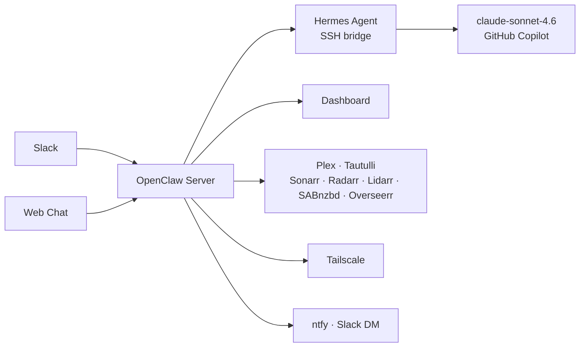

# OpenClaw 🤖

OpenClaw is a Slack-first personal AI assistant for homelab ops, media visibility, file workflows, and quick research — running on a **Mac Mini M4 Pro** at `192.168.1.93`.

| | |
|---|---|
| **Host** | Mac Mini M4 Pro (`192.168.1.93`) |
| **Dashboard** | [openclaw.davevoyles.synology.me/dashboard](https://openclaw.davevoyles.synology.me/dashboard) |
| **Web Chat** | [chat.davevoyles.synology.me](https://chat.davevoyles.synology.me) |
| **Health** | `https://openclaw.davevoyles.synology.me/health` |
| **LLM** | Hermes · claude-sonnet-4.6 (GitHub Copilot) |

## Interfaces

| Role | Interface | Access | Best for |
|---|---|---|---|
| **Primary** | Slack | DM `@OpenClaw` or use slash commands | Day-to-day chat, media checks, ops shortcuts |
| **Secondary** | Dashboard | [openclaw.davevoyles.synology.me/dashboard](https://openclaw.davevoyles.synology.me/dashboard) | Visual status, controls, transcripts |
| **Also available** | Web Chat | [chat.davevoyles.synology.me](https://chat.davevoyles.synology.me) | Browser-based conversations |

> Discord has been removed. Slack is the main messaging interface.

## What it can do

- **Ask anything** via Hermes — quick answers, threaded sessions, research, and summaries.
- **Watch your media stack** — Plex now playing, recent activity, Sonarr/Radarr/Lidarr queues, SABnzbd downloads, and daily briefing highlights.
- **Handle media requests** — search Overseerr and request movies or TV from Slack.
- **Show network visibility** — Tailscale device status, NAS reachability, host health, and grouped Uptime Kuma service checks.
- **Send notifications** — ntfy push alerts, Slack DMs, digests, briefings, and download-complete notices.
- **Work with files** — browse synced files, search recent uploads, and pull quick briefs.

## Key Slack commands

OpenClaw currently registers **53 Slack slash commands**. These are the most useful day-to-day ones; use `/help` for the full list.

### AI & Chat
- `/hermes <prompt>` — start a threaded Hermes session
- `/q <prompt>` — get a quick ephemeral Hermes answer
- `/resume [prompt]` — continue your last Hermes session
- `/sessions [n|resume n]` — list or reopen Hermes sessions
- `/research <topic>` — run the research pipeline

### Files & Knowledge
- `/files [query]` — browse synced documents
- `/filesearch <query>` — search your recent files

### Media
- `/watching` — see what Plex is playing right now
- `/arr` — view Sonarr/Radarr/Lidarr download queues
- `/downloads` — view active SABnzbd downloads
- `/request <title>` — request media through Overseerr
- `/upcoming` — show episodes airing soon from Sonarr

### Ops & Network
- `/status` — quick system snapshot with Uptime Kuma service summary
- `/uptime` — show all Uptime Kuma services grouped by status-page section
- `/morning` — trigger the owner morning briefing DM on demand
- `/news [topic]` — show top headlines or search a topic
- `/tailscale` — show current Tailscale device status
- `/wake mbp|mbp2` — send a Wake-on-LAN packet
- `/nas df|ls <path>|free` — browse NAS status and folders

## Architecture



## Install

```bash
# Install the Hermes client on your Mac
bash <(curl -fsSL https://openclaw.davevoyles.synology.me/ih)

# Configure and run OpenClaw
cp .env.example .env
# fill in your tokens, API keys, and service URLs

docker compose up -d --build
```

### Important environment groups
- **Slack & dashboard:** bot tokens, notify user, API auth
- **Hermes / host bridge:** `COPILOT_BACKEND=hermes`, bridge paths, Copilot proxy
- **Media services:** Tautulli, Sonarr, Radarr, Lidarr, SABnzbd, Overseerr
- **Notifications & monitoring:** ntfy, Slack DM, Uptime Kuma, Wake-on-LAN
- **NAS & search providers:** NAS credentials, GitHub repos, search API keys

## Operations

```bash
# Validate env docs
make validate-env

# Rebuild locally

docker compose up -d --build

# Check health
curl -s https://openclaw.davevoyles.synology.me/health | python3 -m json.tool
```

## Docs

- [docs/DEPLOYMENT.md](docs/DEPLOYMENT.md) — deployment flow
- [docs/TESTING.md](docs/TESTING.md) — test commands and conventions
- [docs/CONTRIBUTING.md](docs/CONTRIBUTING.md) — development workflow
- [CHANGELOG.md](CHANGELOG.md) — release history
