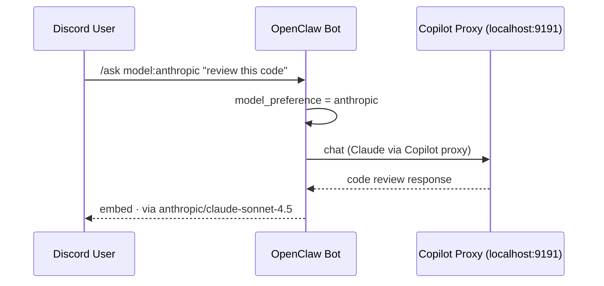
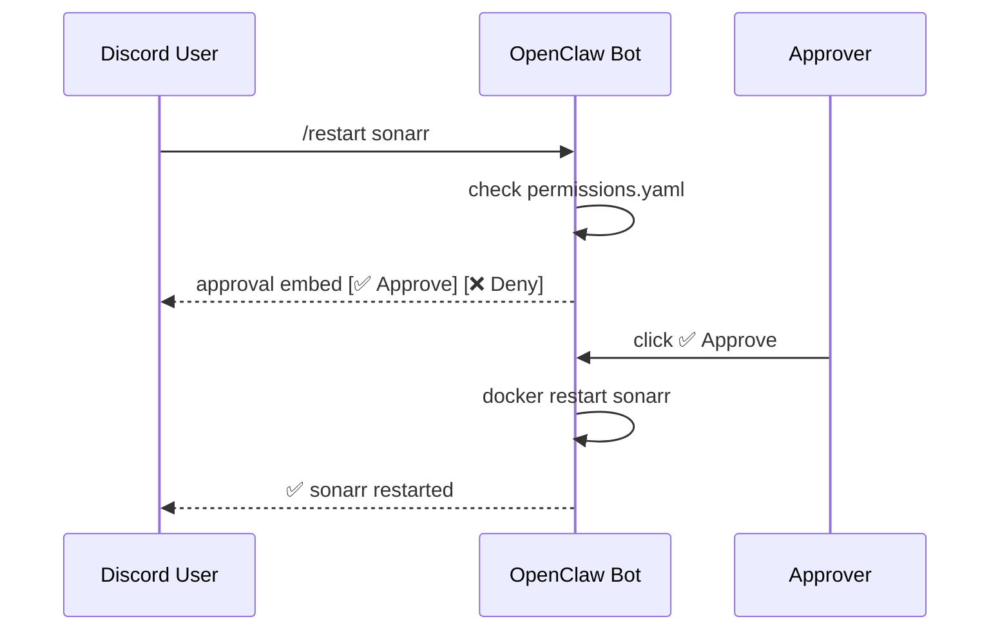

# OpenClaw 🤖

Autonomous AI agent for home automation and system management, accessible via Discord.

Runs on a **Mac Mini M4 Pro** managing a 20+ container Docker infrastructure alongside a Synology NAS.

|                  |                                                                        |
| ---------------- | ---------------------------------------------------------------------- |
| **Host**         | Mac Mini M4 Pro (192.168.1.93)                                         |
| **Tailscale IP** | `100.116.47.67` (`daves-mac-mini`)                                     |
| **Health**       | `http://192.168.1.93:8765/health`                                      |
| **Dashboard**    | `http://192.168.1.93:8765/dashboard`                                   |
| **Metrics**      | `http://192.168.1.93:8765/metrics` (Prometheus)                        |
| **External URL** | `openclaw.davevoyles.synology.me` (via Traefik)                        |
| **Remote SSH**   | `ssh davevoyles@daves-mac-mini` (Tailscale)                            |
| **Interface**    | 101 Discord slash commands across 12 cogs (55 cog commands) + modular command system |
| **LLM**          | Gemini 2.5 Flash (primary, 8192 max tokens) + Gemma 4 E4B local (Ollama) |
| **SDK**          | `google-genai` (migrated from deprecated `google-generativeai`)        |
| **Local LLM**    | Ollama (`gemma4:e4b`) — free, with native tool calling support         |
| **Model Control** | `/ask model:auto\|local\|gemini\|openai\|anthropic` + `/model set`     |
| **Natural Language** | `/ask` auto-shortlists the most relevant skills and tools per request |
| **Status**       | **Phase 42 — Patreon/MonsterVision Monitoring** ✅                     |

## Features

**Phase 1 — Foundation** ✅

- Discord bot with `/ping`, `/about`, `/whoami`, `/help`
- Health check HTTP endpoint (`/health`)
- Audit logging (JSONL)
- Security-hardened Docker container

**Phase 2 — Core Skills** ✅

- `/containers` — list all running Docker containers
- `/status <service>` — detailed container status
- `/logs <service>` — tail recent container logs
- `/system` — CPU, memory, disk usage via Glances
- `/restart <service>` — restart a container (approval required)

**Phase 3 — LLM Integration** ✅

- `/ask <question>` — AI-powered natural language queries
- **Hybrid routing**: simple/conversational queries → Ollama (local, free, unlimited); tool-requiring queries → Gemini 2.5 Flash
- **Intent-based tool shortlisting + request hints**: `/ask` narrows the skill set per prompt and infers cues like services, time windows, sports/watch-guide intent, calendar asks, inbox requests, lightweight "this/that" disambiguation, and normalized entities (services/leagues/WWE/platforms)
- **Follow-up correction loop (incremental)**: `/ask` detects correction language like “actually”, “no, I meant…”, “make it brief”, and “add …”, applies safe parameter-level overrides (style/detail/topic/window) when clear, and falls back safely when ambiguous
- **Compositional ask hints (lightweight)**: chained requests in one message (e.g., recap + compare + table/emoji controls) are parsed into structured hints for routing and tool/parameter selection
- **Domain packs + personas**: prefix `/ask` prompts with `use:finance`, `use:sports`, `use:wwe`, or `use:gaming` to apply persona-aware tool filtering while keeping normal fallback behavior when omitted
- **Semantic fallback retrieval**: when lexical matching is weak, `/ask` can semantically shortlist likely tools instead of exposing the full tool set
- **User-controlled model selection**: `/ask model:local` or `/ask model:gemini` to override routing per-message; `/model set` for a sticky per-user default
- Function calling — LLM autonomously invokes skills (container status, logs, system stats)
- Conversation memory — multi-turn context is isolated per user + channel/thread scope (TTL/history are configurable; defaults: 30 min + 50 turns)
- Markdown table handling — tables are reformatted for Discord embeds; large/complex tables can include an attached `table.png` fallback image
- `/clear` — reset conversation history
- `/model show` / `/model set` — view or change your default LLM routing preference
- `/save <name>` / `/resume <name>` — persist conversations to disk; resume later
- `/threads` — list saved threads; `/forget <name>` — delete one
- Long responses auto-split across multiple embeds (no truncation)
- Rate limiting — 60 RPM / 500 RPH (Gemini only; Ollama is unlimited)

**Phase 4 — Extensible Plugin Architecture** ✅

- **Plugin system** — modular third-party extension framework with hot-reload support
- **Dynamic loading** — install/unload/reload plugins without restarting the bot
- **Plugin API** — comprehensive interface for skill/command registration, storage, config access, events, logging
- **Dependency management** — automatic validation of Python package dependencies and version compatibility
- **Plugin commands** — `/plugin list/info/enable/disable/reload/install/uninstall` for runtime management
- **Example plugins** — `hello-world` (minimal), `custom-api` (HTTP integration), `advanced-commands` (Discord commands)
- **Plugin generator** — `scripts/create_plugin.py` scaffolds new plugins with interactive prompts
- **Documentation** — comprehensive guides (`docs/PLUGIN_API.md`, `docs/PLUGIN_DEVELOPMENT.md`)
- **Test coverage** — 54 tests covering base classes, loader, registry, and API (100% passing)
- See `plugins/examples/` for working examples and `docs/PLUGIN_DEVELOPMENT.md` for development guide

**Phase 5 — Security & Approvals** ✅

- `/restart` now requires explicit approval before executing
- Discord approval UI — click buttons or react with ✅ / ❌ (5-minute timeout)
- `/pending` — view pending approval requests
- `/auditlog [lines]` — view recent audit trail entries
- `/estop` — emergency stop to halt all write actions instantly
- `/estop resume` — resume normal operations after emergency stop
- Risk classification system (LOW/MEDIUM/HIGH/CRITICAL)
- Emergency stop blocks `/ask` and `/restart` when active

**Phase 6 — Advanced Skills** ✅

- `/search` — search TV shows/movies across Sonarr & Radarr
- `/queue` — view active downloads from SABnzbd + qBittorrent
- `/recent` — recently added media from Plex (via Tautulli)
- `/health` — check \*arr service + download client health
- `/ports` — verify all services are listening on expected ports
- `/report` — comprehensive system status report
- `/analyze` — AI-powered container log analysis (LLM or pattern-matching fallback)
- `/schedule` — manage recurring scheduled tasks with cron expressions, prompt jobs, and natural language creation
- `/skills` — list all available skills
- `/remember` / `/recall` — long-term QMD memory (persists to `qmd.json`)
- `/mail` — send email via AgentMail.to
- 25 Gemini function-calling tools for natural language queries
- Persistent scheduled task system with JSON storage and `croniter`-based cron scheduling

**Phase 7 — Remote Access & Monitoring** ✅

- `/network` — LAN + internet + DNS + Tailscale + OpenClaw health summary
- `/tailscale` — Tailscale VPN status and device IP
- `/speedtest` — Cloudflare download speed + DNS latency
- Prometheus metrics endpoint (`/metrics`) — `openclaw_up`, `openclaw_uptime_seconds`, `openclaw_latency_ms`, `openclaw_guilds`
- Traefik reverse proxy route: `openclaw.davevoyles.synology.me`
- Uptime Kuma monitor: polls `/health` every 60s with alerting

**Phase 8 — Local LLM & Production Hardening** ✅

- Ollama integration — `gemma4:e4b` running natively on Mac Mini M4 (9.6 GB, multimodal text/image/audio)
- Hybrid routing in `llm.py` — keyword heuristic routes simple queries to Ollama, tool-calling queries to Gemini
- Silent fallback — Ollama unavailable → seamlessly falls back to Gemini
- `LOCAL_LLM_ENABLED` toggle in `.env` — disable local LLM without a code change
- Response footer shows `via gemma4:e4b` (local · unlimited) or `via gemini-2.5-flash` with rate info
- AgentMail fixed: correct `/v0/inboxes/{inbox_id}/messages/send` endpoint
- `skills/` reorganized as a Python package (`skills/__init__.py` + 4 skill modules)
  - `advanced_skills.py` (280) — orchestration glue, reporting
  - `search_skills.py` (525) — web search cascade with provider retry logic
  - `media_skills.py` (480) — \*arr services, Plex, download clients
  - `web_skills.py` (274) — URL browsing, content extraction

**Phase 8 — Web, Browsing & Vision** ✅

- `/websearch` — live web search via Perplexity AI (primary), Tavily, DuckDuckGo, and Bing Lite fallbacks
- `/browse <url>` — fetch and read a web page; optional Q&A; 3-tier extraction: trafilatura → Jina AI Reader → Playwright headless Chromium
- `/analyze-image` — analyze an uploaded image with Gemini vision
- `/analyze-file` — analyze a document (PDF, TXT, JSON…) with Gemini
- ClawHub `free-web-search` and `openclaw-tavily-search` skill bundles installed

**Phase 9 — Mission Control (Kanban Task Board)** ✅

- `/tasks [status]` — view Kanban tasks; filter by backlog / in_progress / done
- `/ask` natural-language task management — create, move, complete, and comment on tasks
- ClawHub `mission-control` skill installed (`skills/mission-control/`)
- Tasks persisted in `data/tasks.json` (Docker volume mount)
- Dashboard published at https://davevoyles.github.io/openclaw-dashboard/ (GitHub Pages)
- 5 Gemini tool declarations for LLM-driven task management
- LLM routing keywords: _task_, _kanban_, _backlog_, _in progress_, _todo_, _ticket_
- 141+ registered skills (was 117)

**Phase 10 — Persistent Agent Plans** ✅

- `/plans`, `/plan-detail`, `/resume-plan`, `/cancel-plan` — full plan lifecycle management
- Multi-step plan creation via `/ask` — the LLM calls `create_plan()` for complex tasks, tracking each step
- Plans persisted as Markdown in `data/plans/`, survive restarts; interrupted plans auto-detected on startup
- Graph-based structured memory via `ontology` ClawHub skill (entity CRUD, relations, schema validation)

**Phase 11 — Worker Agents** ✅

- `spawn_worker()` delegates focused sub-tasks to independent Gemini sessions with their own tool loops
- Autonomous parallel execution — the bot can research one topic while formatting another
- `/diff` — show uncommitted git changes; `webfetch-md` and `git-essentials` ClawHub skills for self-management

**Phase 12 — Proactive Monitoring** ✅

- RSS/Atom feed monitoring — `fetch_rss_feed`, `search_rss`, `get_rss_digest` with LLM-powered summaries
- URL change detection — `snapshot_url` + `check_url_for_changes` with SHA-256 diff-based alerting
- `/research` — autonomous multi-step research with Perplexity/Tavily/DuckDuckGo search, source ranking, cross-referencing, and confidence levels
- `/weather`, `/briefing` — on-demand weather forecasts and morning briefings

**v0.6.0 — Channel Architecture & Automation** ✅

- Per-channel prompt overrides — `#research`, `#analytics`, `#bookmarks` each get tailored bot behavior
- Obsidian vault integration — `/bookmark` and research reports saved as Markdown with YAML frontmatter
- Parallel worker sub-agents — `spawn_worker()` delegates focused subtasks to independent Gemini sessions
- 4:00 AM automated maintenance — skill updates, session cleanup, full backup to NAS (config, .env, memory, vault, audit)

**Phase 13 — Deep Memory & Semantic Search** ✅

- ChromaDB vector store — `all-MiniLM-L6-v2` embeds memories, conversations, and research locally (free, no API)
- Semantic `/recall` — merges keyword + vector search so facts are found even when phrased differently
- Contextual recall — top 3 relevant memories silently injected before every `/ask`
- SQLite persistent threads — unlimited message history, auto-titling, keyword + semantic search via `/threads-search`
- Thread continuation suggestions — bot detects when a new topic matches a past thread (≥75% similarity)
- Research memory — all `/research` reports indexed; follow-up research builds on prior findings
- Source library — all browsed URLs cataloged with excerpts; searchable via `/sources`
- New commands: `/memory-stats`, `/threads-search`, `/research-search`, `/sources`

**Phase 14 — Genesis-Inspired Intelligence** ✅

- Correction learning — when user says "no, that's wrong", bot extracts a rule and never repeats the mistake
- Memory decay & reinforcement — frequently-accessed memories rank higher; unused ones fade after 30 days
- Weekly memory consolidation — session summaries distilled into weekly digest memories
- User profile — structured preferences, interests, tools, and working style learned from conversations
- Session handover — proactive persistence of decisions, pending items, and next steps when sessions expire
- Knowledge router — `/remember` auto-classifies: preferences → profile, rules → rules engine, facts → QMD
- New commands: `/rules`, `/profile`, `/profile-edit`, `/memory-refresh`

**Phase 15 — Frontier Intelligence** ✅

_Closes the feature gap between OpenClaw and frontier LLMs (GPT-4, Claude, Gemini Pro)._

- **Auto-RAG** — automatically recalls relevant memories, user profile, and learned rules before every LLM call (no more "I forgot")
- **Code Interpreter** — LLM can autonomously write and execute Python code in a sandboxed Docker container for calculations, data analysis, and text processing
- **Vision + Tools** — image analysis can now trigger tool calls in the same turn (e.g. "analyze this dashboard screenshot and restart the unhealthy service")
- **Ollama Tool Calling** — local Gemma model can now call read-only tools natively (system stats, container status, weather, etc.) instead of hallucinating
- **Context Window Expansion** — model-aware limits: Gemini 500K chars (~125K tokens), Gemma 400K chars (~100K tokens), up from 80K
- **Structured Output** — JSON validation, repair, and extraction utilities for robust tool result parsing
- **Agentic Reflection** — self-evaluates complex responses and refines them if issues are found (enable with `REFLECTION_ENABLED=true`)
- **Multi-Model Routing** — code queries → Claude, creative writing → GPT-4o, tools → Gemini, simple chat → local Gemma
- **Copilot Proxy** — routes GPT-4o and Claude through your GitHub Copilot subscription (no separate API keys needed)
- **Automatic Fact Extraction** — memorable facts are auto-extracted from conversations and stored in long-term memory
- **Smarter Recall** — top-5 memories + user profile + active rules injected into every LLM call
- **Memory Deduplication** — checks for >90% similarity before storing, prevents duplicate facts
- **Confidence-Weighted Memory** — explicit `/remember` facts rank higher than auto-extracted ones
- **Configurable Embeddings** — swap to EmbeddingGemma or other Ollama models via `EMBEDDING_MODEL` env var
- New model options: `/ask model:openai` and `/ask model:anthropic` for per-message routing
- Setup script: `bash scripts/setup-copilot-proxy.sh` for one-command Copilot proxy deployment

**Phase 16 — Auto-Dream (Cognitive Memory)** ✅

- Dream cycle engine (`src/dream_cycle.py`) — 3-phase memory consolidation: collect → consolidate → evaluate
- 5 memory layers: working (conversation), episodic (episodes/), long-term (MEMORY.md), procedural (procedures.md), index (index.json)
- Importance scoring with recency decay and reference boost — stale entries auto-archived after 90 days
- Knowledge graph with relation links between memory entries
- 5-metric health score: freshness, coverage, coherence, efficiency, reachability
- Dream insights — pattern recognition across memories generates suggestions
- Dream reports posted to Discord alert channel after each cycle
- 4:00 AM automated dream cycle (integrated into existing maintenance schedule)
- New commands: `/dream`, `/memory-health`, `/memory-export`
- New skills: `dream_now`, `get_memory_health`

**Phase 17 — Deep Research Pro & Search Upgrades** ✅

- **Perplexity AI** as primary search provider — 5-tier cascade: Perplexity AI → Firecrawl → Tavily → DuckDuckGo → Bing Lite (`PERPLEXITY_API_KEY`, `FIRECRAWL_API_KEY` env vars)
- **Serper** (Google SERP) installed as a direct tool, not in cascade (`SERPER_API_KEY` env var)
- **3-tier content extraction** — trafilatura (fast) → Jina AI Reader (free, handles JS-rendered sites) → Playwright headless Chromium (last resort)
- **Deep Research Pro methodology** — keyword variations (2–3 per sub-query), source quality ranking (academic > news > blog > social), cross-reference checking, confidence levels in reports, methodology section
- `/research deep:true` for extended multi-pass research with exhaustive source coverage

**Phase 18 — Scheduled Research, Webhooks & Health Alerts** ✅

- **Scheduled research reports** — `schedule_research_report(topic, cron)` creates recurring research via cron; reports posted to Discord thread + saved to vault
- **Webhook notifications** — Sonarr/Radarr/Plex download events auto-posted to Discord via `webhook_formatter.py`
- **Container health auto-alerts** — `discord_background.py` checks Docker containers every 5 minutes, alerts on unhealthy/exited state
- **Search provider retry logic** — Perplexity and Firecrawl calls retry once on transient failures via `search_provider.retry_once`
- **API quota dashboard** — new dashboard card + `/api/quota-status` endpoint showing real-time API usage across providers
- **Skill module split** — `advanced_skills.py` (1,426 lines) split into `search_skills.py` (525), `media_skills.py` (480), `web_skills.py` (274), `advanced_skills.py` (280)
- 141+ registered skills (was 117)

**Phase 19 — Self-Healing Infrastructure** ✅

- **Proactive config repair** — `fix_qbit_download_path` SSHs to NAS, detects qBittorrent download path drift, stops container, fixes config, restarts
- **Cascading *arr fix** — `fix_arr_remote_path` detects Sonarr/Radarr remote path mapping errors, fixes qBittorrent, restarts affected services, verifies health
- **Container auto-restart** — unhealthy containers in the safe list auto-restart after 2 consecutive failed health checks (every 5 min)
- **Disk space monitoring** — proactive scan includes local disk (Glances) + NAS volumes (SSH `df -h`); alerts at >90% usage
- **NAS health check** — `check_nas_health` queries RAID status (`/proc/mdstat`), disk space, and uptime via SSH
- **Disk auto-cleanup** — `auto_cleanup_disk` prunes Docker images, rotates logs, cleans temp files when space is critical
- **Copilot CLI bridge** — `copilot_fix(prompt)` spawns Copilot CLI in programmatic mode on Mac Mini host via SSH; user-initiated runs directly, bot-detected requires ✅ approval via Discord reaction
- **NAS Storage dashboard widget** — color-coded progress bars per NAS volume (green <75%, yellow 75–90%, red >90%)
- **Expanded SELF_HEAL directives** — proactive scanner LLM can now emit: `restart_container`, `fix_qbit_download_path`, `fix_arr_remote_path`, `auto_cleanup_disk`, `copilot_fix`
- **Dashboard improvements** — human-readable cron schedules, Type tooltips, collapsible sections, model usage chart fix, topology container status fix

**Phase 20 — Discord UX Enhancements** ✅

- **Dynamic autocomplete** — `/restart`, `/status`, `/logs` suggest live container names from `docker ps` as you type
- **Right-click context menus** — "Analyze with AI", "Save to Memory", "Research This", and "Send to SMS" on any Discord message
- **Pagination buttons** — ◀️/▶️ on `/rules` and other long lists (was truncating at 20 items)
- **Choice selectors** — `/search` media type (TV/Movie/All) and `/rules` action (List/Search/Delete) as clickable options
- **Auto-threading** — long `/ask` conversations (3+ exchanges) auto-create a Discord thread to keep channels clean
- **NAS container restart** — `restart_container()` falls back to SSH when container runs on NAS, not Mac Mini
- **UI components library** — `ui_components.py` with reusable `PaginationView`, `paginate_items()`, `build_embed()`
- **Context menu cog** — `cogs/context_cog.py` (auto-loaded) for right-click actions

**Phase 21 — Notifications, Threading & Observability** ✅

- **Per-user notification preferences** — `/notify` command group (7 subcommands: show, mute, unmute, filter, block, unblock, dm) lets each user customize alert delivery
- **Interactive container management** — `/containers` now shows a select menu with action buttons (status, logs, restart) instead of a plain text list
- **Thread-based conversations** — `/ask` auto-creates a Discord thread after 3+ exchanges; follow-up messages work without re-typing `/ask` inside the thread
- **Error aggregation** — `error_aggregator.py` deduplicates similar alerts, batching them into a single notification with occurrence counts
- **Structured logging with correlation IDs** — `trace_context.py` attaches a unique correlation ID to every request, propagated through LLM calls, skill executions, and API requests for end-to-end tracing

**Phase 22 — Document Editing** ✅

- **Word document support** — `/doc read`, `/doc edit`, `/doc create` for reading, AI-assisted editing, and generating `.docx` files
- **Excel spreadsheet support** — `/sheet read`, `/sheet edit`, `/sheet create` for reading, AI-assisted editing, and generating `.xlsx` files
- **Implementation** — `src/document_skills.py` (skill logic) + `src/cogs/doc_cog.py` (Discord cog); depends on `python-docx` and `openpyxl`

**Phase 23 — Personal Assistant** ✅

- `/remind set/list/cancel` + `/timer` — personal reminders and countdown timers with DM delivery (`reminder_cog.py`)
- `/todo add/list/done/delete` — task management with low/medium/high priorities (`todo_cog.py`)
- `/translate <text> <language>` — Gemini-powered text translation (`translate_cog.py`)
- `/poll <question> <options>` — reaction-based voting with automatic tally (`poll_cog.py`)
- `/habit add/checkin/streak/list/delete` — daily habit tracking with streak counters (`habit_cog.py`)
- `/expense add/list/summary/delete` — expense logging by category with weekly/monthly summaries (`expense_cog.py`)
- **Evening digest** — automated 9 PM daily summary (reminders, tasks, habits, expenses) posted to `ALERT_CHANNEL_ID`; complements the morning briefing
- 19 new slash commands across 6 new cogs (88 total)

**Phase 24 — Document Storage & Vault Workflow** ✅

- `/note create/list/view/search` — quick note-taking and full-text vault search (`note_cog.py`)
- **Save to Vault** button on `/research` reports — one-click save to `data/vault/Research/`
- **Save to NAS** button on `/doc create` and `/sheet create` — rsync generated files to Synology NAS
- **Nightly vault backup** — dedicated `backup_vault_to_nas()` rsync at 4 AM alongside config backup
- **Implementation** — `src/cogs/note_cog.py` (4 commands) + `src/obsidian_writer.py` (vault I/O) + `src/maintenance_skills.py` (vault backup)

**Phase 25 — Calendar & Email Discord UI** ✅

- `/calendar today/upcoming` — read Google Calendar events without auth; `/calendar add/delete` create and remove events (`calendar_cog.py`)
- `/email inbox/read/search` — browse Gmail or Outlook ephemerally; `/email send` sends email with `@require_auth` gate (`email_cog.py`)
- Requires Google OAuth2 refresh token (`GOOGLE_OAUTH_CLIENT_ID`, `GOOGLE_OAUTH_CLIENT_SECRET`, `GOOGLE_OAUTH_REFRESH_TOKEN`) and provider app passwords (`GMAIL_USER`, `GMAIL_APP_PASSWORD`)
- 8 new slash commands across 2 new cogs

**Phase 26 — Daily Journal** ✅

- `/journal write/read/streak/prompt` — vault-integrated journaling with consecutive-day streaks and Gemini-powered AI writing prompts (`journal_cog.py`)
- Entries saved to `/vault/Journal/` as `Journal - YYYY-MM-DD.md` with Obsidian frontmatter; modal UI when no entry text is provided
- 4 new slash commands in 1 new cog

**Phase 27 — GitHub Monitoring** ✅

- `/github prs/issues` — list open PRs and issues for any repo; `/github watch/unwatch` subscribe to activity DMs (`github_cog.py`)
- Background task polls watched repos every 30 minutes and DMs subscribed users on new PRs or issues
- Requires `GITHUB_TOKEN` and `GITHUB_DEFAULT_REPOS` (comma-separated)
- 4 new slash commands in 1 new cog

**Phase 28 — Document Review** ✅

- `/review text [mode]` and `/review file [mode]` — structured AI critique for pasted text or uploaded files (DOCX, PDF, TXT, XLSX, MD, PY, JSON, CSV)
- Three modes: `writing` (clarity/tone/structure), `technical` (completeness/accuracy/readability), `quick` (3-bullet summary)
- Output embed includes Strengths / Areas to Improve / Specific Suggestions + "💾 Save Review to Vault" button (saves to `/vault/Reviews/`)
- 2 new slash commands in 1 new cog (`review_cog.py`)

**Phase 29 — Interview Mode** ✅

- `/interview <goal>` — bot asks 3–5 clarifying questions via sequential Discord modals, then synthesises tailored output
- Supports open-ended goals: writing a bio, planning a week, drafting cover letters, decision support, etc.
- Output embed + "💾 Save to Vault" button; 10-minute timeout per question modal
- 1 new slash command in 1 new cog (`interview_cog.py`)

**Phase 30 — Proactive Engagement** ✅

- `/ask` responses now include 2 LLM-generated follow-up question buttons (grey, secondary) and a **🔁 Go Deeper** button
- Follow-up buttons chain — each click generates a new full response with fresh follow-up options
- System prompt updated with `## Proactive Engagement` section: bot ends complex answers with a follow-up question, suggests `/interview` for drafting/planning tasks, offers vault saves for long responses

**Phase 31 — Image Generation** ✅

**Phase 32 — Recaps & Sports Watch Guides** ✅

- `/recap weekly` — summarize the current Discord channel or thread over the last 1-30 days, with styles for highlights, action items, or a compact table
- `/recap copy-latest` — copy-ready export of your latest OpenClaw response in the current channel/thread
- `/recap copy-thread` — generate a fresh channel/thread recap and return a copy-ready export
- `/sports upcoming` — generate a sports watch guide with matchup tables, game times, and where-to-watch details based on live web research
- Report outputs now append concise citation metadata/footnotes when source URLs are available
- Both commands can optionally **save to the Obsidian vault** and **schedule a Monday-morning recurring report**
- New context menu action: **Create recap from thread** for one-click thread summaries
- New context menu action: **Copy Workflow Context** for right-click copy/paste-friendly exports
- Both workflows are also reachable through plain-English `/ask` prompts like "give me a recap of this channel from the last week" or "make a watch table for this week's D1 lacrosse games"
- Copy exports are channel/thread-locked to avoid pulling context from other conversations

- `/imagine generate <prompt>` — Stable Diffusion txt2img with size and negative prompt options
- `/imagine status` — Check SD availability and list loaded models

**Phase 32 — DNS Management** ✅

- `/dns status` — AdGuard Home filtering status
- `/dns stats` — Query/block counts and top domains
- `/dns block <domain>` / `/dns allow <domain>` — Dynamic DNS rewrite rules
- `/dns blocked` — List all manually blocked domains

**Phase 33 — Notion & Google Docs** ✅

- `/notion search <query>` — Search Notion pages and databases via Maton
- `/notion page <title> <content>` — Create Notion pages
- `/notion todo <item>` — Add items to Notion todo database
- `/gdoc save <title> <content>` — Create Google Docs via Maton
- `/gdoc list` — List recent Google Docs

**Phase 34 — System Performance** ✅

- `/perf` — Real-time CPU, memory, disk, and load average via Glances API

**Phase 35 — Push Notifications** ✅

- `/ntfy send <message>` — Send phone push notifications via ntfy.sh (or self-hosted)
- `/ntfy test` — Verify ntfy configuration
- `push_notification()` utility exported for other cogs to send alerts

**Phase 42 — Optional Discord One-Tap SMS UX** ✅

- `/sms config phone:+15551234567 [send_verification:true|false]` — Save your target phone; verification send is on by default
- `/sms test` / `/sms test code:<code>` — start or complete verification flow (when Twilio Verify is unavailable, test sends a real SMS and marks verified)
- `/sms status` — show configured number, verification state, and send budget
- `/sms send <message>` — confirmation-based SMS send with cooldown + rate limiting
- Context menu: right-click any message → **Send to SMS**
- Optional quick flow: `/sms config` → `/sms test` → `/sms test code:<code>` → `/sms send`

**Phase 36 — Movie & TV Lookup** ✅

- `/media movie <title>` — Rich movie embeds with poster, ratings, plot (OMDb)
- `/media tv <title>` — TV show info with season/episode details
- `/media search <query>` — Combined movie and TV search

**Phase 37 — Error Monitoring** ✅

- `/sentry issues [project]` — List unresolved Sentry issues
- `/sentry projects` — List Sentry org projects
- `/sentry resolve <issue_id>` — Resolve a Sentry issue
- `/sentry stats [project]` — Hourly error rate statistics

**Phase 38 — Personalized Digests** ✅

- `/digest now` — instant personalized digest based on your interests
- `/digest config` — view your digest preferences
- `/digest topic add/remove` — manage topics of interest
- `/digest stock add/remove` — manage stock watchlist
- `/digest team add/remove` — manage sports teams
- `/digest schedule` — set daily/weekly delivery schedule
- `/digest preview` — preview next digest
- Smart relevance filtering with scoring algorithm
- 11 LLM-callable digest skills

**Phase 39 — Intelligent Data Synthesis** ✅

- `synthesize_company_report()` — combine stock data, news, and sentiment
- `synthesize_entertainment_report()` — link box office with studio stocks
- `synthesize_market_overview()` — aggregate sector sentiment with economic news
- `find_correlations()` — detect stock-sentiment patterns
- LLM-generated 2-3 sentence insights connecting data points
- Parallel API calls with smart caching (15-min TTL)
- 4 synthesis skills with circuit breakers

**Phase 40 — Trend Detection & Alerting** ✅

- `/track <topic>` — start tracking a topic for trends
- `/trending [category]` — show trending topics by category
- `/trends <topic>` — detailed trajectory with ASCII chart
- `/breaking [category]` — detect breaking news (volume spikes)
- `/untrack <topic>` — stop tracking
- `/tracked` — list all tracked topics
- Time-series analysis (24h/7d/30d rolling windows)
- Volume spike detection (3x threshold)
- Sentiment shift alerts (±0.3 change)
- Discord alerts with rate limiting (1/hour per topic)
- Z-score anomaly detection

**Phase 41 — Scheduled Recap Automation** ✅

- Automated weekly recaps posted to Discord channels
- Per-channel configuration (topics, schedule, date range)
- Cron-based scheduling (default: Monday 9am)
- LLM skills: `configure_recap`, `list_recap_configs`, `disable_recap`, `test_recap`
- Discord-friendly formatting with auto-splitting
- Integration with existing scheduler system

**Phase 42 — Patreon/MonsterVision Monitoring** ✅

- Automated health monitoring for MonsterVision Patreon downloader with 30-minute health checks
- Cookie freshness tracking with proactive alerts (WARNING at 3 days, CRITICAL at 5 days)
- Discord commands: `/patreon status` for diagnostics, `/patreon refresh-cookies` for step-by-step refresh guide
- Auto-recovery: container restarts, cookie detection, download retry logic
- Dashboard integration: real-time cookie age, download progress, next check countdown
- Alert deduplication with 24-hour cooldown per issue
- LLM skills for natural language queries ("Check Patreon health", "How old are my cookies?")

**Planned**

- Grafana dashboards
- EmbeddingGemma migration (requires `ollama pull embeddinggemma` + re-index)

---

## Quick Start

### 1. Create Discord Bot

1. Go to https://discord.com/developers/applications
2. Click **New Application** → name it "OpenClaw"
3. Navigate to **Bot** tab → click **Reset Token** → copy the token
4. Enable these Privileged Gateway Intents:
   - **Message Content Intent**
5. Navigate to **OAuth2** → **URL Generator**:
   - Scopes: `bot`, `applications.commands`
   - Bot Permissions: Send Messages, Embed Links, Use Slash Commands
6. Open the generated URL in your browser to invite the bot to your server

### 2. Configure Environment

```bash
cp .env.example .env
```

Edit `.env` and fill in:

- `DISCORD_BOT_TOKEN` — from step 1
- `DISCORD_GUILD_ID` — right-click your Discord server → Copy Server ID
- `ALLOWED_USER_IDS` — right-click your profile → Copy User ID
- Optional one-tap SMS (Twilio): set `TWILIO_ENABLED=true`, `TWILIO_ACCOUNT_SID`, `TWILIO_AUTH_TOKEN`, and either `TWILIO_FROM_NUMBER` or `TWILIO_MESSAGING_SERVICE_SID`

### 3. Deploy

```bash
cd ~/openclaw
docker compose up -d --build
```

### 4. Verify

```bash
# Check container health
docker ps --filter name=openclaw

# Check health endpoint
curl http://localhost:8765/health

# Check logs
docker logs openclaw --tail 20
```

Then type `/ping` in your Discord server.

---

## Operations & Common Tasks

### Applying `.env` changes

> ⚠️ **`docker restart` does NOT reload `.env`.**
> It reuses the environment snapshot captured when the container was first created.
> Any change to `.env` (new API keys, updated values) requires a **full recreate**:

```bash
# Correct — reloads all env_file values from .env:
docker compose up -d

# Wrong — environment vars stay stale from the last create:
docker restart openclaw   # ← does NOT re-read .env
```

### Rebuilding after code changes

```bash
docker compose up -d --build
```

### Viewing logs

```bash
docker logs openclaw --tail 30 -f
```

### Verifying a specific env var is loaded in the container

```bash
docker exec openclaw env | grep VARIABLE_NAME | wc -c
# Result of 16 or less = blank value; more = key is set
```

| Command                       | Description                                                     | Phase |
| ----------------------------- | --------------------------------------------------------------- | ----- |
| `/ping`                       | Check if OpenClaw is alive (latency + uptime)                   | 1     |
| `/about`                      | Show version and system info                                    | 1     |
| `/whoami`                     | Show your identity and permissions                              | 1     |
| `/help`                       | List available commands                                         | 1     |
| `/containers`                 | List all running Docker containers                              | 2     |
| `/status <service>`           | Detailed status for a specific container                        | 2     |
| `/logs <service>`             | Tail last 30 lines of container logs                            | 2     |
| `/dockerstats`                | Per-container resource usage snapshot                           | 2     |
| `/system`                     | System resource usage (CPU, RAM, disk)                          | 2     |
| `/restart <service>`          | Restart a container (requires approval)                         | 2     |
| `/ask <question>`             | AI query — auto-routes to best model (Gemini/GPT-4o/Claude/Gemma) | 3/15  |
| `/clear`                      | Clear your active conversation history                          | 3     |
| `/save <name>`                | Save current conversation as a named thread (persisted to disk) | 7     |
| `/resume <name>`              | Resume a previously saved conversation thread                   | 7     |
| `/threads`                    | List all your saved conversation threads                        | 7     |
| `/forget <name>`              | Delete a saved conversation thread                              | 7     |
| `/pending`                    | List pending approval requests                                  | 4     |
| `/auditlog [lines]`           | View recent audit log entries                                   | 4     |
| `/estop`                      | Emergency stop — halt all write actions                         | 4     |
| `/estop resume`               | Resume bot after emergency stop                                 | 4     |
| `/search <query>`             | Search Sonarr/Radarr for TV shows or movies                     | 5     |
| `/queue`                      | Show active downloads (SABnzbd + qBittorrent)                   | 5     |
| `/recent [count]`             | Recently added media from Plex                                  | 5     |
| `/health`                     | Check \*arr services and download client health                 | 5     |
| `/ports`                      | Check service port connectivity                                 | 5     |
| `/report`                     | Generate comprehensive system status report                     | 5     |
| `/analyze <service>`          | AI-powered container log analysis                               | 5     |
| `/schedule [action]`          | Manage scheduled tasks — cron expressions, prompt jobs, skill calls  | 5/16  |
| `/skills`                     | List all available skills                                    | 5     |
| `/remember <content>`         | Store a fact in long-term QMD memory                            | 5     |
| `/recall <query>`             | Search long-term QMD memory                                     | 5     |
| `/mail <to> <subject> <body>` | Send email via AgentMail.to                                     | 5     |
| `/spending [breakdown]`       | View Gemini API spending and budget                             | 6     |
| `/network`                    | LAN + internet + DNS + Tailscale + health summary               | 6     |
| `/tailscale`                  | Tailscale VPN status and device IP                              | 6     |
| `/speedtest`                  | Cloudflare download speed + DNS latency                         | 6     |
| `/model set <pref>`           | Set default model: auto/local/gemini/openai/anthropic           | 15    |
| `/recap weekly [days] [style]` | Summarize current channel/thread (highlights, action-items, or table) | 32 |
| `/recap copy-latest`          | Copy-ready export of the latest OpenClaw response in this channel/thread | 32 |
| `/recap copy-thread [days] [style]` | Generate + export a copy-ready recap for this channel/thread | 32 |
| `Context menu: Copy Workflow Context` | Right-click export of selected message as mobile-friendly copy payload | 32 |
| `/sms config <phone> [send_verification]` | Configure one-tap SMS phone + optional verification send          | 42    |
| `/sms test [code]`            | Send verification code or submit code to approve                 | 42    |
| `/sms status`                 | Show masked phone, verification state, and remaining send budget | 42    |
| `/sms send <message>`         | Confirm + send SMS to your configured phone                      | 42    |
| `/run <code>`                 | Execute Python code in sandboxed Docker container               | 15    |
| `/dream`                      | Run a cognitive dream cycle (memory consolidation)              | 16    |
| `/memory-health`              | Show memory health score and 5 metrics                          | 16    |
| `/memory-export`              | Export memory bundle (MEMORY.md + index + episodes)             | 16    |

| `/doc read`                   | Extract and display Word document content                       | 22    |
| `/doc edit <instructions>`    | AI-assisted Word document editing (attach .docx)                | 22    |
| `/doc create <description>`   | Generate a new Word document from description                   | 22    |
| `/sheet read`                 | Display Excel spreadsheet as formatted table                    | 22    |
| `/sheet edit <instructions>`  | AI-assisted Excel spreadsheet editing (attach .xlsx)            | 22    |
| `/sheet create <description>` | Generate a new Excel spreadsheet from description               | 22    |

## Architecture

> **For a detailed breakdown of the Docker infrastructure running on this Mac Mini** — including all container definitions, network topology, volume mounts, and service configuration — see the **`docker-stack/`** folder. It contains the full Compose files and documentation for every service in the stack.

### System Overview

```
User (Discord)
  │
  ▼
┌─────────────────────────────────────────────────────────┐
│ OpenClaw Bot (Mac Mini M4 Pro · Docker · 117 skills)    │
│                                                         │
│  ┌─ LLM Layer ──────────────────────────────────────┐  │
│  │ Gemini 2.5 Flash (primary, 106 tools registered) │  │
│  │ Gemma 4 E4B (local fallback via Ollama)           │  │
│  │ Hallucination guard + auto-retry                  │  │
│  └───────────────────────────────────────────────────┘  │
│                                                         │
│  ┌─ Search Cascade ─────────────────────────────────┐  │
│  │ 1. Perplexity AI (synthesized answers + citations)│  │
│  │ 2. Firecrawl (search + extract in one call)       │  │
│  │ 3. Tavily (structured search)                     │  │
│  │ 4. DuckDuckGo (free)                              │  │
│  │ 5. Bing Lite (last resort)                        │  │
│  │ + Serper Google SERP (direct tool, not in cascade)│  │
│  └───────────────────────────────────────────────────┘  │
│                                                         │
│  ┌─ Content Extraction ─────────────────────────────┐  │
│  │ trafilatura → Jina AI Reader → Playwright         │  │
│  └───────────────────────────────────────────────────┘  │
│                                                         │
│  ┌─ Memory ─────────────────────────────────────────┐  │
│  │ ChromaDB (3 collections) · QMD facts · SQLite     │  │
│  │ User profiles · Auto-RAG context injection        │  │
│  │ Auto-Dream (4AM daily cognitive consolidation)    │  │
│  └───────────────────────────────────────────────────┘  │
│                                                         │
│  ┌─ Integrations ───────────────────────────────────┐  │
│  │ Gmail · Google Calendar · NAS FileStation          │  │
│  │ Docker socket · Obsidian vault · Sonarr/Radarr    │  │
│  └───────────────────────────────────────────────────┘  │
└─────────────────────────────────────────────────────────┘
          │                    │                │
          ▼                    ▼                ▼
   Synology NAS         Perplexity/         Docker
   (FileStation)        Firecrawl/          Containers
                        Tavily APIs         (20+ services)
```

### Request Flow — AI Hybrid Routing


### Request Flow — Multi-Model Routing (Phase 15)



### Request Flow — Approval Workflow



### Network Architecture

```
Internet
    │
    ▼
Synology DDNS (davevoyles.synology.me)
    │
    ▼
Synology Built-in Reverse Proxy ──► Traefik (NAS, port 80/443)
                                           │
                    ┌──────────────────────┼──────────────────────┐
                    ▼                      ▼                      ▼
           sonarr.davevoyles.   openclaw.davevoyles.   plex.davevoyles.
           synology.me          synology.me             synology.me
                    │                      │                      │
                    ▼                      ▼                      ▼
        192.168.1.93:8989    192.168.1.93:8765         (plex direct)
              (Sonarr)           (OpenClaw)

 Remote Access via Tailscale:
   MacBook Pro (100.70.195.63) → Tailscale mesh → 100.116.47.67:8765 (OpenClaw @ daves-mac-mini)
   SSH: ssh davevoyles@daves-mac-mini
```

### Monitoring Stack

```
OpenClaw (:8765/metrics)  ◄── Prometheus scrape (optional)
        │                              │
        ▼                              ▼
Uptime Kuma (:3001)              Grafana dashboard
  - Polls /health every 60s       - openclaw_up
  - Alerts on downtime            - openclaw_uptime_seconds
  - Status page                   - openclaw_latency_ms
                                   - openclaw_guilds
```

### File Structure

```
~/openclaw/
├── bot.py                 # Core Discord bot — init, auth, /ask (1,146 lines, split from 3,084)
├── discord_commands.py    # Slash commands extracted from bot.py (1,130 lines)
├── discord_background.py  # Background loop tasks + container health alerts (702 lines)
├── discord_web.py         # aiohttp health/metrics/smoke/webhook web server (332 lines)
├── skills/
│   ├── __init__.py        # Core Docker & system monitoring skills + unified registry (676 lines)
│   ├── advanced_skills.py # Orchestration glue, reporting (280 lines, split from 1,426)
│   ├── search_skills.py   # Web search cascade with retry logic (525 lines)
│   ├── media_skills.py    # *arr services, Plex, download clients (480 lines)
│   └── web_skills.py      # URL browsing, content extraction (274 lines)
├── src/                   # 60 Python modules (see docs/MODULES.md for full list)
│   ├── llm.py             # Hybrid LLM: public API facade (1,098 lines)
│   ├── llm_client.py      # Gemini client wrapper, model config, system prompt loading
│   ├── llm_tools.py       # Tool execution engine, function calling loop (275 lines)
│   ├── llm_patterns.py    # Regex patterns for query classification, hallucination detection
│   ├── llm_ratelimit.py   # Sliding-window rate limiter (60 RPM / 500 RPH)
│   ├── dream_cycle.py     # Auto-Dream cognitive memory consolidation (916 lines)
│   ├── agent_loop.py      # Plan management — observe/think/act engine (658 lines)
│   ├── research_agent.py  # Autonomous multi-step research with synthesis (632 lines)
│   ├── memory.py          # Per-user+channel conversation memory (TTL/history configurable)
│   ├── vector_store.py    # ChromaDB semantic memory — 3 collections
│   ├── thread_store.py    # SQLite-backed persistent thread storage (WAL mode)
│   ├── dashboard.py       # Web dashboard (served at /dashboard, self-contained HTML)
│   ├── nas.py             # Synology DSM REST API queries
│   ├── scheduler.py       # Scheduled task system with persistence (510 lines)
│   ├── error_tracker.py   # Persistent error tracking and analysis (444 lines)
│   ├── maintenance_skills.py # 4:00 AM automated maintenance (564 lines)
│   ├── spending.py        # Gemini API cost tracking ($30 budget)
│   ├── approvals.py       # Approval workflow engine + Discord buttons/reactions
│   ├── network.py         # Tailscale status, connectivity check, speed test
│   ├── model_router.py    # Multi-model query classification and routing
│   ├── permissions.py     # Role-based permission system (90 lines)
│   ├── search_provider.py # Search provider retry/fallback logic (91 lines)
│   ├── code_sandbox.py    # Sandboxed Python execution (113 lines)
│   ├── tool_health.py     # Tool health monitoring and reporting (180 lines)
│   ├── table_renderer.py  # Markdown table extraction + optional image fallback (166 lines)
│   ├── image_gen.py       # Image generation utilities (91 lines)
│   ├── goal_tracker.py    # Auto-tracked goals from conversations (188 lines)
│   ├── memory_manager.py  # Memory lifecycle management (199 lines)
│   ├── webhook_formatter.py # Incoming webhook parser (Sonarr/Radarr/Plex)
│   ├── error_aggregator.py # Error deduplication and alert batching
│   ├── trace_context.py   # Structured logging with correlation IDs
│   └── ... (see docs/MODULES.md for all 60+ modules)
│   └── cogs/              # 12 Discord cogs (55 commands)
│       ├── analytics_cog.py  # /spending, /auditlog, /audit-summary
│       ├── docker_cog.py     # /containers, /status, /logs, /system, /dockerstats, /restart
│       ├── doc_cog.py        # /doc read/edit/create, /sheet read/edit/create
│       ├── dream_cog.py      # /dream, /memory-health, /memory-export
│       ├── expense_cog.py    # /expense add/list/summary/delete
│       ├── habit_cog.py      # /habit add/checkin/streak/list/delete
│       ├── media_cog.py      # /search, /queue, /recent, /health, /nowplaying, /watch
│       ├── memory_cog.py     # /remember, /recall, /goals, /memory-stats, + 5 more
│       ├── network_cog.py    # /network, /tailscale, /speedtest
│       ├── notify_cog.py     # /notify show/mute/unmute/filter/block/unblock/dm
│       ├── poll_cog.py       # /poll (reaction voting with auto-tally)
│       ├── reminder_cog.py   # /remind set/list/cancel, /timer
│       ├── research_cog.py   # /websearch, /browse, /research, /compare, + 2 more
│       ├── todo_cog.py       # /todo add/list/done/delete
│       └── translate_cog.py  # /translate (Gemini-powered)
├── analyzer.py            # AI-powered log analysis
├── scheduler.py           # Scheduled task system with persistence
├── qmd.py                 # Long-term memory (QMD pattern — persists to qmd.json)
├── agentmail.py           # Email via AgentMail.to API
├── openclaw.code-workspace  # VS Code workspace — opens project via Remote SSH
├── docker-compose.yml     # Container orchestration
├── Dockerfile             # Copies *.py + skills/ package into container
├── .env                   # Secrets (not committed)
├── .env.example           # Template
├── config/
│   ├── config.yaml        # Main configuration
│   ├── permissions.yaml   # Risk levels and access control
│   ├── skills/
│   │   └── enabled.yaml   # Which skills are active
│   └── prompts/
│       └── system.txt     # LLM system prompt
├── data/
│   ├── logs/              # Application logs
│   ├── memory/            # qmd.json, schedules.json
│   ├── audit/             # Audit trail (YYYY-MM-DD.jsonl)
│   └── dream/            # Auto-Dream memory consolidation
│       ├── MEMORY.md      # Long-term consolidated knowledge
│       ├── index.json     # Structured metadata, relations, health scores
│       ├── procedures.md  # Learned procedures and how-tos
│       ├── dream-log.md   # Dream cycle history
│       ├── archive.md     # Archived low-importance entries
│       └── episodes/      # Episodic memory snapshots
├── tests/                 # 37 test files (see docs/MODULES.md)
├── docs/
│   └── IMPLEMENTATION-PLAN.md  # Full 7-phase plan
├── docker-stack/          # Full Docker infrastructure for the Mac Mini (see this folder
│                        #   for architecture, networks, containers, and service config)
└── scripts/
    ├── health-check.sh
    └── add-uptime-kuma-monitor.py
```

## Getting the Most Out of OpenClaw

### Power User Tips

#### 1. Use `/ask` for everything first

Instead of memorizing individual commands, just describe what you want:

```
/ask "what containers are using the most memory?"
/ask "are there any errors in my arr services?"
/ask "why isn't my new show showing up in plex?"
/ask "give me a full health report"
/ask "which services aren't running?"
/ask "give me a recap of this channel from the last week"
/ask "look at this week's upcoming men's division 1 college lacrosse games and make a watch table"
/ask "give me the box office financials and new releases for the last week in table form with emojis"
/ask "what's on my calendar tomorrow?"
/ask "search my inbox for ESPN emails and send me a short recap"
```

OpenClaw now shortlists the most relevant skills for each request, adds lightweight intent hints for things like dates and service names, chains tool calls when needed, and gives you a synthesized answer.

#### 2. Schedule your health checks

Have OpenClaw proactively alert you instead of waiting for problems:

```
/schedule add  skill:check_arr_health  cron:"0 8 * * *"
/schedule add  skill:create_status_report  cron:"0 */6 * * *"
/schedule add  skill:check_download_clients  interval:60

# Prompt jobs — send a prompt to the LLM with full tool access
/ask Schedule a prompt job with cron "0 7 * * 1,5": search ESPN for lacrosse games
```

OpenClaw runs these automatically and posts results to your Discord channel.

#### 3. Use `/analyze` when something breaks

When a service misbehaves, `analyze` feeds the last N log lines to Gemini:

```
/analyze sonarr 100
/analyze sabnzbd 50
/analyze flaresolverr 200
```

It identifies errors, explains root causes, and suggests fixes in plain English.

#### 4. Build a long-term knowledge base with `/remember`

Store facts that help OpenClaw give better answers in the future:

```
/remember "Plex token is in /config/Library/Preferences/com.plexapp.plexmediaserver.plist"
/remember "SABnzbd incomplete downloads go to /tmp before moving to /downloads" tags:sabnzbd,downloads
/remember "Sonarr uses port 8989, API v3" tags:sonarr,api
```

Then ask: `/ask "how do I get the plex token?"` — it will find and use the stored memory.

#### 5. Emergency stop before risky operations

Before doing anything potentially dangerous to your stack:

```
/estop
```

This blocks all `/restart` and LLM write actions until you type `/estop resume`. Use it during maintenance windows or when you're about to run bulk operations.

#### 6. Check the audit log when something unexpected happens

```
/auditlog 25
```

Every command is logged to `data/audit/YYYY-MM-DD.jsonl`. Good for spotting repeated failures, debugging intermittent issues, or reviewing what the bot did while you were away.

#### 7. Use `/report` as a morning brief

```
/report
```

Generates a comprehensive snapshot: container counts, download queue, \*arr health, Plex status, and system stats — all in one embed.

### Common AI Query Examples

```
# System health
/ask "is everything running?"
/ask "which containers have restarted recently?"
/ask "what's using the most CPU?"

# Downloads
/ask "what's downloading right now?"
/ask "why is my download speed slow?"
/ask "is the usenet indexer working?"

# Media library
/ask "was The Substance added to Plex?"
/ask "how many movies do I have?"
/ask "what was added this week?"

# Troubleshooting
/ask "sonarr has been throwing errors — what's wrong?"
/ask "why isn't radarr importing movies?"
/ask "check if prowlarr is syncing with my indexers"

# Network
/ask "am I connected to tailscale?"
/ask "is the NAS reachable?"
/ask "what's my current download speed?"
```

---

## Security

- Container runs with `read_only: true`, `cap_drop: ALL`, `no-new-privileges`
- Only whitelisted Discord user IDs can execute commands
- All actions logged to `data/audit/YYYY-MM-DD.jsonl`
- Resource limits: 2 GB RAM, 2 CPU cores
- Health endpoint on port 8765
- **Approval workflow**: `/restart` requires button-click confirmation before executing
- **Emergency stop**: `/estop` immediately halts all write actions and LLM queries
- **Risk classification**: Commands categorized LOW→CRITICAL with escalating controls
- **Policy enforcement**: `permissions.yaml` blocks restarts of critical infrastructure (traefik, socket-proxy, homepage, watchtower)

## Roadmap

- [x] **Phase 1**: Foundation — Discord bot with basic commands
- [x] **Phase 2**: Core Skills — Docker management, system monitoring
- [x] **Phase 3**: LLM Integration — Gemini-powered AI responses + function calling
- [x] **Phase 4**: Security & Approvals — Button-based approval UI, emergency stop, audit viewer
- [x] **Phase 5**: Advanced Skills — Media search, downloads, Plex, health checks, scheduling, AI log analysis, QMD memory, AgentMail
- [x] **Phase 6**: Remote Access & Monitoring — Traefik routing, Uptime Kuma, Prometheus metrics
- [x] **Phase 7**: Local LLM — Ollama hybrid routing (gemma4:e4b + Gemini 2.5 Flash)
- [ ] **Phase 8**: Production Hardening — Comprehensive testing, backup/restore, Grafana dashboards
- [x] **Phase 15**: Frontier Intelligence — Auto-RAG, code interpreter, multi-model routing, Copilot proxy, persistent memory

See [docs/IMPLEMENTATION-PLAN.md](docs/IMPLEMENTATION-PLAN.md) for the detailed plan.

## Maintenance

```bash
# Restart
cd ~/openclaw && docker compose restart

# View logs
docker logs openclaw -f --tail 50

# Rebuild after code changes
docker compose up -d --build

# Stop
docker compose down
```

## Useful Daily Commands

Commands you'll actually use day-to-day, grouped by scenario.

### Morning Check

```bash
# Quick health check — is everything running?
curl -s http://192.168.1.93:8765/health | python3 -m json.tool

# Open the dashboard in your browser
open http://192.168.1.93:8765/dashboard
```

Or in Discord:

```
/report                  # Full system snapshot
/health                  # *arr + download health
/spending                # How much Gemini budget used
/recap weekly            # Summarize this channel's week
/sports upcoming query:"men's division 1 college lacrosse this week"
```

### Troubleshooting

```bash
# Live-tail OpenClaw logs
docker logs openclaw -f --tail 100

# Check why a container is unhealthy
docker inspect --format '{{json .State.Health}}' openclaw | python3 -m json.tool

# View today's audit trail
cat ~/openclaw/data/audit/$(date +%Y-%m-%d).jsonl | python3 -m json.tool

# Check Gemini spending data directly
cat ~/openclaw/data/memory/spending.json | python3 -m json.tool
```

Or in Discord:

```
/ask "why is sonarr throwing errors?"
/analyze sonarr 100      # AI-powered log analysis
/auditlog 25             # What happened recently
/logs sonarr 50          # Raw container logs
```

### Deployment

```bash
# Rebuild after editing Python files
cd ~/openclaw && docker compose up -d --build

# Force full rebuild (no cache)
docker compose build --no-cache && docker compose up -d

# Check it came up healthy
sleep 10 && docker ps --filter name=openclaw --format 'table {{.Names}}\t{{.Status}}'

# Verify slash commands synced
docker logs openclaw --tail 5 | grep "Synced commands"
```

### Monitoring

```bash
# Prometheus metrics (for Grafana)
curl -s http://192.168.1.93:8765/metrics

# Dashboard API (JSON — all data in one call)
curl -s http://192.168.1.93:8765/api/dashboard | python3 -m json.tool

# Spending summary
curl -s http://192.168.1.93:8765/api/dashboard | python3 -c "
import json, sys
d = json.load(sys.stdin)['spending']
print(f\"Cost: \${d['total_cost']:.4f} / \${d['budget_limit']:.2f}\")
print(f\"Tokens: {d['total_input_tokens']:,} in / {d['total_output_tokens']:,} out\")
print(f\"Calls: {d['calls']}\")
"
```

## Related Documentation

### Architecture & Planning
- [Implementation Plan](docs/IMPLEMENTATION-PLAN.md) — Full 7-phase roadmap
- [Docker Stack](https://github.com/DaveVoyles/docker-on-mac-mini) — The infrastructure OpenClaw manages

### API Documentation
- [API Reference](docs/API_REFERENCE.md) — Complete reference for all external APIs
- [API Setup Guide](docs/API_SETUP.md) — Step-by-step setup instructions
- [API Costs & Budgeting](docs/API_COSTS.md) — Cost breakdown and optimization strategies

---

## Manual Setup Checklist

Things you need to do by hand before OpenClaw is fully operational. Complete these whenever you're ready.

- [ ] **Create Discord Bot** — [discord.com/developers/applications](https://discord.com/developers/applications)
  - New Application → name it "OpenClaw"
  - Bot tab → Reset Token → copy token
  - Enable **Message Content Intent**
  - OAuth2 → URL Generator: scopes `bot` + `applications.commands`, permissions: Send Messages, Embed Links, Use Slash Commands
  - Open generated URL to invite bot to your server
- [ ] **Fill in `~/openclaw/.env`** with:
  - `DISCORD_BOT_TOKEN` — from the bot you just created
  - `DISCORD_GUILD_ID` — right-click your Discord server → Copy Server ID
  - `ALLOWED_USER_IDS` — right-click your Discord profile → Copy User ID
  - `GOOGLE_API_KEY` — from [aistudio.google.com/apikey](https://aistudio.google.com/apikey) (paid Gemini tier)
  - `OLLAMA_URL=http://host.docker.internal:11434` — Ollama endpoint (host machine)
  - `OLLAMA_MODEL=gemma4:e4b` — local model name
  - `LOCAL_LLM_ENABLED=true` — set false to route all queries to Gemini
- [ ] **Install Ollama** (local LLM): `brew install ollama && brew services start ollama && ollama pull gemma4:e4b`
- [ ] **Fill in service API keys in `~/openclaw/.env`** (Phase 5):
  - `SONARR_API_KEY` — from `docker-stack/sonarr/config/config.xml`
  - `RADARR_API_KEY` — from `docker-stack/radarr/config/config.xml`
  - `LIDARR_API_KEY` — from `docker-stack/lidarr/config/config.xml`
  - `PROWLARR_API_KEY` — from `docker-stack/prowlarr/config/config.xml`
  - `SABNZBD_API_KEY` — from `docker-stack/sabnzbd/config/sabnzbd.ini`
  - `TAUTULLI_API_KEY` — from `docker-stack/tautulli/config/config.ini`
  - `OVERSEERR_API_KEY` — from `docker-stack/overseerr/config/settings.json`
- [ ] **First deploy**: `cd ~/openclaw && docker compose up -d --build`
- [ ] **Verify**: type `/ping` in Discord, check `curl http://localhost:8765/health`
- [ ] **Test `/ask`**: try `/ask "hello"` (→ Ollama, free) then `/ask "how's sonarr doing?"` (→ Gemini + function calling)
- [ ] **Ollama**: runs on host via `brew services start ollama`; model is `gemma4:e4b` (auto-pulled). Set `LOCAL_LLM_ENABLED=false` in `.env` to disable.
- [ ] **Add to Uptime Kuma**: run `scripts/add-uptime-kuma-monitor.py` to add the monitor
- [ ] **Traefik route** (optional): `openclaw.davevoyles.synology.me` → configured in NAS `mac-mini.yml`
- [ ] **AgentMail** (optional): set `AGENTMAIL_API_KEY` in `.env` for `/mail` and email-via-AI

## 📊 Weekly Recap Engine

OpenClaw now includes a unified weekly recap generation engine that aggregates data from multiple premium APIs:

### Quick Start

```python
from skills.reporting_skills import generate_weekly_recap

# Generate a comprehensive weekly report
recap = await generate_weekly_recap(
    topics=["entertainment", "sports", "tech", "finance"],
    date_range="last_week"
)

# Returns Discord-ready markdown with:
# - Top news stories by category
# - NBA scores and standings
# - Entertainment stock updates
# - Market sentiment analysis
```

### Features
- **Multi-API Aggregation**: NewsAPI (80K+ sources), API-Sports (NBA), Alpha Vantage (stocks)
- **Intelligent Error Handling**: Graceful degradation when APIs hit rate limits
- **Discord Optimized**: Formatted for 2000 char field limits with section emojis
- **Flexible Filtering**: Choose topics and date ranges

📖 **[Full Documentation](docs/WEEKLY_RECAP_ENGINE.md)**

### API Integration Status

OpenClaw integrates with premium APIs at **$0/month cost**:

- **NewsAPI.org** (100 req/day) — 80K+ news sources, headlines, search
- **API-Sports** (100 req/day) — Live NBA scores, standings, schedules
- **Alpha Vantage** (25 req/day) — Stock data, sentiment analysis, market news

**Total:** 225 API queries/day, **$500-700/month** equivalent value at zero cost.

⏳ **Coming soon:** NFL/NHL/MLB via API-Sports
