```mermaid
graph TB
    %% ── User Interface ──────────────────────────────────────────
    User(["👤 User"])
    Discord["Discord\nBot API"]

    User -->|"slash commands\n& buttons"| Discord

    %% ── Core Bot ────────────────────────────────────────────────
    subgraph OpenClaw ["🐾 OpenClaw (Docker Container)"]
        Bot["bot.py\nCore: init, auth, /ask\n(1,146 lines)"]
        DiscordCmds["discord_commands.py\nSlash commands"]
        DiscordBG["discord_background.py\nBackground loops (702 lines)"]
        DiscordWeb["discord_web.py\nHealth/metrics server"]
        LLM["llm.py\nLLM Dispatcher\n(public API facade)"]
        LLMClient["llm_client.py\nGemini client wrapper"]
        LLMTools["llm_tools.py\nTool execution engine"]
        LLMPatterns["llm_patterns.py\nQuery classification"]
        LLMRateLimit["llm_ratelimit.py\nRate limiter"]
        ResearchAgent["research_agent.py\nReAct Research Loop"]
        Skills["skills/\nsearch_skills · media_skills\nweb_skills · advanced_skills"]
        Gateway["gateway.py\nMaton Client"]
        Approvals["approvals.py\nApproval Workflow"]
        Scheduler["scheduler.py\nCron Jobs"]
        Memory["memory.py\nContext Store + Session Summaries"]
        Spending["spending.py\nCost Tracker"]
        Dashboard["dashboard.py\nHTML Dashboard + JSON API\n:8765/dashboard"]
        WebhookFmt["webhook_formatter.py\nIncoming Webhook Parser"]
        HealthAlerts["discord_background.py\nContainer Health Alerts\n(every 5 min)"]
        WorkerAgent["worker_agent.py\nBackground Sub-Agent"]
        Maintenance["maintenance_skills.py\n4 AM Cron Maintenance"]
        ObsidianWriter["obsidian_writer.py\nVault Writer"]
        AgentLoop["agent_loop.py\nPlan Management\n8 skills"]
        MonitorSkills["monitor_skills.py\nURL Change Detection"]
        RSSSkills["rss_skills.py\nFeed Monitoring"]
        MissionControl["mission_control.py\nKanban Task Store"]
        VectorStore["vector_store.py\nChromaDB Semantic Memory\n3 collections"]
        ThreadStore["thread_store.py\nSQLite Thread Persistence\nWAL mode"]
        Metrics["/metrics\nPrometheus Endpoint\n:8765"]

        subgraph BotModules ["📦 bot.py modules (extracted)"]
            DiscordCmds
            DiscordBG
            DiscordWeb
        end

        subgraph LLMModules ["📦 llm.py modules (extracted)"]
            LLMClient
            LLMTools
            LLMPatterns
            LLMRateLimit
        end

        subgraph Cogs ["📦 Discord Cogs (src/cogs/) — 7 cogs, 36 commands"]
            DockerCog["docker_cog.py\n6 commands"]
            MediaCog["media_cog.py\n6 commands"]
            NetworkCog["network_cog.py\n3 commands"]
            AnalyticsCog["analytics_cog.py\n3 commands"]
            DreamCog["dream_cog.py\n3 commands"]
            MemoryCog["memory_cog.py\n9 commands"]
            ResearchCog["research_cog.py\n6 commands"]
        end
    end

    Discord -->|"events & interactions"| Bot
    Bot --> DiscordCmds
    Bot --> DiscordBG
    Bot --> DiscordWeb
    Bot --> LLM
    LLM --> LLMClient
    LLM --> LLMTools
    LLM --> LLMPatterns
    LLM --> LLMRateLimit
    Bot -->|"contextual recall"| VectorStore
    Bot --> ThreadStore
    Bot --> ResearchAgent
    ResearchAgent -->|"index reports"| VectorStore
    Memory -->|"embed summaries"| VectorStore
    Bot --> Approvals
    Bot --> Scheduler
    Bot --> WebhookFmt
    Bot --> HealthAlerts
    HealthAlerts -->|"unhealthy/exited"| Discord

    %% ── Cogs feed into bot ────────────────────────────────────
    DockerCog --> Bot
    MediaCog --> Bot
    NetworkCog --> Bot
    AnalyticsCog --> Bot
    DreamCog --> Bot
    MemoryCog --> Bot
    ResearchCog --> Bot
    DockerCog --> Skills
    MediaCog --> Skills
    NetworkCog --> Skills
    AnalyticsCog --> Spending

    LLM --> Skills
    LLM --> Gateway
    LLM --> Memory

    %% ── Worker agent delegation from LLM tool calls ──────────
    LLM -->|"spawn_worker() tool call"| WorkerAgent
    WorkerAgent -->|"own tool loop"| LLM
    Bot -->|"spawn_worker()"| WorkerAgent

    ResearchAgent -->|"plan + synthesize"| LLM
    ResearchAgent -->|"search + browse"| Skills
    Memory --> LLM
    Scheduler -->|"cron jobs"| Skills
    Scheduler -->|"4 AM daily"| Maintenance
    Maintenance -->|"rsync backup"| NAS
    Bot -->|"/bookmark"| ObsidianWriter
    ObsidianWriter -->|"write .md"| VaultStore["data/vault/\nResearch · Bookmarks\nNotes · Analytics"]

    %% ── Agent Loop plan persistence ──────────────────────────
    Bot -->|"plan CRUD"| AgentLoop
    LLM -->|"create/update/read plan"| AgentLoop
    AgentLoop -->|"persist .md"| PlansStore["data/plans/\nPersistent .md plans"]

    %% ── Proactive monitoring loops ───────────────────────────
    Scheduler -->|"periodic check"| MonitorSkills
    Scheduler -->|"periodic fetch"| RSSSkills
    MonitorSkills -->|"snapshots"| SnapshotStore["data/memory/\nurl_snapshots.json"]
    RSSSkills -->|"feeds"| RSSStore["data/memory/\nrss_feeds.json"]
    RSSSkills -->|"digest summary"| LLM
    LLM --> MonitorSkills
    LLM --> RSSSkills

    %% ── Mission Control kanban ───────────────────────────────
    LLM --> MissionControl
    Bot -->|"/tasks"| MissionControl
    MissionControl -->|"persist"| TasksJSON["data/tasks.json\n(volume mount)"]

    %% ── LLM Backends ────────────────────────────────────────────
    subgraph AI ["🤖 AI / LLM Backends"]
        Gemini["Google Gemini\ngemini-2.5-flash\n(primary, tools)"]
        Ollama["Ollama Local\ngemma4:e4b\n(chat + native tools)"]
        OpenAI["OpenAI GPT-4o\n(via Copilot proxy)"]
        Anthropic["Anthropic Claude\nSonnet 4.5\n(via Copilot proxy)"]
        CopilotProxy["Copilot Proxy\nlocalhost:9191\n(routes to OpenAI/Anthropic)"]
        ModelRouter["model_router.py\nQuery Classifier"]
    end

    LLM -->|"model_router.py"| ModelRouter
    ModelRouter -->|"tool-calling queries"| Gemini
    ModelRouter -->|"simple chat"| Ollama
    ModelRouter -->|"code queries"| CopilotProxy
    ModelRouter -->|"creative writing"| CopilotProxy
    CopilotProxy -->|"code/reasoning"| Anthropic
    CopilotProxy -->|"creative/general"| OpenAI
    Gemini -->|"token cost"| Spending

    %% ── API Gateway ─────────────────────────────────────────────
    subgraph MatonGW ["🔌 Maton API Gateway\nhttps://gateway.maton.ai"]
        MatonCore["Managed OAuth Proxy\n100+ APIs"]
    end

    Gateway -->|"MATON_API_KEY"| MatonCore
    MatonCore -.->|"100+ SaaS APIs"| ExtAPIs[("External\nSaaS APIs")]

    %% ── Search Skills ───────────────────────────────────────────
    subgraph SearchSkills ["🔍 Search Cascade (5-tier)"]
        Perplexity["Perplexity AI\n(primary, synthesized answers)"]
        Firecrawl["Firecrawl\n(search + extract)"]
        Tavily["openclaw-tavily-search\ntavily_search.py"]
        DDG["free-web-search\nweb_search.py"]
        BingLite["Bing Lite\n(last resort)"]
        Serper["Serper Google SERP\n(direct tool, not in cascade)"]
    end

    Skills -->|"tier 1"| Perplexity
    Skills -->|"tier 2"| Firecrawl
    Skills -->|"tier 3"| Tavily
    Skills -->|"tier 4"| DDG
    Skills -->|"tier 5"| BingLite
    Skills -->|"direct tool"| Serper
    Perplexity -->|"PERPLEXITY_API_KEY"| PerplexityAPI["Perplexity API\nhttps://api.perplexity.ai"]
    Firecrawl -->|"FIRECRAWL_API_KEY"| FirecrawlAPI["Firecrawl API\nhttps://api.firecrawl.dev"]
    Tavily -->|"TAVILY_API_KEY"| TavilyAPI["Tavily API\nhttps://api.tavily.com"]
    DDG --> DDGNet["DuckDuckGo Lite\n+ Bing HTML fallback"]
    Serper -->|"SERPER_API_KEY"| SerperAPI["Google SERP API\nhttps://google.serper.dev"]
    Skills -->|"get_weather"| WttrIn["wttr.in\nWeather API (free)"]

    %% ── Mission Control ─────────────────────────────────────────
    MissionControl -->|"gh CLI sync"| GHPages["GitHub Pages\ndavevoyles.github.io/openclaw-dashboard"]

    %% ── Autonomy Skills ────────────────────────────────────────
    subgraph AutonomySkills ["🧠 Autonomy Skills (ClawHub)"]
        OntologyMod["ontology_skills.py\nstructured graph memory"]
        OntologyStore["data/memory/ontology\ngraph.jsonl + schema.yaml"]
        SelfImprove["self-improving\ninstruction bundle"]
        SkillVetter["skill-vetter\ninstallation guardrail"]
    end

    LLM --> OntologyMod
    OntologyMod -->|"subprocess"| OntologyStore

    %% ── Communication ───────────────────────────────────────────
    subgraph Comms ["📨 Communication"]
        Email["email_skills.py"]
        AgentMailMod["agentmail.py"]
        CalSkills["calendar_skills.py"]
    end

    Skills --> Email
    Skills --> AgentMailMod
    Skills --> CalSkills

    Email -->|"SMTP/IMAP"| Gmail["Gmail\n(App Password)"]
    Email -->|"SMTP/IMAP"| Outlook["Outlook / M365\n(App Password)"]
    AgentMailMod -->|"AGENTMAIL_API_KEY"| AgentMailAPI["AgentMail.to API"]
    CalSkills -->|"OAuth2 tokens"| GoogleCal["Google Calendar API"]
    CalSkills -->|"OAuth2"| GoogleOAuth["Google OAuth2\nconsole.cloud.google.com"]

    %% ── Media Stack ─────────────────────────────────────────────
    subgraph MediaStack ["🎬 Media Stack (Home Server)"]
        Sonarr["Sonarr :8989\nTV Shows"]
        Radarr["Radarr :7878\nMovies"]
        Lidarr["Lidarr :8686\nMusic"]
        Prowlarr["Prowlarr :9696\nIndexers"]
        SABnzbd["SABnzbd :8775\nUsenet DL"]
        QBit["qBittorrent :8080\nTorrent DL"]
        Plex["Plex Media\nServer"]
        Tautulli["Tautulli :8181\nPlex Metrics"]
        Overseerr["Overseerr :5055\nMedia Requests"]
    end

    Skills --> Sonarr
    Skills --> Radarr
    Skills --> Lidarr
    Skills --> Prowlarr
    Skills --> SABnzbd
    Skills --> QBit
    Skills --> Tautulli
    Skills --> Overseerr

    Prowlarr --> SABnzbd
    Prowlarr --> QBit
    Sonarr --> SABnzbd
    Sonarr --> QBit
    Radarr --> SABnzbd
    Radarr --> QBit
    SABnzbd -->|"completed files"| Plex
    QBit -->|"completed files"| Plex
    Plex --> Tautulli
    Overseerr --> Sonarr
    Overseerr --> Radarr
    Approvals -->|"approve/deny requests"| Overseerr

    %% ── NAS & Storage ───────────────────────────────────────────
    subgraph NASStack ["💾 NAS (Synology DSM)"]
        NAS["Synology NAS\nnas.py"]
        Traefik["Traefik\nReverse Proxy\n:80/:443"]
        SynDDNS["Synology DDNS\ndavevoyles.synology.me"]
    end

    Skills --> NAS
    SynDDNS --> Traefik
    Traefik -->|"routes to"| MediaStack

    %% ── Infrastructure ──────────────────────────────────────────
    subgraph Infra ["⚙️ Infrastructure"]
        DockerEngine["Docker Engine\n/var/run/docker.sock"]
        Glances["Glances :61208\nSystem Stats"]
        Tailscale["Tailscale VPN\nMesh Network"]
        Cloudflare["Cloudflare\nSpeed Test"]
    end

    Skills --> DockerEngine
    Skills --> Glances
    Skills --> Tailscale
    Skills --> Cloudflare

    %% ── Observability ───────────────────────────────────────────
    subgraph Observability ["📊 Observability"]
        Prometheus["Prometheus\nScrapes :8765/metrics"]
        UptimeKuma["Uptime Kuma\nStatus Page"]
    end

    Metrics --> Prometheus
    Metrics --> UptimeKuma

    %% ── Styles ──────────────────────────────────────────────────
    classDef service fill:#1e3a5f,stroke:#4a90d9,color:#fff
    classDef external fill:#2d4a1e,stroke:#6abf40,color:#fff
    classDef gateway fill:#4a1e3f,stroke:#c040a0,color:#fff
    classDef infra fill:#3a2d1e,stroke:#c08040,color:#fff
    classDef actor fill:#1e1e3a,stroke:#6060d9,color:#fff

    class Discord,Bot,DiscordCmds,DiscordBG,DiscordWeb,LLM,LLMClient,LLMTools,LLMPatterns,LLMRateLimit,ResearchAgent,Skills,Gateway,Approvals,Scheduler,Memory,Spending,Metrics,Dashboard,WebhookFmt,HealthAlerts,WorkerAgent,Maintenance,ObsidianWriter,AgentLoop service
    class DockerCog,MediaCog,NetworkCog,AnalyticsCog,DreamCog,MemoryCog,ResearchCog service
    class Gemini,Ollama,OpenAI,Anthropic,CopilotProxy,ModelRouter,PerplexityAPI,FirecrawlAPI,TavilyAPI,DDGNet,SerperAPI,Gmail,Outlook,AgentMailAPI,GoogleCal,GoogleOAuth external
    class MatonCore,ExtAPIs gateway
    class DockerEngine,Glances,Tailscale,Cloudflare,Prometheus,UptimeKuma,NAS,Traefik,SynDDNS infra
    class User actor
```

# OpenClaw — Architecture Diagram

This diagram shows how all services, APIs, and components interconnect. Use it to understand data flow before adding new integrations.

Key architectural patterns:
- **Cogs** (`src/cogs/`) register as Discord command groups and feed into `bot.py`
- **Worker agents** are spawned from LLM tool calls via `spawn_worker()` and run their own tool loop
- **Agent plans** are persisted as Markdown in `data/plans/` via `agent_loop.py`
- **Proactive loops** (`monitor_skills.py`, `rss_skills.py`) run on the scheduler and alert on changes
- **Mission Control** (`mission_control.py`) acts as a Kanban store backed by `data/tasks.json`

---

## Modular Structure (April 2026)

`bot.py` was split from 3,084 → 1,146 lines. `llm.py` extracted companion modules. `advanced_skills.py` split into focused skill modules.

```
bot.py was split from 3,084 → 1,146 lines:
├── bot.py (1,146) — Core: init, auth, /ask command
├── discord_commands.py (1,130) — Slash commands
├── discord_background.py (702) — Background loops + container health alerts
└── discord_web.py (332) — Health server + /api/quota-status

llm.py has extracted companion modules:
├── llm.py (1,098) — Public API facade
├── llm_client.py (257) — Gemini client wrapper
├── llm_tools.py (275) — Tool execution
├── llm_patterns.py (194) — Regex + validation
└── llm_ratelimit.py (82) — Rate limiting

skills/advanced_skills.py split into focused modules:
├── advanced_skills.py (280) — Orchestration glue, reporting
├── search_skills.py (525) — Web search cascade + retry logic
├── media_skills.py (480) — *arr services, Plex, download clients
└── web_skills.py (274) — URL browsing, content extraction
```

---



---

## Data Flow Summary

| Flow                            | Path                                                                                                                                            |
| ------------------------------- | ----------------------------------------------------------------------------------------------------------------------------------------------- |
| **User command → response**     | User → Discord → `bot.py` → `llm.py` (`llm_client` + `llm_tools` + `llm_patterns`) → `skills/` → target service → Discord |
| **Media request approval**      | User → Discord → `approvals.py` → Overseerr → Sonarr/Radarr → SABnzbd/qBit → Plex                                                               |
| **Web search (5-tier cascade)** | `search_web()` → Perplexity AI (primary) → Firecrawl (search+extract) → Tavily (structured) → DuckDuckGo Lite (free) → Bing HTML scrape (last resort); Serper Google SERP available as direct tool |
| **Weather**                     | `/weather` or `/ask weather…` → `llm.py` → `get_weather()` → `wttr.in` JSON API                                                                 |
| **Deep research**               | `/research` → `research_agent.py` → Gemini (plan) → `search_web()` × N → `browse_url()` → Gemini (synthesize) → Discord thread                  |
| **Session recall**              | Session expires → `memory.py` → `summarize_conversation()` → saved to disk + QMD; next session → recall note injected                           |
| **Task management**             | User → Discord `/tasks` or `/ask "show tasks"` → `mission_control.py` → `data/tasks.json` → GitHub Pages dashboard                              |
| **Structured memory**           | `llm.py` → `ontology_skills.py` → `skills/ontology/scripts/ontology.py` → `data/memory/ontology/graph.jsonl`                                    |
| **Third-party API call**        | `llm.py` → `gateway.py` → Maton OAuth proxy → target SaaS API                                                                                   |
| **Email / calendar**            | `llm.py` → `skills/` → `email_skills.py` / `calendar_skills.py` → Gmail / Outlook / Google Cal                                                  |
| **Observability**               | Bot `/metrics` → Prometheus scrape + Uptime Kuma poll                                                                                           |
| **Cost tracking**               | Every Gemini call → `spending.py` → `data/memory/spending.json`                                                                                 |
| **Scheduled tasks**             | `scheduler.py` cron → any skill function                                                                                                        |
| **Incoming webhook**            | Sonarr/Radarr/Plex/qBittorrent → `webhook_formatter.py` → `bot.py` → Discord notification                                                       |
| **Container health alerts**     | `discord_background.py` (every 5 min) → `list_containers()` → filter unhealthy/exited → Discord `#alerts` embed                                  |
| **Scheduled research**          | `scheduler.py` cron → `schedule_research_report(topic, cron)` → `research_agent.py` → Discord thread + vault                                     |
| **API quota dashboard**         | Browser → `:8765/api/quota-status` → `spending.py` `get_quota_status()` → JSON; dashboard card auto-refreshes                                    |
| **Dashboard**                   | Browser → `:8765/dashboard` → `dashboard.py` → HTML page + `/api/dashboard` JSON + `/api/quota-status`                                           |
| **Background autonomy**         | `worker_agent.py` → spawns fresh Gemini session → `llm.py` → skills                                                                             |
| **RSS feeds**                   | `scheduler.py` (periodic) → `rss_skills.py` → external feeds → `data/memory/rss_feeds.json` → LLM summarization → Discord notification                     |
| **URL change detection**        | `scheduler.py` (periodic) → `monitor_skills.py` → `_fetch_text()` → SHA-256 compare → `data/memory/url_snapshots.json` → alert on diff                     |
| **Obsidian bookmark**           | `/bookmark` → `obsidian_writer.py` → Markdown + YAML frontmatter → `data/vault/{Research,Bookmarks,Notes,Analytics}/`                           |
| **4 AM maintenance**            | `scheduler.py` (4:00 AM) → `maintenance_skills.py` → git pull skills, restart sessions, rsync config+tasks → NAS                                |
| **Channel-role routing**        | Discord message → `bot.py` checks channel ID → injects per-channel prompt override from `config.yaml` `channels.roles`                          |
| **Parallel sub-agent**          | `bot.py` or LLM → `worker_agent.py` `spawn_worker(goal)` → fresh Gemini session with own tool loop → result returned to caller                  |
| **Agent plan lifecycle**        | `/ask` or LLM → `agent_loop.py` `create_plan()` → `.md` persisted to `data/plans/` → steps tracked via `update_plan_step()` → survives restarts |
| **Plan resumption on startup**  | `bot.py` `on_ready` → `agent_loop.scan_interrupted()` → notifies `ALERT_CHANNEL_ID` of interrupted plans → user can `/resume-plan`              |
| **Semantic memory embed**       | `qmd.py` `remember_fact()` or `memory.py` summary → `vector_store.py` `add_memory()` / `add_conversation_summary()` → ChromaDB `data/chromadb/` |
| **Contextual recall injection** | `bot.py` pre-LLM hook → `vector_store.py` `recall(query, top_k=3)` → top 3 results injected as `[Relevant context]` block before each `/ask`    |
| **Research indexing**           | `research_agent.py` post-synthesis → `vector_store.py` `add_research_report()` → ChromaDB `research` collection; URLs → `sources` metadata       |
| **Correction learning**        | `bot.py` post-response → `rules_engine.py` `detect_correction()` → `extract_rule()` → JSON + ChromaDB; rules injected before each `/ask`         |
| **User profile learning**      | `bot.py` post-response → `user_profile.py` `learn_from_message()` → JSON + ChromaDB; profile injected before each `/ask`                         |
| **Memory decay**               | `maintenance_skills.py` `run_memory_decay()` (daily 4AM) → `vector_store.py` `get_decayed_documents()` → `mark_decayed()` → 10% similarity penalty |
| **Session handover**           | `memory.py` `cleanup_expired()` → `create_session_handover()` → JSON + ChromaDB; injected at start of next conversation                          |
| **Knowledge routing**          | `qmd.py` `remember_fact()` → `_classify_fact()` → routes to `user_profile` / `rules_engine` / QMD+ChromaDB based on content                     |
| **Auto-RAG injection**        | `bot.py` pre-LLM → `vector_store.recall(top_k=5)` + `user_profile` + `rules_engine` → context block injected before every LLM call              |
| **Multi-model routing**       | `bot.py` → `model_router.py` `classify_query()` → code→Claude, creative→GPT-4o, tools→Gemini, chat→Gemma                                       |
| **Copilot proxy**             | `llm.py` → `aiohttp` POST to `localhost:9191/v1/chat/completions` → GitHub Copilot API → OpenAI/Anthropic response                              |
| **Fact extraction**           | `bot.py` post-response → `fact_extractor.extract_facts()` → `should_store()` similarity check → `qmd.remember_fact()` with confidence=0.6       |
| **Ollama tool calling**       | `llm.py` → `ollama_tools.py` `ollama_chat_with_tools()` → Ollama API with tool declarations → execute read-only tools → return result           |

---

## Multi-Model Routing (Phase 15)

OpenClaw supports 5 model backends, selected automatically by `model_router.py` or manually via `/ask model:<pref>`:

| Backend    | Model              | Endpoint                  | Use Case                          |
| ---------- | ------------------ | ------------------------- | --------------------------------- |
| `gemini`   | Gemini 2.5 Flash   | Google AI API             | Tool calling, complex analysis    |
| `local`    | Gemma 4 E4B        | Ollama (localhost:11434)  | Simple chat, native tool calling  |
| `openai`   | GPT-4o             | Copilot proxy (:9191)     | Creative writing, general knowledge |
| `anthropic`| Claude Sonnet 4.5  | Copilot proxy (:9191)     | Code review, careful reasoning    |
| `auto`     | (classified)       | (routed by category)      | Default — picks best model        |

### Copilot Proxy Architecture

GPT-4o and Claude are accessed through a local proxy server that translates OpenAI-compatible API calls using your GitHub Copilot subscription. No separate API keys needed.

```
Bot (llm.py) → model_router.py (classify) → Copilot Proxy (:9191) → GitHub Copilot API → OpenAI/Anthropic
```

Setup: `bash scripts/setup-copilot-proxy.sh`

---

## Auto-RAG Pipeline

Every `/ask` call goes through the Auto-RAG pipeline before reaching the LLM:

```
User message
    │
    ├─→ vector_store.recall(query, top_k=5)  → top 5 relevant memories
    ├─→ user_profile.get_profile_prompt()    → structured user preferences
    ├─→ rules_engine.get_relevant_rules()    → learned correction rules
    │
    └─→ [context block] injected before system prompt → LLM call
```

This ensures the LLM always has access to relevant facts, user preferences, and past corrections without explicit recall commands.

---

## Memory Pipeline

Automatic fact extraction and deduplication flow:

```
Conversation exchange (user message + LLM response)
    │
    ├─→ fact_extractor.extract_facts()       → candidate facts
    ├─→ fact_extractor.should_store()         → similarity check (>90% = skip)
    ├─→ qmd.remember_fact()                  → persist to QMD + ChromaDB
    │       └─→ confidence: 0.9 (explicit /remember) or 0.6 (auto-extracted)
    │
    └─→ user_profile.learn_from_message()    → update structured profile
```

Key properties:
- **Deduplication**: >90% cosine similarity with existing memories → skip
- **Confidence weighting**: explicit `/remember` = 0.9, auto-extracted = 0.6
- **Configurable embeddings**: set `EMBEDDING_MODEL` env var to swap models (default: `all-MiniLM-L6-v2`)

---

## Network Topology

```
Internet
  │
  └── Tailscale VPN ──────────────────────────────────┐
  │                                                    │
  └── Synology DDNS (davevoyles.synology.me)           │
        └── Traefik (reverse proxy :80/:443)           │
              └── Docker network (192.168.1.x)         │
                    ├── OpenClaw container  ◄──────────┘
                    ├── Plex
                    ├── Sonarr / Radarr / Lidarr
                    ├── Prowlarr
                    ├── SABnzbd / qBittorrent
                    ├── Tautulli
                    ├── Overseerr
                    ├── Glances
                    └── Ollama (host.docker.internal)
```
