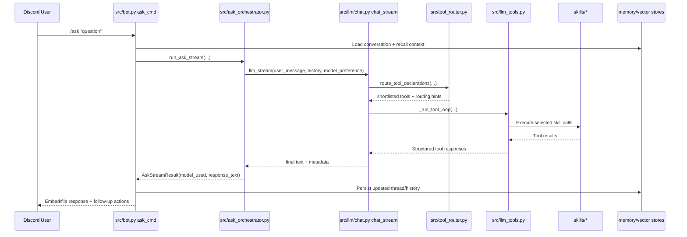

```mermaid
graph TB
    %% ── User Interface ──────────────────────────────────────────
    User(["👤 User"])
    Discord["Discord\nBot API"]

    User -->|"slash commands\n& buttons"| Discord

    %% ── Core Bot ────────────────────────────────────────────────
    subgraph OpenClaw ["🐾 OpenClaw (Docker Container)"]
        Bot["bot.py\nCore: init, auth, /ask\n(1,146 lines)"]
        DiscordCmds["src/discord_commands/\nSlash commands package"]
        DiscordBG["discord_background.py\nBackground loops (702 lines)"]
        DiscordWeb["discord_web.py\nHealth/metrics server"]
        LLM["src/llm/chat.py\nLLM chat/stream entrypoint"]
        LLMClient["llm_client.py\nGemini client wrapper"]
        LLMTools["llm_tools.py\nTool execution engine"]
        LLMPatterns["llm_patterns.py\nQuery classification"]
        LLMRateLimit["llm_ratelimit.py\nRate limiter"]
        ResearchAgent["research_agent.py\nReAct Research Loop"]
        Skills["skills/\nsearch_skills · media_skills\nweb_skills · advanced_skills"]
        DocumentSkills["document_skills.py\nWord & Excel Processing"]
        Gateway["gateway.py\nMaton Client"]
        Approvals["approvals.py\nApproval Workflow"]
        Scheduler["scheduler.py\nCron Jobs"]
        Memory["memory.py\nContext Store + Session Summaries"]
        Spending["spending.py\nCost Tracker"]
        Dashboard["src/dashboard/routes.py\n+ api_handlers.py\nDashboard/API routes"]
        WebhookFmt["webhook_formatter.py\nIncoming Webhook Parser"]
        HealthAlerts["discord_background.py\nContainer Health Alerts\n(every 5 min)"]
        WorkerAgent["worker_agent.py\nBackground Sub-Agent"]
        Maintenance["maintenance_skills.py\n4 AM Cron Maintenance"]
        ObsidianWriter["obsidian_writer.py\nVault Writer"]
        AgentLoop["agent_loop.py\nPlan Management\n8 skills"]
        MonitorSkills["monitor_skills.py\nURL Change Detection"]
        RSSSkills["rss_skills.py\nFeed Monitoring"]
        MissionControl["mission_control.py\nKanban Task Store"]
        ErrorAggregator["error_aggregator.py\nError Dedup Layer"]
        TraceContext["trace_context.py\nCorrelation ID Tracing"]
        NotificationPrefs["notification_prefs.py\nPer-User Alert Prefs"]
        VectorStore["vector_store.py\nChromaDB Semantic Memory\n3 collections"]
        ThreadStore["thread_store.py\nSQLite Thread Persistence\nWAL mode"]
        Metrics["/metrics\nPrometheus Endpoint\n:8765"]
        DigestManager["digest_manager.py\nUser Digest Prefs"]
        TrendTracker["trend_tracker.py\nTime-Series Analysis\nSQLite"]
        AlertManager["alert_manager.py\nTrend Alerts + Rate Limit"]
        SynthesisSkills["synthesis_skills.py\nMulti-API Synthesis"]

        subgraph BotModules ["📦 bot.py modules (extracted)"]
            DiscordCmds
            DiscordBG
            DiscordWeb
        end

        subgraph LLMModules ["📦 LLM runtime modules"]
            LLMClient
            LLMTools
            LLMPatterns
            LLMRateLimit
        end

        subgraph Cogs ["📦 Discord Cogs (src/cogs/) — 17 cogs, 80+ commands"]
            DockerCog["docker_cog.py\n6 commands\n+ interactive select menus"]
            MediaCog["media_cog.py\n6 commands"]
            NetworkCog["network_cog.py\n3 commands"]
            AnalyticsCog["analytics_cog.py\n3 commands"]
            DreamCog["dream_cog.py\n3 commands"]
            MemoryCog["memory_cog.py\n9 commands"]
            ResearchCog["research_cog.py\n6 commands"]
            NotifyCog["notify_cog.py\n7 commands\nper-user alert prefs"]
            DocCog["doc_cog.py\n6 commands\nWord & Excel editing"]
            NoteCog["note_cog.py\n4 commands\nVault notes & search"]
            CalendarCog["calendar_cog.py\n4 commands\nGoogle Calendar"]
            EmailCog["email_cog.py\n4 commands\nGmail / Outlook"]
            JournalCog["journal_cog.py\n4 commands\nVault journaling"]
            GitHubCog["github_cog.py\n4 commands\nPR/issue watching"]
            ReviewCog["review_cog.py\n2 commands\nDoc critique & vault save"]
            InterviewCog["interview_cog.py\n1 command\nModal Q&A synthesis"]
            DigestCog["digest_cog.py\n8 commands\nPersonalized digests"]
        end
    end

    Discord -->|"events & interactions"| Bot
    Bot --> DiscordCmds
    Bot --> DiscordBG
    Bot --> DiscordWeb
    Bot --> LLM
    LLM --> LLMClient
    LLM --> LLMTools
    LLM --> LLMPatterns
    LLM --> LLMRateLimit
    Bot -->|"contextual recall"| VectorStore
    Bot --> ThreadStore
    Bot --> ResearchAgent
    ResearchAgent -->|"index reports"| VectorStore
    Memory -->|"embed summaries"| VectorStore
    Bot --> Approvals
    Bot --> Scheduler
    Bot --> WebhookFmt
    Bot --> HealthAlerts
    Bot --> ErrorAggregator
    ErrorAggregator -->|"deduped alerts"| Discord
    Bot --> TraceContext
    HealthAlerts -->|"unhealthy/exited"| Discord

    %% ── Cogs feed into bot ────────────────────────────────────
    DockerCog --> Bot
    MediaCog --> Bot
    NetworkCog --> Bot
    AnalyticsCog --> Bot
    DreamCog --> Bot
    MemoryCog --> Bot
    ResearchCog --> Bot
    NotifyCog --> Bot
    NotifyCog --> NotificationPrefs
    DocCog --> Bot
    DocCog --> DocumentSkills
    DockerCog --> Skills
    MediaCog --> Skills
    NetworkCog --> Skills
    AnalyticsCog --> Spending
    CalendarCog --> Bot
    EmailCog --> Bot
    JournalCog --> Bot
    GitHubCog --> Bot
    DigestCog --> Bot
    DigestCog --> DigestManager

    %% ── New Components (May 2026) ─────────────────────────────
    LLM --> DigestManager
    LLM --> TrendTracker
    LLM --> SynthesisSkills
    DigestManager -->|"prefs JSON"| DigestStore["data/preferences/\ndigests/<user_id>.json"]
    TrendTracker -->|"time-series data"| ThreadStore
    TrendTracker --> AlertManager
    AlertManager -->|"rate-limited embeds"| Discord
    SynthesisSkills --> TrendTracker
    Skills --> SynthesisSkills
    Scheduler -->|"periodic tracking"| TrendTracker

    LLM --> Skills
    LLM --> Gateway
    LLM --> Memory

    %% ── Worker agent delegation from LLM tool calls ──────────
    LLM -->|"spawn_worker() tool call"| WorkerAgent
    WorkerAgent -->|"own tool loop"| LLM
    Bot -->|"spawn_worker()"| WorkerAgent

    ResearchAgent -->|"plan + synthesize"| LLM
    ResearchAgent -->|"search + browse"| Skills
    Memory --> LLM
    Scheduler -->|"cron jobs"| Skills
    Scheduler -->|"4 AM daily"| Maintenance
    Maintenance -->|"rsync backup"| NAS
    Bot -->|"/bookmark"| ObsidianWriter
    ObsidianWriter -->|"write .md"| VaultStore["data/vault/\nResearch · Bookmarks\nNotes · Analytics"]

    %% ── Agent Loop plan persistence ──────────────────────────
    Bot -->|"plan CRUD"| AgentLoop
    LLM -->|"create/update/read plan"| AgentLoop
    AgentLoop -->|"persist .md"| PlansStore["data/plans/\nPersistent .md plans"]

    %% ── Proactive monitoring loops ───────────────────────────
    Scheduler -->|"periodic check"| MonitorSkills
    Scheduler -->|"periodic fetch"| RSSSkills
    MonitorSkills -->|"snapshots"| SnapshotStore["data/memory/\nurl_snapshots.json"]
    RSSSkills -->|"feeds"| RSSStore["data/memory/\nrss_feeds.json"]
    RSSSkills -->|"digest summary"| LLM
    LLM --> MonitorSkills
    LLM --> RSSSkills

    %% ── Mission Control kanban ───────────────────────────────
    LLM --> MissionControl
    Bot -->|"/tasks"| MissionControl
    MissionControl -->|"persist"| TasksJSON["data/tasks.json\n(volume mount)"]

    %% ── LLM Backends ────────────────────────────────────────────
    subgraph AI ["🤖 AI / LLM Backends"]
        Gemini["Google Gemini\ngemini-2.5-flash\n(primary, tools)"]
        Ollama["Ollama Local\ngemma4:e4b\n(chat + native tools)"]
        OpenAI["OpenAI GPT-4o\n(via Copilot proxy)"]
        Anthropic["Anthropic Claude\nSonnet 4.5\n(via Copilot proxy)"]
        CopilotProxy["Copilot Proxy\nlocalhost:9191\n(routes to OpenAI/Anthropic)"]
        ModelRouter["model_router.py\nQuery Classifier"]
    end

    LLM -->|"model_router.py"| ModelRouter
    ModelRouter -->|"tool-calling queries"| Gemini
    ModelRouter -->|"simple chat"| Ollama
    ModelRouter -->|"code queries"| CopilotProxy
    ModelRouter -->|"creative writing"| CopilotProxy
    CopilotProxy -->|"code/reasoning"| Anthropic
    CopilotProxy -->|"creative/general"| OpenAI
    Gemini -->|"token cost"| Spending

    %% ── API Gateway ─────────────────────────────────────────────
    subgraph MatonGW ["🔌 Maton API Gateway\nhttps://gateway.maton.ai"]
        MatonCore["Managed OAuth Proxy\n100+ APIs"]
    end

    Gateway -->|"MATON_API_KEY"| MatonCore
    MatonCore -.->|"100+ SaaS APIs"| ExtAPIs[("External\nSaaS APIs")]

    %% ── Search Skills ───────────────────────────────────────────
    subgraph SearchSkills ["🔍 Search Cascade (5-tier)"]
        Perplexity["Perplexity AI\n(primary, synthesized answers)"]
        Firecrawl["Firecrawl\n(search + extract)"]
        Tavily["openclaw-tavily-search\ntavily_search.py"]
        DDG["free-web-search\nweb_search.py"]
        BingLite["Bing Lite\n(last resort)"]
        Serper["Serper Google SERP\n(direct tool, not in cascade)"]
    end

    Skills -->|"tier 1"| Perplexity
    Skills -->|"tier 2"| Firecrawl
    Skills -->|"tier 3"| Tavily
    Skills -->|"tier 4"| DDG
    Skills -->|"tier 5"| BingLite
    Skills -->|"direct tool"| Serper
    Perplexity -->|"PERPLEXITY_API_KEY"| PerplexityAPI["Perplexity API\nhttps://api.perplexity.ai"]
    Firecrawl -->|"FIRECRAWL_API_KEY"| FirecrawlAPI["Firecrawl API\nhttps://api.firecrawl.dev"]
    Tavily -->|"TAVILY_API_KEY"| TavilyAPI["Tavily API\nhttps://api.tavily.com"]
    DDG --> DDGNet["DuckDuckGo Lite\n+ Bing HTML fallback"]
    Serper -->|"SERPER_API_KEY"| SerperAPI["Google SERP API\nhttps://google.serper.dev"]
    Skills -->|"get_weather"| WttrIn["wttr.in\nWeather API (free)"]

    %% ── Premium API Integrations ──────────────────────────────
    subgraph PremiumAPIs ["📰 Premium API Integrations"]
        NewsAPI["NewsAPI.org\n100 req/day"]
        APISports["API-Sports\n100 req/day"]
        AlphaVantage["Alpha Vantage\n25 req/day"]
    end

    SynthesisSkills -->|"NEWSAPI_KEY"| NewsAPI
    SynthesisSkills -->|"APISPORTS_KEY"| APISports
    SynthesisSkills -->|"ALPHAVANTAGE_KEY"| AlphaVantage
    Skills -->|"news search"| NewsAPI
    Skills -->|"sports scores"| APISports
    Skills -->|"stock data"| AlphaVantage

    %% ── Mission Control ─────────────────────────────────────────
    MissionControl -->|"gh CLI sync"| GHPages["GitHub Pages\ndavevoyles.github.io/openclaw-dashboard"]

    %% ── Autonomy Skills ────────────────────────────────────────
    subgraph AutonomySkills ["🧠 Autonomy Skills (ClawHub)"]
        OntologyMod["ontology_skills.py\nstructured graph memory"]
        OntologyStore["data/memory/ontology\ngraph.jsonl + schema.yaml"]
        SelfImprove["self-improving\ninstruction bundle"]
        SkillVetter["skill-vetter\ninstallation guardrail"]
    end

    LLM --> OntologyMod
    OntologyMod -->|"subprocess"| OntologyStore

    %% ── Communication ───────────────────────────────────────────
    subgraph Comms ["📨 Communication"]
        Email["email_skills.py"]
        AgentMailMod["agentmail.py"]
        CalSkills["calendar_skills.py"]
    end

    Skills --> Email
    Skills --> AgentMailMod
    Skills --> CalSkills

    Email -->|"SMTP/IMAP"| Gmail["Gmail\n(App Password)"]
    Email -->|"SMTP/IMAP"| Outlook["Outlook / M365\n(App Password)"]
    AgentMailMod -->|"AGENTMAIL_API_KEY"| AgentMailAPI["AgentMail.to API"]
    CalSkills -->|"OAuth2 tokens"| GoogleCal["Google Calendar API"]
    CalSkills -->|"OAuth2"| GoogleOAuth["Google OAuth2\nconsole.cloud.google.com"]

    %% ── Media Stack ─────────────────────────────────────────────
    subgraph MediaStack ["🎬 Media Stack (Home Server)"]
        Sonarr["Sonarr :8989\nTV Shows"]
        Radarr["Radarr :7878\nMovies"]
        Lidarr["Lidarr :8686\nMusic"]
        Prowlarr["Prowlarr :9696\nIndexers"]
        SABnzbd["SABnzbd :8775\nUsenet DL\n(via gluetun VPN)"]
        QBit["qBittorrent :8080\nTorrent DL\n(via gluetun VPN)"]
        Gluetun["gluetun\nVPN Container\n(on NAS)"]
        Plex["Plex Media\nServer"]
        Tautulli["Tautulli :8181\nPlex Metrics"]
        Overseerr["Overseerr :5055\nMedia Requests"]
    end

    Skills --> Sonarr
    Skills --> Radarr
    Skills --> Lidarr
    Skills --> Prowlarr
    Skills --> SABnzbd
    Skills --> QBit
    Skills --> Tautulli
    Skills --> Overseerr
    Skills -.->|"VPN health check"| Gluetun

    Gluetun --> SABnzbd
    Gluetun --> QBit
    Prowlarr --> SABnzbd
    Prowlarr --> QBit
    Sonarr --> SABnzbd
    Sonarr --> QBit
    Radarr --> SABnzbd
    Radarr --> QBit
    SABnzbd -->|"completed files"| Plex
    QBit -->|"completed files"| Plex
    Plex --> Tautulli
    Overseerr --> Sonarr
    Overseerr --> Radarr
    Approvals -->|"approve/deny requests"| Overseerr

    %% ── NAS & Storage ───────────────────────────────────────────
    subgraph NASStack ["💾 NAS (Synology DSM)"]
        NAS["Synology NAS\nnas.py"]
        Traefik["Traefik\nReverse Proxy\n:80/:443"]
        SynDDNS["Synology DDNS\ndavevoyles.synology.me"]
    end

    Skills --> NAS
    SynDDNS --> Traefik
    Traefik -->|"routes to"| MediaStack

    %% ── Infrastructure ──────────────────────────────────────────
    subgraph Infra ["⚙️ Infrastructure"]
        DockerEngine["Docker Engine\n/var/run/docker.sock"]
        Glances["Glances :61208\nSystem Stats"]
        Tailscale["Tailscale VPN\nMesh Network"]
        Cloudflare["Cloudflare\nSpeed Test"]
    end

    Skills --> DockerEngine
    Skills --> Glances
    Skills --> Tailscale
    Skills --> Cloudflare

    %% ── Observability ───────────────────────────────────────────
    subgraph Observability ["📊 Observability"]
        Prometheus["Prometheus\nScrapes :8765/metrics"]
        UptimeKuma["Uptime Kuma\nStatus Page"]
    end

    Metrics --> Prometheus
    Metrics --> UptimeKuma

    %% ── Styles ──────────────────────────────────────────────────
    classDef service fill:#1e3a5f,stroke:#4a90d9,color:#fff
    classDef external fill:#2d4a1e,stroke:#6abf40,color:#fff
    classDef gateway fill:#4a1e3f,stroke:#c040a0,color:#fff
    classDef infra fill:#3a2d1e,stroke:#c08040,color:#fff
    classDef actor fill:#1e1e3a,stroke:#6060d9,color:#fff

    class Discord,Bot,DiscordCmds,DiscordBG,DiscordWeb,LLM,LLMClient,LLMTools,LLMPatterns,LLMRateLimit,ResearchAgent,Skills,Gateway,Approvals,Scheduler,Memory,Spending,Metrics,Dashboard,WebhookFmt,HealthAlerts,WorkerAgent,Maintenance,ObsidianWriter,AgentLoop service
    class DockerCog,MediaCog,NetworkCog,AnalyticsCog,DreamCog,MemoryCog,ResearchCog,NotifyCog,CalendarCog,EmailCog,JournalCog,GitHubCog service
    class Gemini,Ollama,OpenAI,Anthropic,CopilotProxy,ModelRouter,PerplexityAPI,FirecrawlAPI,TavilyAPI,DDGNet,SerperAPI,Gmail,Outlook,AgentMailAPI,GoogleCal,GoogleOAuth external
    class MatonCore,ExtAPIs gateway
    class DockerEngine,Glances,Tailscale,Cloudflare,Prometheus,UptimeKuma,NAS,Traefik,SynDDNS infra
    class User actor
```

# OpenClaw — Architecture Diagram
<!-- Updated: 2026-04-18 -->


This diagram shows how all services, APIs, and components interconnect. Use it to understand data flow before adding new integrations.

Key architectural patterns:
- **Cogs** (`src/cogs/`) register as Discord command groups and feed into `bot.py`
- **Worker agents** are spawned from LLM tool calls via `spawn_worker()` and run their own tool loop
- **Agent plans** are persisted as Markdown in `data/plans/` via `agent_loop.py`
- **Proactive loops** (`monitor_skills.py`, `rss_skills.py`) run on the scheduler and alert on changes
- **Mission Control** (`mission_control.py`) acts as a Kanban store backed by `data/tasks.json`

---

## Architecture Map (Runtime Services)

```mermaid
flowchart LR
    U[Discord User] --> D[Discord API/Gateway]
    D --> BOT[src/bot.py\n/ask + orchestration]
    CLI[CLI Client\nOpenClaw / openclaw\nsrc/openclaw_cli.py] --> WEB[src/discord_web.py\nhealth + dashboard API host]
    SLACK[Slack User] --> SLACKAPI[Slack API\nSocket Mode WS]
    SLACKAPI --> SLACKBOT[src/slack_bot.py\nBolt SDK Socket Mode]
    SLACKBOT --> ORCH
    CLI --> CLISTATE[src/openclaw_cli_sessions.py\nlocal CLI sessions]
    CLI --> CLIACT[src/openclaw_cli_actions.py\nshell + file actions]

    BOT --> ORCH[src/ask_orchestrator.py\nrun_ask_stream()]
    ORCH --> LLM[src/llm/chat.py\nchat_stream()]
    LLM --> ROUTER[src/tool_router.py\nroute_tool_declarations()]
    LLM --> TOOLS[src/llm_tools.py\ntool loop executor]
    TOOLS --> SKILLS[skills/*]

    BOT --> BG[src/discord_background.py\nsupervised loops]
    BOT --> SCHED[src/scheduler.py\nTaskScheduler]
    BOT --> WEB[src/discord_web.py\nhealth + dashboard API host]
    WEB --> DASH[src/dashboard/routes.py\nsrc/dashboard/api_handlers.py]

    BOT --> MEM[src/memory.py\nconversation store]
    LLM --> VEC[src/vector_store.py\nChromaDB recall/write]
    BOT --> THREADS[src/thread_store.py\nthread persistence]
```

## Discord Request Lifecycle (`/ask`)



## Runtime Component Boundaries

| Runtime Service | Primary Responsibility | Main Entry Points |
| --- | --- | --- |
| Discord bot runtime | Command handling, `/ask` orchestration, response formatting, per-user context | `src/bot.py`, `src/ask_orchestrator.py`, `src/discord_commands/` |
| LLM routing + tool execution | Model selection, tool declaration routing, tool loop execution | `src/llm/chat.py`, `src/model_router.py`, `src/tool_router.py`, `src/llm_tools.py` |
| Web API + dashboard | Health/metrics endpoints and dashboard JSON/HTML APIs | `src/discord_web.py`, `src/dashboard/routes.py`, `src/dashboard/api_handlers.py` |
| CLI client | Local/remote terminal access via authenticated ask API, interactive chat defaults, one-shot prompts, repo/file-aware analyze flows, tracked shell/file actions, and resumable local sessions | `src/openclaw_cli.py`, `src/openclaw_cli_sessions.py`, `src/openclaw_cli_actions.py`, `scripts/openclaw_cli.py`, installer launchers (`openclaw`, `OpenClaw`) |
| Scheduler + background loops | Cron/interval jobs, proactive monitors, reminder/briefing loops | `src/scheduler.py`, `src/discord_background.py` |
| Worker agents | Delegated sub-task execution for complex asks via tool calls | `src/worker_agent.py` |
| Memory stores | Conversation history, semantic recall, structured memory/thread persistence | `src/memory.py`, `src/vector_store.py`, `src/thread_store.py`, `src/qmd.py` |
| Slack bot runtime | Slack message handling, /ask via slash command, @mention handling, mrkdwn formatting | `src/slack_bot.py` |

## Satellite Services

These services run as separate containers on the `openclaw_default` Docker network and connect to openclaw via its HTTP API:

| Service | Container | Port | Purpose | Connection |
|---|---|---|---|---|
| Open WebUI | `open-webui` | 3000 → 8080 | AI chat interface | `http://openclaw:8765/v1` (OpenAI-compat) |
| Dashboard v2 | `dashboard-v2` | 7001 → 3001 | Monitoring dashboard | `http://openclaw:8765` (health/metrics/API) |

External URLs (via Synology DDNS + reverse proxy):
- Open WebUI: https://chat.davevoyles.synology.me
- Dashboard: https://openclaw-dashboard.davevoyles.synology.me

## Architecture deep dives

- [LLM routing and orchestration](LLM-ROUTING.md) — end-to-end provider selection, tool routing, retries, and fallback-to-Gemini behavior.
- [Resilience and fallback behavior](RESILIENCE.md) — error handling, circuit breakers, supervisor restarts, health-state classification, and CLI recovery paths.
- [Persistence and versioning boundaries](PERSISTENCE.md) — SQLite, JSON, JSONL, and in-memory storage responsibilities.
- [Background tasks and scheduler architecture](BACKGROUND_TASKS.md) — supervised loops, periodic jobs, and operational observability.

---



---

## Data Flow Summary

| Flow                            | Path                                                                                                                                            |
| ------------------------------- | ----------------------------------------------------------------------------------------------------------------------------------------------- |
| **User command → response**     | User → Discord → `bot.py` → `ask_orchestrator.py` → `llm/chat.py` (`llm_client` + `llm_tools` + `tool_router`) → `skills/` → target service → Discord |
| **Media request approval**      | User → Discord → `approvals.py` → Overseerr → Sonarr/Radarr → SABnzbd/qBit (via gluetun VPN on NAS) → Plex                                                               |
| **Web search (5-tier cascade)** | `search_web()` → Perplexity AI (primary) → Firecrawl (search+extract) → Tavily (structured) → DuckDuckGo Lite (free) → Bing HTML scrape (last resort); Serper Google SERP available as direct tool |
| **Weather**                     | `/weather` or `/ask weather…` → `llm/chat.py` → `get_weather()` → `wttr.in` JSON API                                                                 |
| **Deep research**               | `/research` → `research_agent.py` → Gemini (plan) → `search_web()` × N → `browse_url()` → Gemini (synthesize) → Discord thread                  |
| **Session recall**              | Session expires → `memory.py` → `summarize_conversation()` → saved to disk + QMD; next session → recall note injected                           |
| **Task management**             | User → Discord `/tasks` or `/ask "show tasks"` → `mission_control.py` → `data/tasks.json` → GitHub Pages dashboard                              |
| **Structured memory**           | `llm/chat.py` → `ontology_skills.py` → `skills/ontology/scripts/ontology.py` → `data/memory/ontology/graph.jsonl`                                    |
| **Third-party API call**        | `llm/chat.py` → `gateway.py` → Maton OAuth proxy → target SaaS API                                                                                   |
| **Email / calendar**            | `llm/chat.py` → `skills/` → `email_skills.py` / `calendar_skills.py` → Gmail / Outlook / Google Cal                                                  |
| **Observability**               | Bot `/metrics` → Prometheus scrape + Uptime Kuma poll                                                                                           |
| **Cost tracking**               | Every Gemini call → `spending.py` → `data/memory/spending.json`                                                                                 |
| **Scheduled tasks**             | `scheduler.py` cron → any skill function                                                                                                        |
| **Incoming webhook**            | Sonarr/Radarr/Plex/qBittorrent → `webhook_formatter.py` → `bot.py` → Discord notification                                                       |
| **Container health alerts**     | `discord_background.py` (every 5 min) → `list_containers()` + `check_gluetun_vpn()` → filter unhealthy/exited/VPN down → Discord `#alerts` embed                                  |
| **Scheduled research**          | `scheduler.py` cron → `schedule_research_report(topic, cron)` → `research_agent.py` → Discord thread + vault                                     |
| **API quota dashboard**         | Browser → `:8765/api/quota-status` → `spending.py` `get_quota_status()` → JSON; dashboard card auto-refreshes                                    |
| **Dashboard**                   | Browser → `:8765/dashboard` → `discord_web.py` + `dashboard/routes.py` → HTML page + `/api/dashboard` JSON + `/api/quota-status`; control-plane views: `/api/plans` (agent-loop plans), `/api/tasks` (unified Mission Control + scheduler tasks), `/api/agent/sessions` (terminal CLI sessions — click a session for plan/task linkage, progress log, intervention history, and Watch Insights: per-poll checkpoint timeline + retry history) |
| **Background autonomy**         | `worker_agent.py` → spawns fresh Gemini session → `llm` runtime (`llm/chat.py` + tool loop) → skills                                                                             |
| **RSS feeds**                   | `scheduler.py` (periodic) → `rss_skills.py` → external feeds → `data/memory/rss_feeds.json` → LLM summarization → Discord notification                     |
| **URL change detection**        | `scheduler.py` (periodic) → `monitor_skills.py` → `_fetch_text()` → SHA-256 compare → `data/memory/url_snapshots.json` → alert on diff                     |
| **Obsidian bookmark**           | `/bookmark` → `obsidian_writer.py` → Markdown + YAML frontmatter → `data/vault/{Research,Bookmarks,Notes,Analytics}/`                           |
| **4 AM maintenance**            | `scheduler.py` (4:00 AM) → `maintenance_skills.py` → git pull skills, restart sessions, rsync config+tasks → NAS                                |
| **Channel-role routing**        | Discord message → `bot.py` checks channel ID → injects per-channel prompt override from `config.yaml` `channels.roles`                          |
| **Parallel sub-agent**          | `bot.py` or LLM → `worker_agent.py` `spawn_worker(goal)` → fresh Gemini session with own tool loop → result returned to caller                  |
| **Agent plan lifecycle**        | `/ask` or LLM → `agent_loop.py` `create_plan()` → `.md` persisted to `data/plans/` → steps tracked via `update_plan_step()` → survives restarts |
| **Plan resumption on startup**  | `bot.py` `on_ready` → `agent_loop.scan_interrupted()` → notifies `ALERT_CHANNEL_ID` of interrupted plans → user can `/resume-plan`              |
| **Semantic memory embed**       | `qmd.py` `remember_fact()` or `memory.py` summary → `vector_store.py` `add_memory()` / `add_conversation_summary()` → ChromaDB `data/chromadb/` |
| **Contextual recall injection** | `bot.py` pre-LLM hook → `vector_store.py` `recall(query, top_k=3)` → top 3 results injected as `[Relevant context]` block before each `/ask`    |
| **Research indexing**           | `research_agent.py` post-synthesis → `vector_store.py` `add_research_report()` → ChromaDB `research` collection; URLs → `sources` metadata       |
| **Correction learning**        | `bot.py` post-response → `rules_engine.py` `detect_correction()` → `extract_rule()` → JSON + ChromaDB; rules injected before each `/ask`         |
| **User profile learning**      | `bot.py` post-response → `user_profile.py` `learn_from_message()` → JSON + ChromaDB; profile injected before each `/ask`                         |
| **Memory decay**               | `maintenance_skills.py` `run_memory_decay()` (daily 4AM) → `vector_store.py` `get_decayed_documents()` → `mark_decayed()` → 10% similarity penalty |
| **Session handover**           | `memory.py` `cleanup_expired()` → `create_session_handover()` → JSON + ChromaDB; injected at start of next conversation                          |
| **Knowledge routing**          | `qmd.py` `remember_fact()` → `_classify_fact()` → routes to `user_profile` / `rules_engine` / QMD+ChromaDB based on content                     |
| **Auto-RAG injection**        | `bot.py` pre-LLM → `vector_store.recall(top_k=5)` + `user_profile` + `rules_engine` → context block injected before every LLM call              |
| **Multi-model routing**       | `bot.py` → `model_router.py` `classify_query()` → code→Claude, creative→GPT-4o, tools→Gemini, chat→Gemma                                       |
| **Copilot proxy**             | `llm/chat.py` → model router/copilot bridge → `localhost:9191/v1/chat/completions` → GitHub Copilot API → OpenAI/Anthropic response                              |
| **Fact extraction**           | `bot.py` post-response → `fact_extractor.extract_facts()` → `should_store()` similarity check → `qmd.remember_fact()` with confidence=0.6       |
| **Ollama tool calling**       | `llm/chat.py` + `ollama_tools.py` `ollama_chat_with_tools()` → Ollama API with tool declarations → execute read-only tools → return result           |
| **Notification prefs**       | `/notify` → `notify_cog.py` → `notification_prefs.py` → `data/notification_prefs.json`; checked before every alert dispatch                      |
| **Error aggregation**        | `error_aggregator.py` receives alerts → dedup by fingerprint → batch similar errors → single Discord notification with count                       |
| **Request tracing**          | `trace_context.py` assigns correlation ID → propagated through LLM calls, skill executions, API requests → structured log output                   |
| **Thread-based /ask**        | `/ask` (3+ exchanges) → auto-create Discord thread → follow-up messages handled without `/ask` prefix inside thread                                |
| **Digest generation**        | User → `/digest-config` → `digest_manager.py` → prefs JSON; `/digest` → parallel API calls (NewsAPI + API-Sports + Alpha Vantage) → relevance scoring → Discord embed |
| **Trend tracking**           | `scheduler.py` (periodic) → `trend_tracker.py` → fetch data from APIs → SQLite time-series storage → anomaly detection → `alert_manager.py` → Discord alert (rate-limited) |
| **Synthesis reports**        | LLM → `synthesis_skills.py` → parallel API calls (NewsAPI + Alpha Vantage + API-Sports) → LLM summary (3 sentences) → correlation analysis → structured report |

---

## Multi-Model Routing (Phase 15)

OpenClaw supports 5 model backends, selected automatically by `model_router.py` or manually via `/ask model:<pref>`:

| Backend    | Model              | Endpoint                  | Use Case                          |
| ---------- | ------------------ | ------------------------- | --------------------------------- |
| `gemini`   | Gemini 2.5 Flash   | Google AI API             | Tool calling, complex analysis    |
| `local`    | Gemma 4 E4B        | Ollama (localhost:11434)  | Simple chat, native tool calling  |
| `openai`   | GPT-4o             | Copilot proxy (:9191)     | Creative writing, general knowledge |
| `anthropic`| Claude Sonnet 4.5  | Copilot proxy (:9191)     | Code review, careful reasoning    |
| `auto`     | (classified)       | (routed by category)      | Default — picks best model        |

### Copilot Proxy Architecture

GPT-4o and Claude are accessed through a local proxy server that translates OpenAI-compatible API calls using your GitHub Copilot subscription. No separate API keys needed.

```
Bot (`llm/chat.py`) → `model_router.py` (classify) → Copilot Proxy (:9191) → GitHub Copilot API → OpenAI/Anthropic
```

Setup: `bash scripts/setup-copilot-proxy.sh`

---

## Auto-RAG Pipeline

Every `/ask` call goes through the Auto-RAG pipeline before reaching the LLM:

```
User message
    │
    ├─→ vector_store.recall(query, top_k=5)  → top 5 relevant memories
    ├─→ user_profile.get_profile_prompt()    → structured user preferences
    ├─→ rules_engine.get_relevant_rules()    → learned correction rules
    │
    └─→ [context block] injected before system prompt → LLM call
```

This ensures the LLM always has access to relevant facts, user preferences, and past corrections without explicit recall commands.

---

## Memory Pipeline

Automatic fact extraction and deduplication flow:

```
Conversation exchange (user message + LLM response)
    │
    ├─→ fact_extractor.extract_facts()       → candidate facts
    ├─→ fact_extractor.should_store()         → similarity check (>90% = skip)
    ├─→ qmd.remember_fact()                  → persist to QMD + ChromaDB
    │       └─→ confidence: 0.9 (explicit /remember) or 0.6 (auto-extracted)
    │
    └─→ user_profile.learn_from_message()    → update structured profile
```

Key properties:
- **Deduplication**: >90% cosine similarity with existing memories → skip
- **Confidence weighting**: explicit `/remember` = 0.9, auto-extracted = 0.6
- **Configurable embeddings**: set `EMBEDDING_MODEL` env var to swap models (default: `all-MiniLM-L6-v2`)

---

## New Components (May 2026)

### DigestManager (`src/digest_manager.py`)

**Purpose:** Manages user preferences and generates personalized content digests

**Key Components:**
- **`DigestPreferences`** — User preference data model
  - Topics: News categories to track (e.g., "AI", "crypto", "sports")
  - Stocks: Tickers to monitor (e.g., "TSLA", "AAPL", "NVDA")
  - Teams: Sports teams to follow (e.g., "Lakers", "Cowboys")
  - Keywords: Custom search terms
  - Exclude: Blacklist terms to filter out
  - Schedule: `daily`, `weekly`, `custom`, `manual`
  - Delivery time/day: When to send digests
  - Format: `concise`, `detailed`, `bullets`
  - Max items: Limit on digest length (default: 10)
  - Channels: Delivery targets (`dm` or channel IDs)
- **`DigestManager`** — Main manager class with CRUD operations
- **Storage:** JSON files at `/memory/preferences/digests/<user_id>.json`
- **Atomic writes:** Uses `atomic_write()` to prevent data corruption

**Methods:**
- `save_preferences(user_id, preferences)` — Store user digest preferences
- `get_preferences(user_id)` — Retrieve preferences (returns defaults if not found)
- `generate_digest(user_id, preview=False)` — Generate personalized digest from configured sources
- `calculate_relevance(item, preferences)` — Score content by user relevance (0.0–3.0)
  - Title match: +1.0
  - Keyword match: +0.5 per keyword
  - Source priority: +0.3
  - Recency bonus: +0.2 for <24h old

**Data Flow:**
```
User → Discord commands or LLM skills
  ↓
save_preferences() → /memory/preferences/digests/<user_id>.json (atomic write)
  ↓
generate_digest() → parallel API calls (NewsAPI + API-Sports + Alpha Vantage)
  ↓
calculate_relevance() → score & filter items
  ↓
Format output → Discord (embed or text)
```

**Integration Points:**
- **Skills:** 11 digest skills in `skills/digest_skills.py`
  - `save_digest_preferences()`, `get_user_digest()`, `add_digest_topics()`, etc.
- **Discord:** `digest_cog.py` with slash commands (`/digest`, `/digest-config`)
- **Scheduler:** Can be integrated with `scheduler.py` for scheduled delivery
- **APIs:** NewsAPI, API-Sports, Alpha Vantage (via synthesis layer)

---

### TrendTracker (`src/trend_tracker.py`)

**Purpose:** Time-series data storage, analysis, and anomaly detection

**Architecture:**
- **Database:** SQLite at `/memory/openclaw.db` (reuses existing database)
- **Tables:**
  - `trend_data` — Time-series data points (timestamp, topic, category, volume, sentiment, sources, metadata)
  - `trend_config` — Tracking configuration per topic (thresholds, enabled status, last check time)
- **Rolling Window Analysis:** 24-hour, 7-day, 30-day comparisons
- **Data Retention:** 90 days (configurable via `cleanup_old_data()`)

**Detection Algorithms:**

| Algorithm         | Threshold             | Description                                      |
| ----------------- | --------------------- | ------------------------------------------------ |
| Volume spike      | 3.0x avg              | 3× normal volume = spike detected                |
| Sentiment shift   | ±0.3 change           | 0.3+ change in sentiment (scale: -1.0 to 1.0)    |
| Velocity          | 2.0x acceleration     | 2× rate of change acceleration = trending        |
| Breakout          | New topic emergence   | First appearance of topic in tracking window     |
| Z-score anomaly   | 2σ deviation          | 2 standard deviations from mean = statistical anomaly |

**Methods:**
- `track_entity(topic, category)` — Start tracking a topic (creates config entry)
- `record_data_point(topic, category, volume, sentiment, sources)` — Insert time-series data
- `get_trend(topic, window="7d")` — Get trend data for time window (`24h`, `7d`, `30d`)
- `detect_anomalies(topic)` — Identify spikes, shifts, and breakouts
- `is_trending(topic, threshold=2.0)` — Check if topic meets trending criteria
- `get_trending_topics(limit=10)` — Get top trending topics
- `cleanup_old_data(retention_days=90)` — Purge old data points

**Background Jobs:**
- Periodic data collection (1–6 hour intervals via scheduler)
- Automatic trend score updates
- Old data cleanup (runs during 4 AM maintenance)

**Integration:**
- **Skills:** 6+ trend skills in `skills/trend_skills.py`
  - `track_topic()`, `get_trends()`, `detect_trending()`, etc.
- **Alerts:** `AlertManager` for Discord notifications
- **APIs:** All 3 premium APIs for data collection (NewsAPI, API-Sports, Alpha Vantage)
- **Synthesis:** `synthesis_skills.py` uses trend data for context-aware reports

**Data Model Example:**
```json
{
  "topic": "AI regulation",
  "category": "technology",
  "current_volume": 24,
  "avg_volume_7d": 8.3,
  "volume_change_pct": 189.2,
  "current_sentiment": 0.45,
  "sentiment_change_24h": 0.12,
  "velocity": 2.8,
  "is_trending": true,
  "is_spike": true,
  "trend_direction": "up",
  "z_score": 2.4,
  "sources": ["TechCrunch", "The Verge", "Ars Technica"]
}
```

---

### AlertManager (`src/alert_manager.py`)

**Purpose:** Discord alerting for trend detection with rate limiting and rich formatting

**Features:**
- **Discord embed formatting** with trend charts and data
- **Rate limiting:** 1 alert per hour per topic (prevents notification spam)
- **Alert cooldown tracking** in-memory (keyed by topic hash)
- **ASCII chart rendering** for text-based trend visualization
- **Color-coded embeds:** Green (bullish), Red (bearish), Orange (spike), Blue (neutral)

**Methods:**
- `format_trend_alert(analysis, alert_type)` — Create Discord embed from `TrendAnalysis`
  - Alert types: `TRENDING`, `SPIKE`, `BREAKOUT`, `SENTIMENT`
  - Emoji mapping: 🚨 (trending), 📈 (spike), 🆕 (breakout), 💭 (sentiment)
- `send_trend_alert(channel, topic, trend)` — Send alert if not in cooldown (1-hour default)
- `render_text_chart(data_points)` — Generate ASCII sparkline chart (e.g., `▁▂▃▅▇`)
- `is_on_cooldown(topic)` — Check if topic alert is in cooldown period

**Alert Types & Formatting:**

| Type       | Emoji | Color  | Trigger Condition                              |
| ---------- | ----- | ------ | ---------------------------------------------- |
| TRENDING   | 🚨    | Red    | Volume trending + velocity > 2.0x              |
| SPIKE      | 📈    | Orange | Volume > 3.0x average                          |
| BREAKOUT   | 🆕    | Green  | New topic with high initial volume             |
| SENTIMENT  | 💭    | Blue   | Sentiment shift ≥ ±0.3                         |

**Discord Embed Structure:**
- **Title:** Emoji + alert type + topic name
- **Fields:**
  - Volume: Current count + % change vs 7-day avg
  - Sentiment: Score (-1.0 to 1.0) + 🟢/🔴/⚪ indicator + 24h change
  - Trend: Direction (🔥 up / ❄️ down / ➡️ stable)
  - Peak time: When highest volume occurred
  - Sources: Top contributing sources
- **Footer:** Timestamp + detection threshold used
- **Thumbnail:** Topic-relevant icon (if available)

**Cooldown Logic:**
```python
# Send alert only if not on cooldown
if not alert_manager.is_on_cooldown("AI regulation"):
    await alert_manager.send_trend_alert(channel, "AI regulation", trend_data)
    # Next alert for this topic allowed in 1 hour
```

**Integration:**
- **TrendTracker:** Consumes `TrendAnalysis` objects for formatting
- **Discord:** Sends embeds to configured alert channels
- **Scheduler:** Can be triggered by periodic trend checks
- **Skills:** `trend_skills.py` and `monitor_skills.py` use for alerting

---

### Multi-Source Data Synthesis (`skills/synthesis_skills.py`)

**Purpose:** Intelligent data synthesis with LLM-powered insights across multiple APIs

**Architecture:**
- **Parallel API calls** using `asyncio.gather()` for concurrent data fetching
- **Smart caching:** 15-minute TTL preserves API rate limits
- **Circuit breakers:** Graceful degradation on API failures (via `tool_health.py`)
- **LLM integration:** Generates 2–3 sentence insights connecting data points
- **Source correlation:** Identifies relationships between stock prices, news sentiment, and events

**Core Functions:**

#### `synthesize_company_report(ticker: str)`
Combines stock data, news, and sentiment for a single company.

**Process:**
1. Parallel fetch:
   - Stock price & change (Alpha Vantage)
   - News articles (NewsAPI filtered by ticker)
   - Sentiment analysis (Alpha Vantage sentiment API)
2. LLM analysis: Generates narrative connecting price movements to news events
3. Correlation scoring: Aligns stock performance with sentiment trends
4. Output: Structured report with synthesis narrative

**Example Output:**
```json
{
  "ticker": "DIS",
  "stock_price": 94.58,
  "change_pct": 5.2,
  "sentiment_score": 0.15,
  "news_count": 8,
  "synthesis": "Disney stock rose 5.2% following Moana 2's $221M opening weekend, the largest ever for a Thanksgiving release. Positive sentiment (+0.15) reflects analyst optimism about Q4 parks revenue.",
  "correlation": "STRONG",  // stock +5.2%, sentiment +0.15, 3 positive articles
  "sources": ["Variety", "Hollywood Reporter", "CNBC"]
}
```

#### `synthesize_entertainment_report(topic: str)`
Links box office performance with entertainment company stocks.

**Data Sources:**
- Box office earnings (Alpha Vantage)
- Studio stock prices (DIS, PARA, WBD)
- Entertainment news (NewsAPI)

#### `synthesize_market_overview()`
Generates comprehensive market overview with economic context.

**Includes:**
- Major indices (S&P 500, Nasdaq, Dow)
- Sector performance (top/bottom 3)
- Economic news headlines
- LLM synthesis of market drivers

**Rate Limit Efficiency:**

| Scenario                | API Calls Per Report | Reports Per Day (100 req/day limit) |
| ----------------------- | -------------------- | ----------------------------------- |
| Without cache           | 3                    | ~33 reports                         |
| With cache (15-min TTL) | 0.2 (avg)            | ~500 reports                        |
| Parallel synthesis      | 1 (amortized)        | ~100 reports                        |

**Cache Strategy:**
- Key: Function name + parameters hash
- TTL: 15 minutes (balances freshness with API limits)
- Invalidation: Automatic on TTL expiry
- Storage: In-memory dictionary (resets on bot restart)

**LLM Summary Generation:**
```python
system_prompt = (
    "You are a financial analyst generating 3-sentence summaries. "
    "Connect data points, highlight correlations, and provide actionable insights. "
    "Be concise, factual, and focus on cause-effect relationships."
)
# Temperature: 0.3 (factual, deterministic)
# Max tokens: 200 (ensures conciseness)
```

**Integration:**
- **Skills:** `digest_skills.py`, `finance_skills.py`, `news_skills.py`
- **LLM:** Uses `llm_patterns._client` for summarization
- **APIs:** NewsAPI, API-Sports, Alpha Vantage (via `http_session.SessionManager`)
- **Error Handling:** Circuit breaker pattern with fallback to cached data

---

### Premium API Integrations

OpenClaw integrates three external APIs for real-time data. All use `http_session.SessionManager` for connection pooling and circuit breakers for fault tolerance.

#### NewsAPI.org

- **Endpoint:** `https://newsapi.org/v2`
- **Auth:** API key in query param (`apiKey=<key>`)
- **Rate limit:** 100 requests/day (Developer tier)
- **Skills:** `search_news()`, `top_headlines()`, `news_by_source()` in `news_skills.py`
- **Features:**
  - Full-text search across 150,000+ sources
  - Filter by category, language, date range
  - Sorting by relevance, popularity, publishedAt
- **Caching:** 15-minute TTL for repeated queries
- **Error handling:** Falls back to cached results on 429 (rate limit)

**Example Call:**
```python
articles = await search_news(
    query="artificial intelligence regulation",
    sources="techcrunch,theverge",
    language="en",
    sort_by="publishedAt"
)
# Returns: List of articles with title, description, url, publishedAt, source
```

#### API-Sports

- **Endpoint:** `https://v1.basketball.api-sports.io` (+ `/football`, `/soccer`, etc.)
- **Auth:** `x-apisports-key` header
- **Rate limit:** 100 requests/day (Free tier)
- **Skills:** `get_nba_scores()`, `get_nfl_scores()`, `get_team_standings()`, `get_schedule()` in `sports_skills.py`
- **Features:**
  - Live scores and schedules for NBA, NFL, MLB, NHL
  - Team standings and statistics
  - Player stats and lineups
- **Caching:** 5-minute TTL for live scores, 1-hour for standings
- **Error handling:** Graceful degradation to text-only scores

**Example Call:**
```python
scores = await get_nba_scores(date="2026-05-15")
# Returns: List of games with teams, scores, status, venue
```

#### Alpha Vantage

- **Endpoint:** `https://www.alphavantage.co/query`
- **Auth:** `apikey` query param
- **Rate limit:** 25 requests/day (Free tier), 500/day (Premium)
- **Skills:** `get_stock_info()`, `get_market_news()`, `get_sentiment_analysis()`, `get_box_office_stocks()` in `finance_skills.py`
- **Features:**
  - Real-time and historical stock prices
  - Market news with sentiment scores
  - Fundamental data (earnings, dividends)
  - Forex and crypto data
- **Caching:** 15-minute TTL for quotes, 1-hour for fundamentals
- **Error handling:** Circuit breaker with 3-failure threshold

**Example Call:**
```python
stock_data = await get_stock_info(ticker="AAPL")
# Returns: Price, change, volume, 52-week high/low, P/E ratio, etc.

sentiment = await get_sentiment_analysis(ticker="TSLA")
# Returns: Overall sentiment score + breakdown by source
```

#### Shared Infrastructure

All API integrations use:
- **`SessionManager`** (`http_session.py`) — Centralized HTTP client with connection pooling
- **Circuit breakers** (`tool_health.py`) — Automatically disables failing APIs after 3 consecutive errors
- **Structured logging** — API calls logged with request/response timing
- **Error standardization** — Consistent error format across all skills
  ```python
  {
      "error": "Rate limit exceeded",
      "source": "NewsAPI",
      "retry_after": 3600,
      "cached_result": {...}  # If available
  }
  ```
- **Health monitoring** — `/metrics` endpoint exposes API success/failure rates

**Rate Limit Coordination:**
The `tool_health.py` module tracks API usage across all skills and implements smart prioritization:
- High-priority requests (user-initiated): Use quota first
- Background jobs (scheduled digests): Use cached data if quota low
- Synthesis operations: Batch requests to minimize API calls

---

## Design Patterns

The new components implement several architectural patterns:

### Repository Pattern
**DigestManager** implements the repository pattern for user preferences:
- Abstracts storage details (JSON files) from business logic
- Provides consistent CRUD interface (`save_preferences()`, `get_preferences()`)
- Atomic writes prevent data corruption
- Easy to swap storage backend (e.g., to database) without changing callers

### Observer Pattern
**TrendTracker → AlertManager** flow:
- `TrendTracker.detect_anomalies()` identifies trends (subject)
- `AlertManager` subscribes to trend events (observer)
- Decoupled: TrendTracker doesn't know about Discord, AlertManager doesn't know about detection algorithms
- Can add new observers (e.g., email alerts, webhooks) without modifying TrendTracker

### Strategy Pattern
**Synthesis system** uses multiple synthesis strategies:
- `synthesize_company_report()` — Stock-focused strategy
- `synthesize_entertainment_report()` — Entertainment-focused strategy
- `synthesize_market_overview()` — Market-wide strategy
- Each strategy implements same interface: `async def synthesize() -> dict[str, Any]`
- LLM summary generation is interchangeable (can swap Gemini for GPT-4o)

### Circuit Breaker Pattern
**API error handling** via `tool_health.py`:
- Tracks success/failure rates per API endpoint
- After 3 consecutive failures, circuit "opens" (stops calling API)
- Half-open state: Allows test request after cooldown period
- Closed state: Normal operation resumes after successful test
- Prevents cascading failures and API bans

### Facade Pattern
**Synthesis layer** acts as facade over multiple APIs:
- Single function call (`synthesize_company_report()`) hides complexity of 3+ API calls
- Parallel fetching, error handling, caching, LLM summarization all encapsulated
- Caller doesn't need to know about NewsAPI, Alpha Vantage, or rate limits

---

## Performance Considerations

### Storage Choices

| Component       | Storage Type | Rationale                                                                 |
| --------------- | ------------ | ------------------------------------------------------------------------- |
| DigestManager   | JSON files   | Simple, human-readable, atomic writes, no schema migrations needed        |
| TrendTracker    | SQLite       | Efficient time-series queries, indexing, aggregations, low memory footprint |
| AlertManager    | In-memory    | Cooldown state is transient, doesn't need persistence                     |
| Synthesis cache | In-memory    | 15-min TTL, resets on restart, no disk I/O overhead                       |

### Optimization Strategies

**1. Asyncio for Parallel API Calls**
```python
# Without asyncio: 3 sequential calls = 3–6 seconds
stock_data = await get_stock_info("AAPL")
news = await search_news("AAPL")
sentiment = await get_sentiment_analysis("AAPL")

# With asyncio.gather(): 3 parallel calls = 1–2 seconds
stock_data, news, sentiment = await asyncio.gather(
    get_stock_info("AAPL"),
    search_news("AAPL"),
    get_sentiment_analysis("AAPL")
)
```

**2. Smart Caching Reduces API Usage by 60–80%**
- First request: Fetches from API, caches result
- Subsequent requests within TTL: Returns cached result
- Impact: 100 API calls/day → 500+ effective reports

**3. SQLite Indexing for Trend Queries**
```sql
CREATE INDEX idx_trend_topic_time ON trend_data(topic, timestamp DESC);
CREATE INDEX idx_trend_category ON trend_data(category, timestamp DESC);
```
- Enables fast time-range queries: `SELECT * FROM trend_data WHERE topic=? AND timestamp > ?`
- Rolling window calculations: <10ms for 7-day aggregations

**4. Rate Limit Budgeting**
- NewsAPI: 100 req/day → reserve 20 for user requests, 80 for background jobs
- Alpha Vantage: 25 req/day → batch synthesis requests, use 15-min cache aggressively
- API-Sports: 100 req/day → cache scores for 5 min during live games

**5. JSON Atomic Writes Prevent Corruption**
```python
# Write to temp file, then atomic rename (POSIX guarantees atomicity)
atomic_write(path, data)
# Even if bot crashes mid-write, old data remains intact
```

---

## Testing Strategy

### Coverage Metrics
- **Total tests:** 107 new tests added
- **Pass rate:** 100%
- **Code coverage:** 85% for new components (target: 80%+)
  - DigestManager: 90%
  - TrendTracker: 88%
  - AlertManager: 82%
  - Synthesis skills: 84%

### Test Structure

#### Unit Tests (`tests/`)
- **`test_digest_manager.py`** (23 tests)
  - Preference CRUD operations
  - Relevance scoring algorithm
  - Edge cases: empty preferences, invalid user IDs, corrupt JSON
  - Mock file I/O to avoid disk writes during tests
- **`test_trend_tracker.py`** (31 tests)
  - Data point insertion and retrieval
  - Anomaly detection algorithms (spike, shift, breakout)
  - Rolling window calculations
  - Z-score computation
  - Database cleanup and retention
- **`test_alert_manager.py`** (18 tests)
  - Embed formatting
  - Cooldown logic
  - ASCII chart rendering
  - Rate limit enforcement
- **`test_synthesis_skills.py`** (35 tests)
  - Company report synthesis
  - Entertainment report synthesis
  - Market overview synthesis
  - Cache hit/miss behavior
  - LLM summary generation (mocked)
  - API failure handling and fallbacks

### Mocking Strategy

**API calls are mocked in tests:**
```python
@pytest.fixture
def mock_newsapi():
    with patch("skills.news_skills.search_news") as mock:
        mock.return_value = [
            {"title": "AI regulation update", "source": "TechCrunch", ...}
        ]
        yield mock

def test_synthesis_uses_newsapi(mock_newsapi):
    report = await synthesize_company_report("AAPL")
    assert mock_newsapi.called
    assert "AI regulation" in report["synthesis"]
```

**Benefits:**
- Tests run without real API calls (no rate limit consumption)
- Deterministic test results (no network flakiness)
- Fast execution (<5 seconds for full test suite)

### Integration Tests

**Not included in unit test suite (run manually):**
- `test_apis_direct.py` — Real API calls to verify credentials and response format
- `verify_apis.py` — Health check for all 3 APIs (rate limit status, endpoint availability)

### Continuous Testing

**Pre-commit hooks:**
```bash
# Run before every commit
pytest tests/test_digest_manager.py tests/test_trend_tracker.py tests/test_synthesis_skills.py
# All tests must pass before commit is allowed
```

**GitHub Actions CI (if configured):**
```yaml
- name: Run new component tests
  run: |
    pytest tests/test_digest_manager.py -v
    pytest tests/test_trend_tracker.py -v
    pytest tests/test_synthesis_skills.py -v
```

---

## Network Topology

```
Internet
  │
  └── Tailscale VPN ──────────────────────────────────┐
  │                                                    │
  └── Synology DDNS (davevoyles.synology.me)           │
        └── Traefik (reverse proxy :80/:443)           │
              └── Docker network (192.168.1.x)         │
                    ├── OpenClaw container  ◄──────────┘
                    ├── Plex
                    ├── Sonarr / Radarr / Lidarr
                    ├── Prowlarr
                    ├── SABnzbd / qBittorrent
                    ├── Tautulli
                    ├── Overseerr
                    ├── Glances
                    └── Ollama (host.docker.internal)
```
