# OpenClaw — Architecture Diagram

This diagram shows how all services, APIs, and components interconnect. Use it to understand data flow before adding new integrations.

```mermaid
graph TB
    %% ── User Interface ──────────────────────────────────────────
    User(["👤 User"])
    Discord["Discord\nBot API"]

    User -->|"slash commands\n& buttons"| Discord

    %% ── Core Bot ────────────────────────────────────────────────
    subgraph OpenClaw ["🐾 OpenClaw (Docker Container)"]
        Bot["bot.py\nCommand Router"]
        LLM["llm.py\nLLM Dispatcher"]
        Skills["skills/\nadvanced_skills.py"]
        Gateway["gateway.py\nMaton Client"]
        Approvals["approvals.py\nApproval Workflow"]
        Scheduler["scheduler.py\nCron Jobs"]
        Memory["memory.py\nContext Store"]
        Spending["spending.py\nCost Tracker"]
        Metrics["/metrics\nPrometheus Endpoint\n:8765"]
    end

    Discord -->|"events & interactions"| Bot
    Bot --> LLM
    Bot --> Approvals
    Bot --> Scheduler
    LLM --> Skills
    LLM --> Gateway
    LLM --> Memory
    Memory --> LLM
    Scheduler -->|"cron jobs"| Skills

    %% ── LLM Backends ────────────────────────────────────────────
    subgraph AI ["🤖 AI / LLM Backends"]
        Gemini["Google Gemini\ngemini-2.5-flash\n(primary)"]
        Ollama["Ollama Local\ngemma3:12b\n(conversational)"]
        OpenAI["OpenAI GPT\n(fallback)"]
        Anthropic["Anthropic Claude\n(fallback)"]
    end

    LLM -->|"tool-calling queries"| Gemini
    LLM -->|"simple turns"| Ollama
    LLM -.->|"optional fallback"| OpenAI
    LLM -.->|"optional fallback"| Anthropic
    Gemini -->|"token cost"| Spending

    %% ── API Gateway ─────────────────────────────────────────────
    subgraph MatonGW ["🔌 Maton API Gateway\nhttps://gateway.maton.ai"]
        MatonCore["Managed OAuth Proxy\n100+ APIs"]
    end

    Gateway -->|"MATON_API_KEY"| MatonCore
    MatonCore -.->|"100+ SaaS APIs"| ExtAPIs[("External\nSaaS APIs")]

    %% ── Search Skills ───────────────────────────────────────────
    subgraph SearchSkills ["🔍 Search Skills (ClawHub)"]
        Tavily["openclaw-tavily-search\ntavily_search.py"]
        DDG["free-web-search\nweb_search.py"]
    end

    Skills -->|"subprocess"| Tavily
    Skills -->|"subprocess fallback"| DDG
    Tavily -->|"TAVILY_API_KEY"| TavilyAPI["Tavily API\nhttps://api.tavily.com"]
    DDG --> DDGNet["DuckDuckGo Lite\n+ Bing fallback"]

    %% ── Mission Control ─────────────────────────────────────────
    subgraph MissionControl ["📋 Mission Control (ClawHub)"]
        MC["mission_control.py\n5 task skills"]
        TasksJSON["data/tasks.json\n(volume mount)"]
    end

    Skills --> MC
    MC --> TasksJSON
    MC -->|"gh CLI sync"| GHPages["GitHub Pages\ndavevoyles.github.io/openclaw-dashboard"]

    %% ── Autonomy Skills ────────────────────────────────────────
    subgraph AutonomySkills ["🧠 Autonomy Skills (ClawHub)"]
        OntologyMod["ontology_skills.py\nstructured graph memory"]
        OntologyStore["data/memory/ontology\ngraph.jsonl + schema.yaml"]
        SelfImprove["self-improving\ninstruction bundle"]
        SkillVetter["skill-vetter\ninstallation guardrail"]
    end

    LLM --> OntologyMod
    OntologyMod -->|"subprocess"| OntologyStore

    %% ── Communication ───────────────────────────────────────────
    subgraph Comms ["📨 Communication"]
        Email["email_skills.py"]
        AgentMailMod["agentmail.py"]
        CalSkills["calendar_skills.py"]
    end

    Skills --> Email
    Skills --> AgentMailMod
    Skills --> CalSkills

    Email -->|"SMTP/IMAP"| Gmail["Gmail\n(App Password)"]
    Email -->|"SMTP/IMAP"| Outlook["Outlook / M365\n(App Password)"]
    AgentMailMod -->|"AGENTMAIL_API_KEY"| AgentMailAPI["AgentMail.to API"]
    CalSkills -->|"OAuth2 tokens"| GoogleCal["Google Calendar API"]
    CalSkills -->|"OAuth2"| GoogleOAuth["Google OAuth2\nconsole.cloud.google.com"]

    %% ── Media Stack ─────────────────────────────────────────────
    subgraph MediaStack ["🎬 Media Stack (Home Server)"]
        Sonarr["Sonarr :8989\nTV Shows"]
        Radarr["Radarr :7878\nMovies"]
        Lidarr["Lidarr :8686\nMusic"]
        Prowlarr["Prowlarr :9696\nIndexers"]
        SABnzbd["SABnzbd :8775\nUsenet DL"]
        QBit["qBittorrent :8080\nTorrent DL"]
        Plex["Plex Media\nServer"]
        Tautulli["Tautulli :8181\nPlex Metrics"]
        Overseerr["Overseerr :5055\nMedia Requests"]
    end

    Skills --> Sonarr
    Skills --> Radarr
    Skills --> Lidarr
    Skills --> Prowlarr
    Skills --> SABnzbd
    Skills --> QBit
    Skills --> Tautulli
    Skills --> Overseerr

    Prowlarr --> SABnzbd
    Prowlarr --> QBit
    Sonarr --> SABnzbd
    Sonarr --> QBit
    Radarr --> SABnzbd
    Radarr --> QBit
    SABnzbd -->|"completed files"| Plex
    QBit -->|"completed files"| Plex
    Plex --> Tautulli
    Overseerr --> Sonarr
    Overseerr --> Radarr
    Approvals -->|"approve/deny requests"| Overseerr

    %% ── NAS & Storage ───────────────────────────────────────────
    subgraph NASStack ["💾 NAS (Synology DSM)"]
        NAS["Synology NAS\nnas.py"]
        Traefik["Traefik\nReverse Proxy\n:80/:443"]
        SynDDNS["Synology DDNS\ndavevoyles.synology.me"]
    end

    Skills --> NAS
    SynDDNS --> Traefik
    Traefik -->|"routes to"| MediaStack

    %% ── Infrastructure ──────────────────────────────────────────
    subgraph Infra ["⚙️ Infrastructure"]
        DockerEngine["Docker Engine\n/var/run/docker.sock"]
        Glances["Glances :61208\nSystem Stats"]
        Tailscale["Tailscale VPN\nMesh Network"]
        Cloudflare["Cloudflare\nSpeed Test"]
    end

    Skills --> DockerEngine
    Skills --> Glances
    Skills --> Tailscale
    Skills --> Cloudflare

    %% ── Observability ───────────────────────────────────────────
    subgraph Observability ["📊 Observability"]
        Prometheus["Prometheus\nScrapes :8765/metrics"]
        UptimeKuma["Uptime Kuma\nStatus Page"]
    end

    Metrics --> Prometheus
    Metrics --> UptimeKuma

    %% ── Styles ──────────────────────────────────────────────────
    classDef service fill:#1e3a5f,stroke:#4a90d9,color:#fff
    classDef external fill:#2d4a1e,stroke:#6abf40,color:#fff
    classDef gateway fill:#4a1e3f,stroke:#c040a0,color:#fff
    classDef infra fill:#3a2d1e,stroke:#c08040,color:#fff
    classDef actor fill:#1e1e3a,stroke:#6060d9,color:#fff

    class Discord,Bot,LLM,Skills,Gateway,Approvals,Scheduler,Memory,Spending,Metrics service
    class Gemini,Ollama,OpenAI,Anthropic,TavilyAPI,DDGNet,Gmail,Outlook,AgentMailAPI,GoogleCal,GoogleOAuth external
    class MatonCore,ExtAPIs gateway
    class DockerEngine,Glances,Tailscale,Cloudflare,Prometheus,UptimeKuma,NAS,Traefik,SynDDNS infra
    class User actor
```



---

## Data Flow Summary

| Flow | Path |
|------|------|
| **User command → response** | User → Discord → `bot.py` → `llm.py` (Gemini) → `skills/` → target service → Discord |
| **Media request approval** | User → Discord → `approvals.py` → Overseerr → Sonarr/Radarr → SABnzbd/qBit → Plex |
| **Web search** | `llm.py` → `skills/` → subprocess → `tavily_search.py` or `web_search.py` → search API |
| **Task management** | User → Discord `/tasks` or `/ask "show tasks"` → `mission_control.py` → `data/tasks.json` → GitHub Pages dashboard |
| **Structured memory** | `llm.py` → `ontology_skills.py` → `skills/ontology/scripts/ontology.py` → `data/memory/ontology/graph.jsonl` |
| **Third-party API call** | `llm.py` → `gateway.py` → Maton OAuth proxy → target SaaS API |
| **Email / calendar** | `llm.py` → `skills/` → `email_skills.py` / `calendar_skills.py` → Gmail / Outlook / Google Cal |
| **Observability** | Bot `/metrics` → Prometheus scrape + Uptime Kuma poll |
| **Cost tracking** | Every Gemini call → `spending.py` → `data/memory/spending.json` |
| **Scheduled tasks** | `scheduler.py` cron → any skill function |

---

## Network Topology

```
Internet
  │
  └── Tailscale VPN ──────────────────────────────────┐
  │                                                    │
  └── Synology DDNS (davevoyles.synology.me)           │
        └── Traefik (reverse proxy :80/:443)           │
              └── Docker network (192.168.1.x)         │
                    ├── OpenClaw container  ◄──────────┘
                    ├── Plex
                    ├── Sonarr / Radarr / Lidarr
                    ├── Prowlarr
                    ├── SABnzbd / qBittorrent
                    ├── Tautulli
                    ├── Overseerr
                    ├── Glances
                    └── Ollama (host.docker.internal)
```
